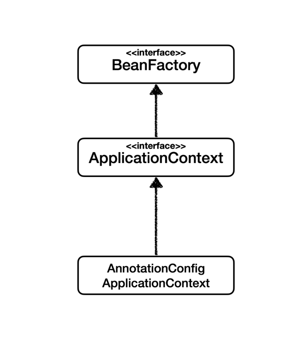

# BeanFactory와 ApplicationContext

## BeanFactory
- 스프링 컨테이너의 최상위 인터페이스다.
- 스프링 빈을 관리하고 조회하는 역할을 담당한다.
- 지연 로딩(Lazy Loading)
  - Bean을 실제로 요청할 때(getBean() 호출 시) 생성하고 초기화한다.
  - 이는 초기 로딩 속도를 빠르게 하고, 메모리 사용을 최적화할 수 있다.

## ApplicationContext
- BeanFactory 기능을 포함해서 여러 기능을 가지고 있는 `BeanFactory`의 하위 인터페이스이다.
- 즉시 로딩
  - 컨텍스트 초기화 시점에 모든 Bean을 미리 생성하고 초기화한다. 
  - 이는 애플리케이션 시작 시점에 모든 Bean의 상태를 확인할 수 있어 런타임 오류를 사전에 방지할 수 있다. 
  - 그러나 필요하지 않은 Bean까지 로딩될 수 있어 초기 로딩 시간이 길어질 수 있다. 
  - `@Lazy` 어노테이션을 사용하여 특정 Bean에 대해 지연 로딩을 설정할 수 있다.
- 애플리케이션을 개발할 때는 빈을 관리하고 조회하는 기능은 물론이고, 수 많은 부가기능을 지원한다.
  
  - **메시지소스를 활용한 국제화 기능**
      예를 들어서 한국에서 들어오면 한국어로, 영어권에서 들어오면 영어로 출력
  - **환경변수**
    로컬, 개발, 운영등을 구분해서 처리
  - **애플리케이션 이벤트**
    이벤트를 발행하고 구독하는 모델을 편리하게 지원
  - **편리한 리소스 조회**
    파일, 클래스패스, 외부 등에서 리소스를 편리하게 조회
- 스프링 컨테이너는 다양한 형식의 설정 정보를 받아들일 수 있게 유연하게 설계되어 있다. 
  - 자바 코드, XML 등등

> 스프링 공식문서에서 `ApplicationContext`에서 `BeanFactory`가 지원하는 기능을 모두 지원하므로 특별한 이유가 없는 한 `ApplicationContext`를 사용하기를 권장한다.

## 참고
- [BeanFactory or ApplicationContext? - 스프링 공식문서](https://docs.spring.io/spring-framework/reference/core/beans/beanfactory.html#context-introduction-ctx-vs-beanfactory)
- 스프링 핵심 원리 - 기본편 (김영한)