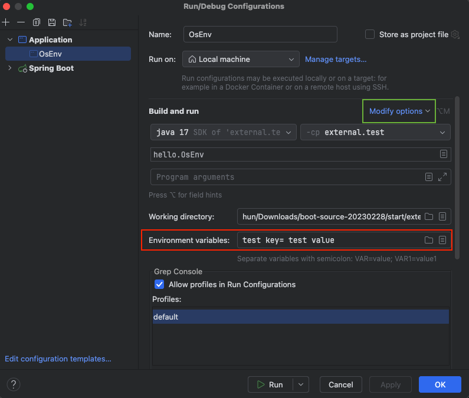

# 스프링에서 외부 설정을 관리하는 방법
애플리케이션 개발 시 외부 설정을 읽을 수 있는 다양한 방법이 존재한다.  
이 글에서는 그 방법들에 대해서 알아보고 스프링에서 그 방법들을 어떻게 통합해서 관리하는 지 알아보겠다.

## 1. OS 환경변수
OS에 설정된 OS 환경 변수값들을 활용하는 방법을 알아보자.

### 환경 변수 조회 방법
#### **Mac에서 터미널로 조회**
```bash
printenv
```
터미널에서 `printenv` 명령어를 실행하면 `key=value` 형태로 OS에 설정된 값들이 출력된다.

#### **자바 애플리케이션에서 조회**
```java
import java.util.Map;
import lombok.extern.slf4j.Slf4j;

@Slf4j
public class OsEnv {

  public static void main(String[] args) {
    Map<String, String> envMap = System.getenv();
    for (String key : envMap.keySet()) {
        log.info("env {}={} ", key, envMap.get(key));
    }
  }
}
```
- `System.getenv()` 메서드를 사용해 OS 환경 변수를 조회한다.
- 환경 변수는 키-값 쌍으로 이루어져 있어 `Map` 형태로 관리된다.

### **IntelliJ에서 OS환경 변수 추가하는 법**

1. **Edit Configurations**를 클릭
2. 빨간색 네모칸에 있는 `Environment Variables` 항목에 키=값 형태로 입력
3. 항목이 없다면 초록색 네모 칸을 눌러 Environment Variables을 클릭하여 추가

>환경 변수는 OS의 전역 설정이므로 특정 프로그램 외에도 다른 프로그램에서 사용할 수 있다.

## 2. 자바 시스템 속성
실행한 JVM 내에서만 접근 가능한 외부 설정이다.

### 설정값 조회 방법
```java
import java.util.Properties;
import lombok.extern.slf4j.Slf4j;

@Slf4j
public class JavaSystemProperties {

  public static void main(String[] args) {
    Properties properties = System.getProperties();
    for (Object key : properties.keySet()) {
      log.info("prop {}={} ", key, System.getProperty(String.valueOf(key)));
    }
  }
}
```
- `System.getProperties()` 메서드로 JVM 시스템 속성을 조회한다.

### 설정값 추가 방법
#### **1. jar파일로 실행할 시**
```bash
java -DcustomKey=customValue -jar app.jar
```
- `-D` 옵션을 사용해 `key=value` 형식으로 설정을 추가한다.
> D는 Define의 약자로 추측된다.

#### **2. IntelliJ에서 추가**

1. `VM options`에 `-Dkey=value` 형식으로 속성 추가
2. 해당 항목이 없으면 초록색 네모칸을 눌러 `Add VM options`를 클릭

#### **3. 자바 코드로 설정값 추가**
```java
    System.setProperty("propertyName", "propertyValue");
    String value = System.getProperty("propertyName");
```
- 코드 내부에서도 시스템 속성을 설정할 수 있다.
- 그러나 이 방식은 코드 내부에서 설정하는 것이기 때문에 외부로 설정을 분리하는 효과는 없다.

## 3. 커맨드 라인 인수
- `main(String[] args)` 배열을 통해 인수를 전달받는다.

### 조회 방법
```java
import lombok.extern.slf4j.Slf4j;

@Slf4j
public class CommandLineV1 {

  public static void main(String[] args) {
    for (String arg : args) {
      log.info("arg {}", arg);
    }
  }
}
```

### 설정값 추가 방법
#### **jar파일로 실행할 시**
```bash
java -jar app.jar arg1 arg2
```
- 스페이스로 구분된 값을 `args` 배열로 전달받는다.

#### IntelliJ에서 커맨드 라인 인수 추가

1. **Edit Configurations**를 클릭
2. `Program Arguments`에 인수를 공백으로 구분해 입력 (예: `arg1 arg2`)

### 제한사항
- 키-값 쌍 형식이 아니므로 직접 파싱해야 한다.
> 하지만 이 부분은 스프링부트에서 키-값 쌍 형식으로 처리하는 방법을 만들어뒀다. 아래에서 살펴보자

## 4. 커맨드 라인 옵션 인수
- 스프링 부트에서는 `--key=value` 형식을 사용해 키-값 쌍으로 전달 가능하다.
- 표준화된 방식을 제공하기 때문에 직접 파싱할 필요가 없다.

### 사용 방법
```java
import java.util.List;
import java.util.Set;
import lombok.extern.slf4j.Slf4j;
import org.springframework.boot.ApplicationArguments;
import org.springframework.boot.DefaultApplicationArguments;

@Slf4j
public class CommandLineV2 {

  public static void main(String[] args) {
    for (String arg : args) {
      log.info("arg {}", arg);
    }

    ApplicationArguments appArgs = new DefaultApplicationArguments(args);

    log.info("SourceArgs = {}", List.of(appArgs.getSourceArgs()));
    log.info("NonOptionArgs = {}", appArgs.getNonOptionArgs());
    log.info("OptionNames = {}", appArgs.getOptionNames());

    Set<String> optionNames = appArgs.getOptionNames();
    for (String optionName : optionNames) {
      log.info("option name {}={} ", optionName, appArgs.getOptionValues(optionName));
    }
  }
}

/*
     커맨드 라인 인수 : --hello --name=gildong --name=haha mode=on
     22:59:58.336 [main] INFO hello.CommandLineV2 - arg --hello
     22:59:58.337 [main] INFO hello.CommandLineV2 - arg --name=gildong
     22:59:58.337 [main] INFO hello.CommandLineV2 - arg --name=haha
     22:59:58.337 [main] INFO hello.CommandLineV2 - arg mode=on
     22:59:58.343 [main] INFO hello.CommandLineV2 - SourceArgs = [--hello, --name=gildong, --name=haha, mode=on]
     22:59:58.343 [main] INFO hello.CommandLineV2 - NonOptionArgs = [mode=on]
     22:59:58.343 [main] INFO hello.CommandLineV2 - OptionNames = [name, hello]
     22:59:58.343 [main] INFO hello.CommandLineV2 - option name name=[gildong, haha]
     22:59:58.343 [main] INFO hello.CommandLineV2 - option name hello=[]
 */

```
#### 코드 설명
1. ApplicationArguments appArgs = new DefaultApplicationArguments(args)
   - 전달된 args 배열을 파싱해 ApplicationArguments 객체를 생성
   - 스프링 부트의 명령줄 옵션 형식을 쉽게 처리할 수 있도록 지원
2. appArgs.getSourceArgs()
   - 명령줄에서 전달된 원본 인수 배열을 출력
   - 즉, 커맨드 라인 인수를 그대로 출력
3. appArgs.getNonOptionArgs()
   - 커맨드 라인 인수 중에서 옵션 형식(--key=value)이 아닌 순수 문자열 인수를 반환
4. appArgs.getOptionNames()
   - 커맨드 라인 인수 중에서 옵션의 키(key) 목록을 반환
5. appArgs.getOptionNames(key)
   - 키에 해당하는 값들을 출력
   - 하나의 키에 여러 개의 값이 존재할 수 있으므로 List형식으로 출력

값이 없는 옵션(--flag)은 빈 배열로 처리된다.


### 설정값 추가 방법
#### **jar파일로 실행할 시**
```bash
java -jar app.jar --key1=value1 --key2=value2 --flag
```
- `--key=value` 형식으로 전달하면 `ApplicationArguments`에서 손쉽게 파싱할 수 있다.
- 값이 없는 키(`--flag`)는 빈 배열로 처리됩니다.

#### IntelliJ에서 커맨드 라인 인수 추가

1. **Edit Configurations**를 클릭
2. `Program Arguments`에 인수를 공백으로 구분해 입력 (예: `--key1=value1 --key2=value2 --flag`)


## 추가 사항
### 외부 파일 사용
- 설정값을 파일로 분리하여 관리하면 유지보수가 용이합니다.
- 예: `application.properties` 또는 `application.yml` 파일을 사용.
- 스프링에서는 `@Value` 또는 `@ConfigurationProperties`를 통해 외부 파일 설정을 매핑할 수 있습니다.

#### `application.properties` 예시
```properties
server.port=8080
datasource.url=jdbc:mysql://localhost:3306/mydb
```

#### 프로퍼티 매핑 예시
```java
import org.springframework.beans.factory.annotation.Value;
import org.springframework.stereotype.Component;

@Component
public class AppConfig {

  @Value("${server.port}")
  private int port;

  @Value("${datasource.url}")
  private String dataSourceUrl;

  // Getters and Setters
}
```

---

## 정리
스프링에서 외부 설정을 가져오는 방법은 다양하며, 목적과 상황에 맞게 선택하여 사용할 수 있습니다. OS 환경 변수, 자바 시스템 속성, 커맨드 라인 인수, 외부 파일 등 각 방식의 특징과 사용법을 이해하고 적절히 활용해보세요.


## 외부 설정 방법을 하나로 통합한 스프링 부트
커맨드 라인 인수로 외부 설정을 사용하는 경우를 제외하고는 모두 외부 설정을 `key=value` 형식으로 사용할 수 있는 방법이다.
그런데 이 외부 설정값을 사용하는 개발자 입장에서는 `key=value`형식으로 값을 읽는다는 것은 같지만 읽는 방법이 달라서 각각의 사용법을 익혀야한다.  
예를 들어서 OS환경 변수는 `System.getenv(key)`를 사용해야하고, 자바 시스템 속성은 `System.getProperty(key)`, 커맨드 라인 옵션 인수는 `getOptionValues(key)`메서드를 사용해서 설정값을 조회한다.  

스프링은 이 문제를 `Environment`와 `PropertySource`로 추상화해서 해결한다.

