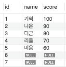
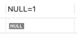

# IN절에서는 NULL을 사용할 수 없다.

SQL쿼리를 사용할 때 IN절에 NULL 값이 들어가면 안된다.  
IN절은 WHERE 절의 조건에 맞는 각 행의 칼럼 값이 IN절 안의 값 중 하나와 일치할 때 행을 반환하는 연산자이다.  


## IN절에 NULL 값이 있다면 어떻게 될까?

실제 예시로 살펴보기 위해 테이블을 만들자.  
``` sql
CREATE TABLE students(
	id INT PRIMARY KEY AUTO_INCREMENT,
    name VARCHAR(20),
    score INT
);
```
모든 데이터를 조회하는 쿼리
``` sql
SELECT * FROM students;
```


처음에 나는 여기서 score가 100인 행과 null인 행을 조회하고 싶어서 아래와 같은 쿼리를 만들었다.
```sql
SELECT * FROM students WHERE score IN (100, null);
```

하지만 기대와 다르게 score가 100인 행만 조회되었다.  


## SQL에서 NULL을 인지하는 방식

SQL에서 NULL은 어떠한 값이 아니라 **아무 값도 갖지 않는다**는 뜻이다.  
그렇기 때문에 NULL은 다른 값들과 비교할 수가 없다.  
실제로 NULL을 이용한 연산의 결과는 값이 나오지 않는다.

```sql
SELECT NULL=1;
```


심지어 NULL=NULL도 값이 나오지 않는다.  
왜냐하면 값을 가져야 비교할 수 있는데 NULL은 알 수 없는 값이기 때문이다. 

```sql
SELECT NULL=NULL;
```


그렇다면 NOT IN 절에 NULL을 넣으면 어떻게 될까?  
NULL이 아닌 값을 조회하니까 score의 값을 가진 행들이 조회될까?
```sql
SELECT * FROM students WHERE score NOT IN(NULL);
```
조회되는 값은 존재하지 않는다.  
위에서 말했듯 NULL값은 비교할 수 없는 값이기 때문에 모든 행들이 FALSE 혹은 UNKNOWN으로 평가된다.  


아래 쿼리도 조회해보자
```sql
SELECT * FROM stuents WHERE score NOT IN (100,90);
```
IN절의 100과 90은 비교할 수있는 값이기 때문에 각 행과 비교를 하며 참 거짓을 확인한다.  
하지만 6번 id와 7번 id는 NULL을 가지기 때문에 비교할 수 없는 연산이 되므로 행을 반환하지 않는다.  


## NULL 값을 조회하고 싶다면 어떻게 할까?
NULL은 일반적인 값과 다르기 때문에 `IS NULL` 조건을 사용해야한다.  
```sql
SELECT * FROM students WHERE score IN (100,90) OR score IS NULL;
```


## 결론!
> 결론은 IN절에는 NULL을 사용하지 말도록 하자
> NULL 체크를 해야한다면 IS NULL 혹은 IS NOT NULL로 하자