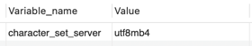
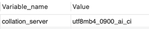

# MySQL은 문자열 검색 시 대소문자 구분을 하지 않는다.

비이진 문자열(CHAR, VARCHAR, TEXT)의 경우 문자열 비교를 할 때 대소문자 비교를 하지 않는다.  
문자 집합과 정렬은 각각 기본값으로 `utf8mb4`와 `utf8mb4_0900_ai_ci`를 기반으로 하기 때문이다.  

## utf8mb4
mysql에서 아래 쿼리문을 실행하면 어떤 인코딩 방식으로 실행하는 지 확인할 수 있다.

```sql
SHOW VARIABLES LIKE 'character_set_server';
```
실행 결과  


원래 기본적으로 utf-8은 1~4바이트까지 전세계 모든 문자를 표현할 수 있다.  
하지만 MySQL에서는 utf-8을 사용해도 3바이트까지만 표현이 가능하다.  
이모지는 4바이트로 저장되어 있기 때문에 MySQL에서 utf-8을 사용할 경우 이모지를 저장할 수 없다.  

그래서 이모지를 표현하기 위해서는 인코딩 방식을 바꿔줘야 하는데 이것을 가능하게 해주는 방식이 `utf8mb4`이다.  
mb4는 multiByte 4를 뜻하는 것으로 4바이트까지 확장한다는 뜻이다.  

> 대소문자 구분에 대해 이 설정이 직접적으로 영향을 미치지는 않지만, 궁금해서 살펴보았다.


## utf8mb4_0900_ai_ci
mysql에서 아래 쿼리문을 실행하면 어떤 대조 순서를 사용하는 지 확인할 수 있다.
```sql
SHOW VARIABLES LIKE 'collation_server';
```
실행결과  


여기서 각각의 요소가 의미하는 건 다음과 같다.  
- utf8mb4: 문자 집합
- 0900: MySQL 8.0에서 도입된 새로운 유니코드 정렬 및 비교 알고리즘을 사용한다는 의미
- ai: Accent Insensitive, 즉 악센트(é, è 등)를 구분하지 않는다는 뜻
- ci: Case Insensitive, 즉 대소문자를 구분하지 않는다는 뜻

> 이 설정이 기본적으로 되어 있기 때문에 MySQL에서는 대소문자를 구분하지 않는다.

> 문자 집합과 정렬 방식은 여러 종류가 있고, 필요에 따라 변경이 가능하다.
## 참고

[MySQL 공식 문서 - 문자열 검색의 대소문자 구분](https://dev.mysql.com/doc/refman/8.4/en/case-sensitivity.html)
