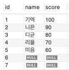
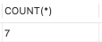
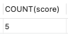
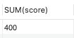
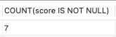
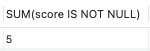
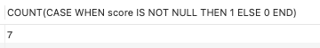
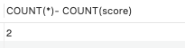

# COUNT 함수와 SUM 함수의 차이

## 두 함수는 어디에 사용될까?
COUNT 함수와 SUM 함수 모두 데이터를 집계할 때 사용한다.  
- COUNT는 행의 개수를 셀 때 사용
- SUM은 함수 인자에 해당하는 값의 합을 계산할 때 사용

## 실제 사용 예시로 살펴보자

먼저 예시로 학생 정보를 저장할 테이블을 만들자.
``` sql
CREATE TABLE students(
	id INT PRIMARY KEY AUTO_INCREMENT,
    name VARCHAR(20),
    score INT
);
```
모든 데이터를 조회하는 쿼리
``` sql
SELECT * FROM students;
```


### 기본적인 count 함수, sum 함수 사용법

``` sql
SELECT COUNT(*) FROM students;
```


아스트릭을 사용하면 모든 행의 개수를 카운팅한다.  
기본적으로 count 함수는 null 값은 세지 않는데 여기서는 아스트릭으로 카운팅 기준을 삼아서 구분이 되는 행들을 센다.  
이 때 6번 id와 7번 id는 null 값들을 가지고 있지만 각 id가 다르기 때문에 다른 행으로 인식돼서 카운팅이 된다.  
그래서 count의 결과로 7이 나온다.

```sql
SELECT COUNT(score) FROM students;
```


score 칼럼을 기준으로 행의 개수를 세게 된다.
기본적으로 count함수는 null값을 세지 않기 때문에 null 값을 제외한 5개의 결과값이 나오게 된다.

``` sql
SELECT SUM(score) FROM students;
```


score 칼럼의 값들을 전부 더하라는 뜻이다.


### 내가 의문이 들었던 점!

``` sql
SELECT COUNT(score IS NOT NULL) FROM students;
```

나는 이 쿼리의 결과가 5가 나올 것이라고 예상했다.  
하지만 결과는 7이 나왔다.  


그냥 단순한게 null이 아닌 값들을 세어야겠다는 생각으로 위 쿼리문을 만들었었다.  
실제 동작은 각 행을 지나가면서 score가 null이 아니면 true, null이면 false를 반환하고 전체를 세는 것이었다.  

### 그럼 어떻게 해야 할까?

``` sql
SELECT SUM(score IS NOT NULL) FROM students;
```


이렇게 하면 각 행을 지나가면서 score가 null이 아니면 true, null이면 false가 된다.  
sql에서는 true는 1로 평가되고 false는 0으로 평가된다.  
그렇기 때문에 결과값은 not null인 행의 개수만 세게 돼서 5가 나오게 되는 것이다.  

#### count 쿼리를 사용하고 싶다면 어떻게 해야할까?  
``` sql
SELECT COUNT(CASE WHEN score IS NOT NULL THEN 1 END) FROM students;
```


score가 null이 아니라면 1이 반환되고 null이면 아무것도 반환되지 않는다.  
count함수는 반환되는 값들의 개수를 세기 때문에 5가 나오게 된다.

진짜로 반환되는 값들만 세는 것이 맞는지 확인해보자
```sql
SELECT COUNT(CASE WHEN score IS NOT NULL THEN 1 ELSE 0 END) FROM students;
```
  

not null이라면 1이 반환되고 null이라면 0이 반환된다.    
모든 행들이 다 반환되기 때문에 결과값이 7이 나온다.


null 값의 개수를 구하는 것이 목적이라면 아래와 같이 구할 수도 있다.  
```sql
SELECT COUNT(*)- COUNT(score) FROM students;
```



아스트릭을 함수인자로 넣는다면 행이 존재하지만 칼럼값으로 null이 포함되어 있어도 카운팅이 된다.  
(구분이 되는 행이기 때문에 카운팅 된다.)    
칼럼을 넣는다면 null이 포함되지 않기 때문에 null을 제외한 칼럼이 카운팅 된다.  
그렇기 때문에 위의 쿼리를 실행하면 null값의 개수를 구할 수 있다.