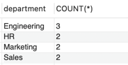
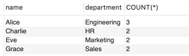
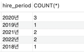

# MySQL ONLY_FULL_GROUP_BY 이해하기

MySQL에서 `GROUP BY`를 사용할 떄 다음과 같은 오류가 발생할 때가 있다. 
``` 
Error Code:1055. 
Expression #1 of SELECT list is not in GROUP BY clause and contains nonaggregated column 'practice.employees.hire_date' 
which is not functionally dependent on columns in GROUP BY clause; this is incompatible with sql_mode=only_full_group_by
```
쉽게 말해서 `SELECT`절에서 사용하는 칼럼이 `GROUP BY`에 포함되지 않거나, 함수적 종속성을 만족하지 않아 `only_full_group_by`모드와 호환되지 않는다는 의미이다.  
이 글에서는 `only_full_group_by`모드가 무엇이며, 왜 이러한 오류가 발생하는지, 그리고 어떻게 해결할 수 있는지 알아보겠다.


## 기본 개념
- `ONLY_FULL_GROUP_BY` 활성화:
  - `SELECT`절에 포함된 모든 컬럼/표현식은 `GROUP BY`에 명시되거나 집계 함수로 처리되어야 한다.
  - 혹은, `SELECT` 절의 컬럼이 `GROUP BY`절의 컬럼에 함수적으로 종속되어야 한다.
- `ONLY_FULL_GROUP_BY` 비활성화:
  - `SELECT`절에 있는 컬럼이나 표현식이 `GROUP BY`절에 없어도 쿼리를 실행할 수 있다. 
  - 단, 어떤 값이 반환될지 모호해지며, 비결정적인 결과가 나올 수 있다.

> 함수적 종속성: X의 값을 알면 Y를 정확히 결정할 수 있는 관계를 의미.

## only_full_group_by에 대해 실제 예제로 알아보기

### 1. 데이터 준비
```sql
CREATE TABLE employees (
   id INT AUTO_INCREMENT PRIMARY KEY,
   name VARCHAR(50),
   department VARCHAR(50),
   salary INT,
   hire_date DATE
);

INSERT INTO employees (name, department, salary, hire_date) VALUES
    ('Alice', 'Engineering', 70000, '2020-03-15'),
    ('Bob', 'Engineering', 75000, '2019-06-22'),
    ('Charlie', 'HR', 50000, '2021-01-10'),
    ('David', 'HR', 52000, '2022-09-14'),
    ('Eve', 'Marketing', 60000, '2021-07-25'),
    ('Frank', 'Marketing', 62000, '2020-12-30'),
    ('Grace', 'Sales', 58000, '2018-11-13'),
    ('Hank', 'Sales', 59000, '2022-04-18'),
    ('Ivy', 'Engineering', 72000, '2020-08-05');
```

### 2. 테스트할 쿼리

#### 1. 정상 실행 예시
```sql
SELECT department, COUNT(*)
FROM employees
GROUP BY department;
```
**결과**  


- 여기서는 `SELECT`에서 사용한 `department`가 `GROUP BY`에도 포함되어 있으므로 문제없이 실행된다.

#### 2. 에러 발생 예시
```sql
SELECT name, department, COUNT(*)
FROM employees
GROUP BY department;
```
- `GROUP BY`는 `department`로 묶지만, `SELECT`에서는 `name`을 반환하려 한다.
- 같은 부서(department)에 여러 명(name)이 있을 수 있으므로 MySQL은 어떤 `name`을 반환해야 할지 모른다.
- 그러므로 `only_full_group_by` 모드 활성화 시 에러가 발생합니다.

**sql_mode에서 only_full_group_by를 비활성화한다면?**
```sql
--비활성화하는 쿼리
SET sql_mode = REPLACE(@@sql_mode, 'ONLY_FULL_GROUP_BY', '');

--실험이 끝나면 아래 쿼리로 되돌린다.
SET sql_mode = CONCAT(@@sql_mode, ',ONLY_FULL_GROUP_BY');
    
-- 현재 SQL 모드 확인
SELECT @@sql_mode;
```
**결과**   
  

- 결과가 나오긴 하지만 `department`로 그루핑 할 때 `name`은 여러개의 값을 가지고 있다. 그렇기 떄문에 MySQL은 `name`값 중 임의의 값을 반환한다.

#### 3. GROUP BY와 SELECT 표현식을 일치 (정상 실행)
```sql
SELECT CONCAT(YEAR(hire_date), "년") AS hire_period, COUNT(*)
FROM employees
GROUP BY hire_period;
```
**결과**  


#### 4. GROUP BY 표현식 실험 (에러 발생 - 이 글을 쓴 이유)
```sql
SELECT CONCAT(YEAR(hire_date),"년") AS hire_period, COUNT(*)
FROM employees
GROUP BY YEAR(hire_date);
```
이 쿼리문은 에러가 발생한다.  
우리 입장에서는 년도를 기준으로 `hire_date` 그루핑하고 그 표현식에 "년"만 붙여서 조회하는 건데 왜 안되는거냐고 생각할 수 있다.  
하지만 MySQL 입장에서는 `YEAR(hire_date)`,`CONCAT(YEAR(hire_date),"년") AS hire_period`은 엄연히 다른 표현식으로 인지하고 함수 종속성도 판단할 수 없기 때문에 에러를 발생시킨다.  

물론 사용자 입장에서 이 쿼리는 논리적으로 문제가 없어 보이기 때문에 `only_full_group_by`을 비활성화 시키고 조회하면 3번과 같은 결과가 나온다.  
**결과**  


## ONLY_FULL_GROUP_BY가 필요한 이유
`only_full_group_by`는 데이터 무결성과 결과의 예측 가능성을 보장한다.  
비활성화하면 편리할 수 있지만, 모호한 결과로 인해 나중에 예기치 못한 문제를 일으킬 수 있다.
그리고 우리가 생각했을 때 에러가 발생하지 않을거라고 생각할 수 있지만, 에러는 늘 우리가 생각하지 못한 곳에서 발생하기 떄문에 해당 옵션을 활성화하는 것이 좋다.

## 참고 자료
[MySQL 공식 문서 - 14.19.3 MySQL의 GROUP BY 처리](https://dev.mysql.com/doc/refman/8.4/en/group-by-handling.html)