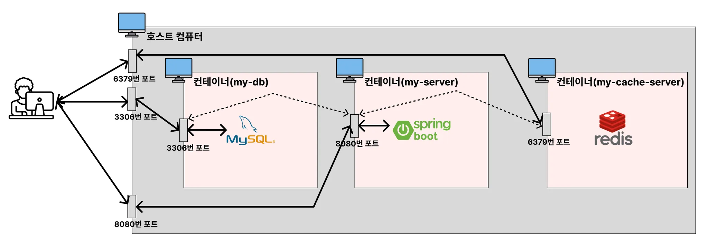

# Docker Compose

## Docker Compose 개념
여러 개의 Docker 컨테이너들을 하나의 서비스로 정의해서 하나의 묶음으로 관리할 수 있게 해주는 도구이다.

## Docker Compose 사용 이유
1. 여러 개의 컨테이너 한번에 관리
   예를 들어 Spring project를 사용하면 Database도 같이 사용하게 되는 경우가 많다.  
   그럴 때 **Docker Compose**를 사용하면 각 컨테이너를 독립적으로 관리하는 것이 아니라 하나의 환경에서 실행하고 관리해준다.
2. 복잡한 명령어 간소화
   지금까지 컨테이너를 띄울 때 명령어가 복잡해지는 경우가 많았다. MySQL을 띄울 때 명령어를 다시 확인해보자.
    
    ```bash
   docker run -e MYSQL_ROOT_PASSWORD=pwd1234 -p 3306:3306 -v /Users/choijaehun/Documents/Develop/docker-mysql/mysql_data:/var/lib/mysql -d mysql
    ```
    
    조금만 시간 지나도 다 까먹을 것 같은 명령어이다.  **Docker Compose**를 사용하면 단순히 `docker compose up 명령어로 컨테이너를 실행시킬 수 있다.

## Docker Compose 명령어
### compose 파일 작성
```yml
services:
	websever:
		container_name: webserver
		image: nginx
		ports: 
			- 80:80
```

### compose.yml에서 정의한 컨테이너 실행
```bash
docker compose up     # 포그라운드에서 실행
docker compose up -d  # 백그라운드에서 실행
```
- 파일이름이 compose.yml 이 아닐 경우 아래처럼 명시해야한다.
- 예: `docker compose -f myapp.yml up`

### Docker Compose로 실행 컨테이너 확인
```bash
# compose.yml에 정의된 컨테이너 중 실행 중인 컨테이너만 보여준다. 
docker compose ps 

# compose.yml에 정의된 모든 컨테이너를 보여준다.
docker compose ps -a
```

### Docker Compose 로그 확인하기
``` bash
docker compose logs # compose로 실행된 컨테이너들 로그 확인
```

### 컨테이너를 실행하기 전에 이미지 재빌드하기

```bash
docker compose up --build # 포그라운드에서 실행
docker compose up --build -d # 백그라운드에서 실행
```
- `compose.yml`에서 정의한 이미지 파일에서 코드가 변경 됐을 경우, 이미지를 다시 빌드해서 컨테이너를 실행시켜야 코드 변경된 부분이 적용된다. 그러므로 이럴 때에는 `--build` 옵션을 추가해서 사용해야 한다.

- **참고** : `docker compose up` vs `docker compose up --build`
> - `docker compose up` : 이미지가 없을 때만 빌드해서 컨테이너를 실행시킨다. 이미지가 이미 존재하는 경우 이미지를 빌드하지 않고 컨테이너를 실행시킨다.  
> - `docker compose up --build` : 이미지가 있건 없건 무조건 빌드를 다시해서 컨테이너를 실행시킨다.

### 이미지 다운받기 / 업데이트하기
```bash
docker compose pull
```

- `compose.yml`에서 정의된 이미지를 다운 받거나 업데이트 한다.
    - 로컬 환경에 이미지가 없다면 이미지를 다운 받는다.
    - 로컬 환경에 이미 이미지가 있는데, Dockerhub의 이미지와 다른 이미지일 경우 이미지를 업데이트 한다.

### Docker Compose에서 이용한 컨테이너 종료하기
```bash
docker compose down
```    

## Dcoker Compose 사용 방법

### Redis 실행하기
#### 1. compose.yml 파일 작성하기
**compose.yml**
```yml
# docker run -d -p 6379:6379 redis 아래와 같은 의미
services:
	my-cache-server:
		image: redis
		ports: 
			- 6379:6379 
```

#### 2. compose 파일 실행시키기
```bash
docker compose up -d
```
- `-d`: 백그라운드 실행은 명령어를 입력할 때 같이 입력한다.
#### 3. compose 실행 현황 보기
```bash
docker compose ps # docker compose로 실행된 컨테이너만 확인
docker ps
```

#### 4. compose로 실행된 컨테이너 삭제
```bash
docker compose down
```


### MySQL 실행하기
#### compose.yml 파일 작성하기
```yml
# docker run -e MYSQL_ROOT_PASSWORD=pwd1234 -p 3306:3306 -v /Users/choijaehun/Documents/Develop/docker-mysql/mysql_data:/var/lib/mysql -d mysql
services:
  my-db:
    image: mysql
    environment:
      MYSQL_ROOT_PASSWORD: pwd1234
    volumes:
      - ./mysql_data:/var/lib/mysql
    ports:
      - 3306:3306
```
- `environment: ...` : CLI에서 `-e MYSQL_ROOT_PASSWORD=password` 역할과 동일하다.
- `volumes: ...` : CLI에서 `-v {호스트 경로}:/var/lib/mysql` 역할과 동일하다.

### SpringBoot 실행하기
#### 1. Dockerfile 작성하기
```Dockerfile
FROM openjdk:17-jdk

COPY build/libs/*SNAPSHOT.jar /app.jar

ENTRYPOINT ["java", "-jar", "/app.jar"]
```
- 프로젝트를 먼저 이미지로 만들기 위해서 **dockerfile**로 만든다.
#### 2. Spring Boot 프로젝트 빌드
```bash
./gradlew clean build
```
- Dockerfile을 통해 jar파일을 컨테이너로 옮겨야 하기 때문에 빌드 진행

#### 3. compose 파일 작성
```bash
services:
  my-server:
    build: .
    ports:
      - 8080:8080
```
- `build: .` : compose.yml이 존재하는 디렉토리(.)에 있는 Dockerfile로 이미지를 생성해 컨테이너를 띄우겠다는 의미이다.

#### 4. compose 파일 실행
```bash
docker compose up -d --build
```

## 두 개 이상의 컨테이너 관리하는 법 (SpringBoot, MySQL, Redis)

### 1. Spring Boot 프로젝트에 mysql, redis 연결
**build.gradle**
``` groovy
dependencies {
	...
	implementation 'org.springframework.boot:spring-boot-starter-data-redis'
	implementation 'org.springframework.boot:spring-boot-starter-data-jpa'
	runtimeOnly 'com.mysql:mysql-connector-j'
}
```
**application.yml**
```yml
spring:
  datasource:
    url: jdbc:mysql://my-db:3306/mydb
    username: root
    password: pwd1234
    driver-class-name: com.mysql.cj.jdbc.Driver
  data:
    redis:
      host: my-cache-server
      port: 6379
```
- 여기서 주의해야 할 점은 mysql의 서버명을 **my-db**로 해야한다. **my-db**는 MySQL의 서비스명이다.
- redis도 host명으로 localhost를 쓰는 것이 일반적인데 redis의 서비스명으로 써야한다.
- 이렇게 해야하는 이유는 아래에서 설명해보겠다.

**compose.yml**
```yml
services:
  my-server:
    build: .
    ports:
      - 8080:8080
    depends_on:
      my-db:
        condition: service_healthy
      my-cache-server:
        condition: service_healthy
  my-db:
    image: mysql
    environment:
      MYSQL_ROOT_PASSWORD: pwd1234
      MYSQL_DATABASE: mydb
    volumes:
      - ./mysql_data:/var/lib/mysql
    ports:
      - 3306:3306
    healthcheck:
      test: [ "CMD", "mysqladmin", "ping" ]
      interval: 5s
      retries: 10
  my-cache-server:
    image: redis
    ports:
      - 6379:6379
    healthcheck:
      test: [ "CMD", "redis-cli", "ping" ]
      interval: 5s
      retries: 10
```
- 여기서 주의해야 할 점은 스프링부트는 redis와 mysql이 실행된 후 실행되어야 하기 때문에 헬스체크를 통해 실행 순서를 미룬다.

## 2. Docker 컨테이너로 띄우기
```bash
./gradlew clean build
docker compose down
docker compose up --build -d
```

## application.yml에서 mysql 서버와 redis 서버를 저렇게 설정한 이유

- mysql의 서버명을 localhost로 할 경우 springboot서버는 본인이 띄워진 컨테이너 안에서 3306번 포트를 찾는다.  
  하지만 의도한 3306번 포트는 호스트 컴퓨터에서 가리킬 때 연결이 된다.  
  그래서 서버를 MySQL이 띄워진 서비스 명으로 설정하면 docker compose가 올바른 경로를 찾아준다.
- redis도 마찬가지다. localhost로 호스트를 설정할 경우 스프링부트의 컨테이너 안에서 6379번 포트를 찾기 때문에 연결이 되지 않는다.  
  그래서 redis도 서버를 redis가 띄워진 서비스 명으로 설정한다.