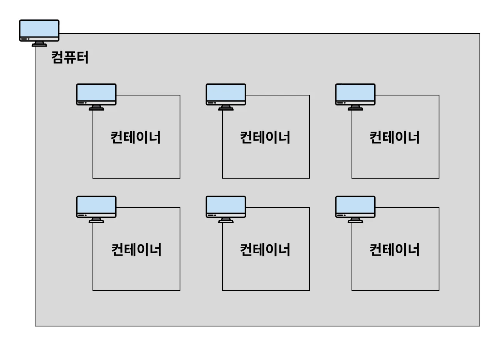

# Docker 기본 개념

## Docker를 사용하는 이유
Docker를 사용하게 되면 여러가지 장점이 있지만, 그 중에서 가장 큰 장점은 **이식성**이다.

예를 들어, 학교에서 MySQL로 실습을 하는 수업을 한다고 하자.  
누군가는 Window를 사용할 수도 있고, 다른 누군가는 Mac을 사용할 수 있다. 또한 같은 운영체제라도 컴퓨터 환경이 다르다.  
MySQL을 설치해서 실습을 해야 하는데 각 컴퓨터의 환경이 다르기 때문에 같은 방식으로 설치를 하더라도 충돌이나 다양한 이유로 MySQL이 안 깔릴 수 있다.  

이 문제를 해결해주는 도구가 Docker이다.

간단하게 정리해보면 아래와 같은 장점이 있다.
- 매번 귀찮은 설치 과정을 일일이 거치지 않아도 된다.
- 항상 일관되게 프로그램을 설치할 수 있다.
- 각 프로그램이 독립적인 환경에서 실행되기 때문에 프로그램 간 충돌이 발생하지 않는다.

## Docker란?
컨테이너를 사용하여 각각의 프로그램이 분리된 환경에서 실행되고 관리될 수 있게 해주는 도구이다.

> 현실세계의 컨테이너는 서로 독립된 공간에서 영향을 주지 않는다. 그래서 이 개념을 차용한 것 같다.

## 컨테이너란?
하나의 컴퓨터 환경 내에서 독립적인 컴퓨터 환경을 구성해서 각 환경에 프로그램을 별도로 설치할 수 있게 만든 개념이다.  
하나의 컴퓨터 환경 내에는 여러 개의 컨테이너를 띄울 수 있다.  

이 그림에서 보는 것처럼 하나의 컴퓨터 안에 여러 개의 컨테이너를 만들 수 있다.  
그리고 컨테이너와 컨테이너를 포함하는 컴퓨터를 구분하기 위해 컨테이너를 포함한 컴퓨터를 **호스트 컴퓨터**라고 부른다.

### 컨테이너의 독립성
컨테이너는 독립적인 공간을 갖는다고 했다. 구체적으로 아래와 같은 것들이 독립적이다.
- 디스크(저장 공간) : 각 컨테이너마다 각자의 저장 공간을 가진다. 그래서 각 컨테이너는 서로 직접적으로 내부 파일에 접근할 수 없다.  
- 네트워크(IP, port) : 각 컨테이너마다 고유의 네트워크를 가지고 있다.

## 이미지란?
실행 가능한 애플리케이션을 포함한 패키지라고 볼 수 있다.  
위에서 말한 컨테이너는 이미지를 실행한 인스턴스인 것이다.

예를 들어 MySQL 서버를 이미지로 만들었다면 이 이미지를 Docker로 실행시키는 순간 MySQL 서버가 컨테이너 환경에서 실행된다.  
그래서 MySQL을 일일이 설치할 필요 없이 MySQL을 사용할 수 있게 된다.