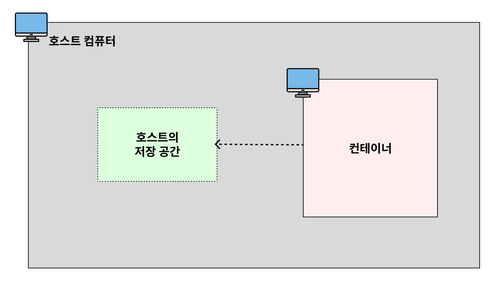
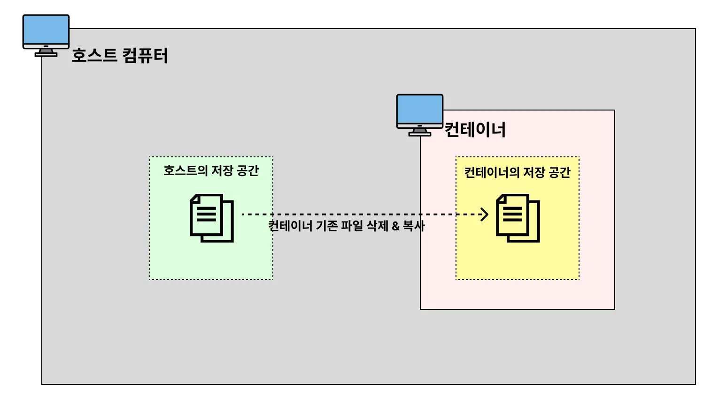
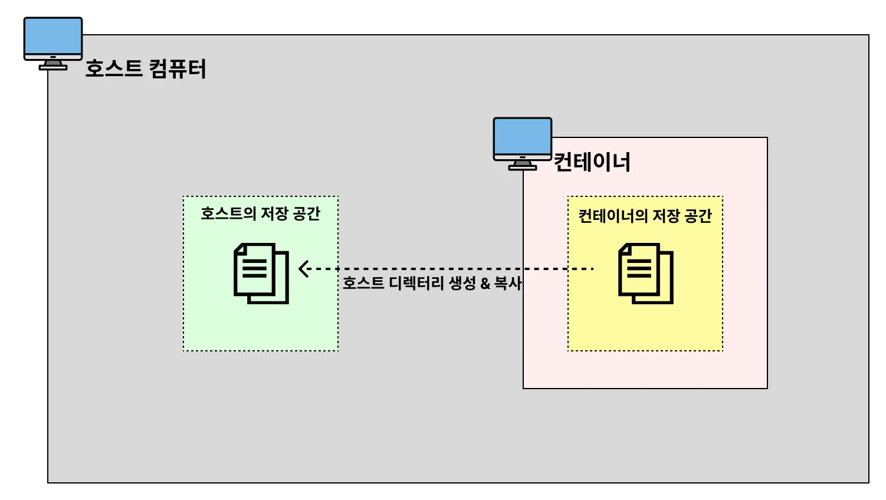

# Docker Volume (도커 볼륨)

## 도커 볼륨의 필요성
Docker를 활용하면 프로그램을 컨테이너로 띄울 수 있다. 
컨테이너는 호스트 컴퓨터에서 만드는 작은 컴퓨터이다. 컨테이너를 종료하는 것은 호스트 컴퓨터에서 컨테이너를 제거하는 것이다.  
이렇게 제거가 되면 컨테이너 내부에 있던 데이터들도 같이 삭제가 된다.  

예를 들어, MySQL 컨테이너를 사용하다가 컨테이너를 교체하거나 삭제하게 되면 내부의 데이터도 같이 삭제된다.
이 문제는 도커 볼륨을 사용하면 해결할 수 있다.

## 도커 볼륨이란?
도커 볼륨은 도커 컨테이너에서 데이터를 영속적으로 저장하기 위한 방법이다.  
볼륨은 컨테이너의 저장 공간에 데이터를 저장하는 것이 아니라 호스트 컴퓨터의 저장 공간을 공유해서 사용한다.  
이를 통해 컨테이너를 삭제하더라도 데이터는 호스트 컴퓨터에 남아 있게 된다.



## 볼륨을 사용하는 명령어
```bash
docker run -v [호스트의 디렉토리 절대경로]:[컨테이너의 디렉토리 절대경로] [이미지명]:[태그명]
```
- [호스트의 디렉토리 절대 경로]에 디렉토리가 이미 존재할 경우, 호스트의 디렉터리가 컨테이너의 디렉터리를 덮어씌운다.

    
- [호스트의 디렉토리 절대 경로]에 디렉토리가 존재하지 않을 경우, 호스트의 디렉터리 절대 경로에 디렉터리를 새로 만들고 컨테이너의 디렉터리에 있는 파일들을 호스트의 디렉터리로 복사해온다.

    


## 볼륨을 활용하여 MySQL 실행하기

### 실행 명령어
```bash
cd /Users/choijaehun/Documents/Develop
mkdir docker-mysql # MySQL 데이터를 저장하고 싶은 폴더 만들기

# docker run -e MYSQL_ROOT_PASSWORD=password123 -p 3306:3306 -v {호스트의 절대경로}/mysql_data:/var/lib/mysql -d mysql
docker run -e MYSQL_ROOT_PASSWORD=password123 -p 3306:3306 -v /Users/jaeseong/Documents/Develop/docker-mysql/mysql_data:/var/lib/mysql -d mysql
```

### 설명
1. 디렉토리 생성 
   docker-mysql 디렉토리는 MySQL 데이터를 저장할 호스트 디렉토리이다.
2. Dockerhub에서 컨테이너 데이터 경로 확인 
   컨테이너 내부 데이터 저장 경로는 Dockerhub의 **Where to Store Data** 섹션에서 확인할 수 있다.  
   MySQL의 경우 /var/lib/mysql이다.
3. 환경 변수 설정 
   `-e MYSQL_ROOT_PASSWORD=password123`는 MySQL 접속에 필요한 비밀번호를 설정한다.   
   비밀번호와 같은 설정 정보는 Dockerhub에서 확인할 수 있다.
4. 데이터 동기화 
   컨테이너와 호스트 디렉토리 사이에서 데이터가 자동으로 동기화된다. 컨테이너를 삭제해도 데이터는 호스트에 남아 있으므로 안전하다.


## 컨테이너를 삭제하고 다시 띄울 때 주의할 점
### 실행 명령어
```bash
# 컨테이너 종료
docker stop [MySQL 컨테이너 ID]
docker rm [MySQL 컨테이너 ID]

# 비밀번호 바꿔서 컨테이너 생성
docker run -e MYSQL_ROOT_PASSWORD=pwd1234 -p 3306:3306 -v /Users/jaeseong/Documents/Develop/docker-mysql/mysql_data:/var/lib/mysql -d mysql

docker exec -it [MySQL 컨테이너 ID] bash
mysql -u root -p # 접속이 안 됨...
```
### 설명
다른 비밀번호를 사용하고 싶어서 컨테이너를 생성할 때 다른 비밀번호를 사용한다고 해서 해당 비밀번호를 사용할 수는 없다.  
왜냐하면 이미 처음 볼륨을 사용해서 MySQL을 띄울 때 패스워드 정보가 볼륨에 초기화되어 있기 때문이다.  
그래서 비밀번호를 바꾸고 싶으면 컨테이너에 접속 후에 변경해야한다.  
그리고 이미 존재하는 볼륨에 접근하는 컨테이너는 `환경변수를 입력하지 않아도 된다. 이미 환경변수는 최초에 다 등록이 되었기 때문이다.
