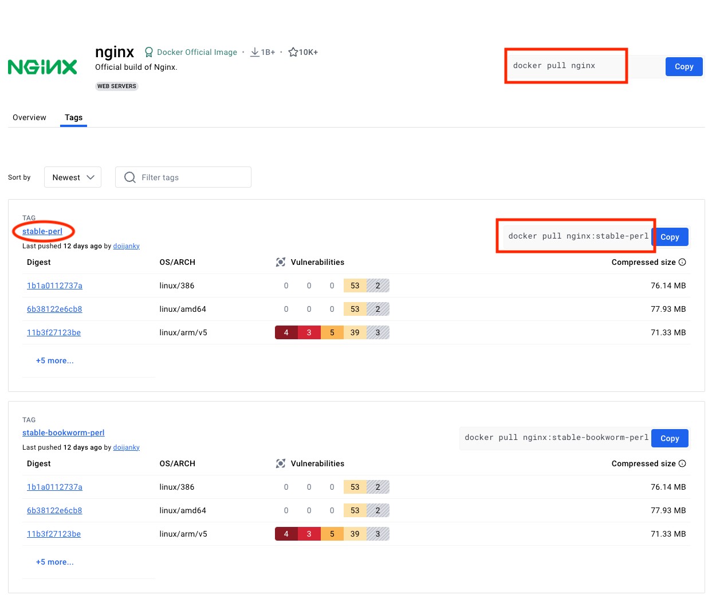
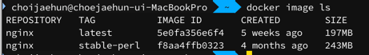
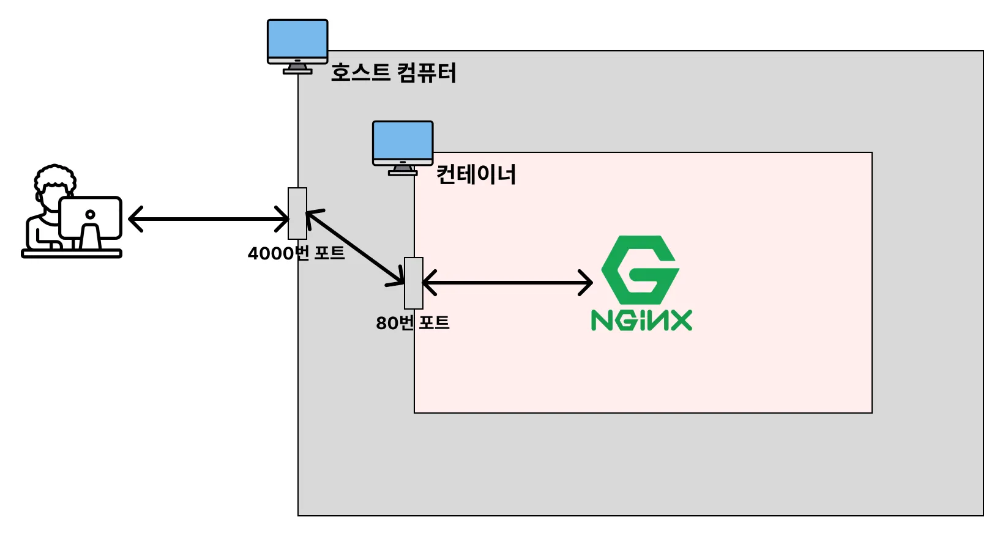

# 자주 사용하는 Docker 명령어

## 이미지 다운로드

이미지를 다운로드 할 때 [Dockerhub](https://hub.docker.com/)에서 이미지를 다운 받는다.
Github에 사람들이 코드를 저장해두고 clone, pull을 통해 사용하듯이 Dockerhub도 사람들이 올려놓은 이미지들이 저장되어 있어서 pull을 통해 다운 받아서 사용할 수 있다.
즉 Dockerhub는 Github처럼 이미지를 저장하고 다운받을 수 있는 저장소 역할을 한다.

### 최신 버전 이미지 다운로드 명령어
```bash
docker pull 이미지명 # docker pull 이미지명:latest 와 동일
```

### 특정 버전 이미지 다운로드 명령어
```bash
docker pull 이미지명:태그명
```
- 태그명은 특정 버전을 나타내는 이름이다.



예를 들어 dockerhub에서 nginx 이미지를 다운받는다고 했을 떄 
- `docker pull nginx`를 입력하면 최신 버전
- `docker pull nginx:stable-perl`을 입력하면 특정 버전

으로 다운 받을 수 있다.


## 이미지 조회

### 다운받은 모든 이미지 조회
```bash
docker image ls
```
  
- `ls` : list의 약자
- `REPOSITORY` : 이미지 이름(이미지명)
- `TAG` : 이미지 태그명. 버전을 의미
- `IMAGE ID` : 이미지 ID. 일반적으로 같은 이미지의 다른 버전은 이미지 이름이 같으므로 IMAGE ID로 식별
- `CREATED`: 이미지가 생성된 날짜 (다운받은 날짜 X)
- `SIZE` : 이미지 크기

## 이미지 삭제

### 특정 이미지 삭제
```bash
docker image rm [이미지 ID 또는 이미지명:태그명]
```
- `rm`: remove의 약자
- `이미지 ID`를 입력할 때 일부만 입력해도 된다. (단, ID의 일부만 입력할 떄는 식별이 가능해야한다.)
- 실행 중인 컨테이너에서 사용하고 있는 이미지는 강제로 삭제할 수 없다.
- 이미지 ID로 삭제할 수 있다.
- 이미지명으로 삭제할 때 태그명을 생략할 경우 latest 대상으로 한다.

### 중지된 컨테이너에서 사용하고 있는 이미지 삭제
```bash
docker image rm -f [이미지 ID 또는 이미지명]
```
- 실행 중인 컨테이너에서 사용하고 있는 이미지는 강제로 삭제할 수 없다.

### 전체 이미지 삭제
```bash
# 컨테이너에서 사용하고 있지 않은 이미지만 전체 삭제
docker image rm $(docker images -q)

# 컨테이너에서 사용하고 있는 이미지를 포함해서 전체 이미지 삭제
docker image rm -f $(docker images -q)
```

**`docker images -q`**
- 시스템에 있는 모든 이미지의 ID 반환
- `docker images`는 `docker image ls`와 같고, `docker image ls`의 레거시한 표현이다. 
- `-q`는 quite를 의미하며 간략하게 표현한다는 뜻으로 ID값만 반환해준다.

## 컨테이너 생성
이미지를 바탕으로 컨테이너를 생성한 뒤, 컨테이너 실행까지 시킨다.
생성과 실행을 분리시켜서 명령어를 실행시킬 수 있지만, 일반적으로 생성하면서 동시에 실행하므로 해당 명령어는 소개하지 않겠다.  

```bash
# docker run 이미지명[:태그명]
docker run nginx # 포그라운드에서 실행 (추가적인 명령어 조작을 할 수가 없음)

# Ctrl + C로 종료할 수 있음
```
- 도커 환경에서 다운받은 이미지가 없다면 Dockerhub로부터 이미지를 다운 받은 후 실행시켜준다.

### 백그라운드에서 실행
```bash
# docker run -d 이미지명[:태그명]
docker run -d nginx

# Nginx 컨테이너 중단 후 삭제하기
docker ps # 실행 중인 컨테이너 조회
docker stop {nginx를 실행시킨 Contnainer ID} # 컨테이너 중단
docker rm {nginx를 실행시킨 Contnainer ID} # 컨테이너 삭제
docker image rm nginx # Nginx 이미지 삭제
```
- 포그라운드로 실행시키면 다른 작업을 할 수 없지만 백그라운드로 실행하면 다른 작업을 할 수 있다.
- `-d`는 데몬을 의미하며, 데몬이라는 개념 자체가 **백그라운드에서 지속적으로 실행되는 프로세스**라는 뜻이다.

### 호스트의 포트와 컨테이너의포트 연결
Nginx는 웹서버라서 웹에서 실행해야하는데 위에서처럼 단순히 백그라운드에서 실행하면 웹브라우저에서 접근할 방법이 없다.  
접근하려면 포트매핑을 해야한다. 포트 매핑은 **호스트컴퓨터와 컨테이너의 네트워크를 연결하는 다리**역할을 한다.

```bash
# docker run -d -p [호스트 포트]:[컨테이너 포트] 이미지명[:태그명]
docker run -d -p 4000:80 nginx
```


- 웹브라우저는 컨테이너에 직접적으로 접근할 방법은 없고, 호스트 컴퓨터를 통해 접근해야한다.
- 포트매핑은 웹브라우저에서 4000번 포트로 접근하면 컨테이너에 설치된 NGINX의 포트인 80번으로 연결되게 해준다.

## 컨테이너 조회

### 실행중인 컨테이너 조회
```bash
docker ps
```
- `ps`: process status의 약자

### 모든 컨테이너 조회(작동 중인 컨테이너 + 작동을 멈춘 컨테이너)
```bash
docker ps -a
```
- `-a`: all 의 약자

## 컨테이너 중지
```bash
docker stop 컨테이너명[또는 컨테이너 ID]
docker kill 컨테이너명[또는 컨테이너 ID]
```
- stop은 안정적으로 컨테이너를 종료하는 거고 kill은 강제로 종료하는 것이다.


## 컨테이너 삭제
### 중지되어 있는 특정 컨테이너 삭제
```bash
docker rm 컨테이너명[또는 컨테이너 ID]
```
- 실행 중인 컨테이너는 중지한 후에만 삭제가 가능하다.

### 실행되고 있는 특정 컨테이너 삭제
```bash
docker rm -f 컨테이너명[또는 컨테이너 ID]
```
### 중지되어 있는 모든 컨테이너 삭제
```bash
docker rm $(docker ps -qa)
```

### 실행되고 있는 모든 컨테이너 삭제
```bash
docker rm -f $(docker ps -qa)
```

## 컨테이너 로그 조회
### 특정 컨테이너의 모든 로그 조회
```bash
# docker logs [컨테이너 ID 또는 컨테이너명]

docker run -d nginx
docker logs [nginx가 실행되고 있는 컨테이너 ID]
```

### 최근 로그 10줄만 조회
```bash
# docker logs --tail [로그 끝부터 표시할 줄 수] [컨테이너 ID 또는 컨테이너명]
docker logs --tail 10 [컨테이너 ID 또는 컨테이너명]
```

### 기존 로그 조회 + 생성되는 로그를 실시간으로 보고 싶은 경우
```bash
# docker logs -f [컨테이너 ID 또는 컨테이너명]

# Nginx의 컨테이너에 실시간으로 쌓이는 로그 확인하기
docker run -d -p 80:80 nginx
docker logs -f
```
- `-f`: follow의 약어

### 기존 로그는 조회하지 않기 + 생성되는 로그를 실시간으로 보고 싶은 경우
```bash
docker logs --tail 0 -f [컨테이너 ID 또는 컨테이너명]
```

## 실행중인 컨테이너 내부 접속하기
컨테이너는 미니 컴퓨터라고 볼 수 있다. 즉, 호스트 컴퓨터 안에서 자기만의 컴퓨터 공간을 갖는다.  
그렇다면 호스트 컴퓨터에서 파일들을 보듯, 컨테이너도 내부 파일들을 확인할 수 있다.

```bash
# docker exec -it 컨테이너명[또는 컨테이너 ID] bash

docker run -d nginx
docker exec -it [Nginx가 실행되고 있는 컨테이너 ID] bash
ls # 컨테이너 내부 파일 조회
cd /etc/nginx 
cat nginx.conf
```
- 컨테이너 내부에서 나오려면 `Ctrl + D` 또는 `exit`을 입력하면 된다.
- `exec`는 execute의 줄임말이다.
- `bash` : 쉘(Shell)의 일종
- `-it` : `-it`옵션을 사용해야 명령어를 입력하고 결과를 확인할 수 있다.  
  `-it`옵션을 적지 않으면 명령어를 1번만 실행시키고 종료되어 버린다.  
  즉, `-it` 옵션을 적어야 계속해서 명령어를 입력할 수 있다.  
  - `-i`: interactive의 약자로 입력을 계속 받을 수 있게 설정
  - `-t`: tty(가상 터미널)연결. 이를 통해 셸 환경을 사용할 수 있다.