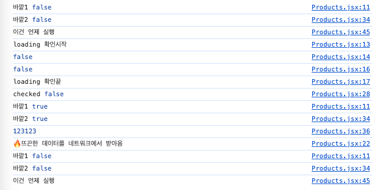

# React의 useEffect 실행순서 (feat. fetch)

useEffect를 사용하다가 실행순서의 흐름을 이해하기 위해서 log를 찍으며 확인해보았다.

``` javascript
import React, { useEffect, useState } from "react";

export default function Products() {
  const [products, setProducts] = useState([]);
  const [checked, setChecked] = useState(false);
  const [loading, setLoading] = useState(false);
  const [error, setError] = useState(undefined);

  const handleChange = () => setChecked((prev) => !prev);

  console.log("바깥1", loading);
  useEffect(() => {
    console.log("loading 확인시작");
    console.log(loading);
    setLoading(true);
    console.log(loading);
    console.log("loading 확인끝");
    setError(undefined);
    fetch(`data/${checked ? "sale_" : ""}products.json`)
      .then((res) => res.json())
      .then((data) => {
        console.log("🔥뜨끈한 데이터를 네트워크에서 받아옴");
        setProducts(data);
        setLoading(false);
      })
      .catch(() => setError("에러가 발생했음!"))
      .finally(() => setLoading(false));
    console.log("checked", checked);
    return () => {
      console.log("🧹 깨끗하게 청소하는 일들을 합니다.");
    };
  }, [checked]);

  console.log("바깥2", loading);
  if (loading) {
    console.log(123123);
    return <div>loading...</div>;
  }

  if (error) {
    return <p>{error}</p>;
  }

  return (
    <>
      {console.log("이건 언제 실행")}
      <input
        id="checkbox"
        type="checkbox"
        value={checked}
        onChange={handleChange}
      />
      <label htmlFor="checkbox">Show Only 🔥 Sale</label>
      <ul>
        {products.map((product) => (
          <li key={product.id}>
            <article>
              <h3>{product.name}</h3>
              <p>{product.price}</p>
            </article>
          </li>
        ))}
      </ul>
    </>
  );
}
```

** 처음 렌더링 후 실행결과**  


## 실행 과정
1. useEffect를 무시하고 실행이 되고, 렌더링 된다.
2. 그 후 useEffect가 실행되고 fetch는 비동기 함수이기 때문에 기다리지 않고 다음 흐름이 진행된다.
3. useEffect의 실행이 끝나고, useState의 set함수들에 의해 리렌더링이 발생한다.
4. 그 후 fetch실행 결과를 받게 되고, 여기에서의 useState set함수에 의해 다시 리렌더링이 발생한다.


## 정리
useEffect는 컴포넌트가 렌더링된 후 실행되며, 비동기 작업은 바로 실행되고, 렌더링 작업이 끝나면 상태 업데이트가 발생하여 다시 렌더링이 발생한다.