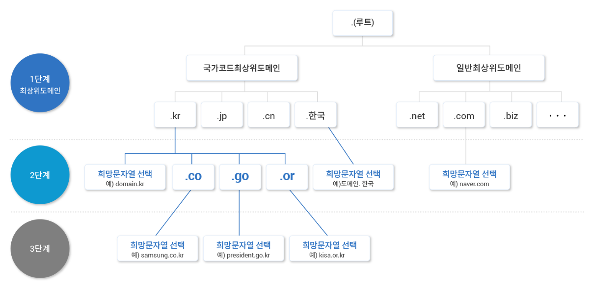

# DNS의 동작 원리

## 1. DNS란 무엇인가?
인터넷을 사용할 때 우리는 `google.com`, `naver.com` 같은 도메인 주소를 입력하지만, 실제 인터넷은 **IP 주소(예: 142.250.190.78)** 를 기반으로 동작한다.  
이 작업은 DNS가 해주는데 DNS 덕분에 우리는 복잡한 숫자가 아닌 사람이 이해하기 쉬운 문자 주소를 사용할 수 있다.
즉, DNS(Domain Name System)는 **도메인 주소를 IP 주소로 변환하는 시스템**이다.

## 2. DNS 계층 구조
전세계에 인터넷 사용자의 DNS를 하나의 서버로 관리한다는 것은 불가능하다.  
그래서 수많은 DNS가 아래와 같이 계층적으로 협력해서 도메인 주소를 처리한다.

- Root Domain
  - Root NS에서 관리한다.
  - 전 세계에 13대 존재하는 최상위 네임서버이다.
  - "www.google.com." 이렇게 맨 뒤에 붙는 `.`을 의미하는데 일반적으로 생략하는 편이다. 
  - 최상위 도메인인 TLD(Top-Level-Domain)의 도메인의 위치를 알려준다.
- Top Level Domain
  - TLD NS에서 관리한다. 
  - 최상위 도메인으로 .com, .kr 등의 맨 뒤에 붙는 도메인 등록기관이 관리한다.
  - 그 아래 계층의 도메인의 위치를 알려준다.
- Sub Domain
  - Sub Domain NS에서 관리한다. 
  - Top Level Domain 아래의 계층은 전부 Sub Domain으로 부른다.
  - 여기부터는 위와 같이 자신의 하위계층의 위치를 알고 있다.

이처럼 도메인 주소는 맨 뒤부터 해석하면서 IP를 찾아 나간다.  
아래 동작과정에서 더 자세히 알아보자.

## 3. DNS의 동작 과정

1. 사용자가 `www.google.com` 검색
   - 브라우저는 입력된 텍스트가 URL인지 검색어인지 판단
   - `.com`, `.net`, `.kr` 등의 도메인 형식이 포함되어 있으면, URL로 인식하고 DNS 요청 진행
   - 띄어쓰기가 포함되어 있으면, 검색어로 판단하여 기본 검색 엔진으로 요청 진행
2. 브라우저 캐시 확인
   - 사용자가 `www.google.com`을 입력하면 **브라우저 캐시**를 확인한다.
   - 최근에 방문한 사이트라면 브라우저에 저장된 IP 주소를 사용하여 바로 접속 가능
3. hosts 파일 확인
   - 브라우저 캐시가 없다면 컴퓨터 **내부의 hosts 파일**을 확인한다.
   - hosts 파일에 `www.google.com` 도메인의 IP 주소가 존재한다면 바로 접속
   - 없다면 **로컬 DNS 서버로 요청**을 보낸다.
4. 로컬 DNS 서버로 요청
   - 로컬 DNS 서버 자체의 캐시를 확인하여 도메인에 대한 IP 주소가 존재하면 바로 반환한다.
   - 예를 들어 A 사용자가 IP를 반환받고 캐싱을 해두면 B 사용자가 접근할 때 이 캐시로 IP를 반환받는다.
   - 캐시가 없다면 Root 네임서버로 질의 시작
5. Root 네임서버로 요청
   - Root 네임서버는 ICANN이 관리하며 전 세계에 13대 존재
   - Root NS는 `www.google.com`의 IP를 직접 제공하지 않는다.
   - `com`을 알고 있는 TLD 네임서버의 주소를 알려준다.
6. TLD 네임서버로 요청
   - 여기에서도 `www.google.com`의 IP를 직접 제공하지 않는다.
   - `google.com`을 관리하는 네임서버의 주소를 알려준다.
7. Sub Domain 네임서버로 요청
   - 이 네임서버는 `www.google.com`의 정확한 IP 주소를 반환한다.
8. IP 주소 반환
   - Sub Domain에서 받은 IP를 로컬 DNS 서버를 거쳐서 브라우저에게 전달한다.

DNS는 단순히 도메인을 변환하는 것이 아니라 여러 개의 네임서버가 협력하여 IP 주소를 찾는다.  
즉, 각 네임서버는 모든 정보를 알고 있는 것이 아니라 각자 전담하는 정보와 추가 정보를 알고 있을 뿐이다.

## 4. 캐시와 TTL
DNS 동작 과정을 보면 조회 속도를 높이기 위해 여러 단계의 DNS 캐시를 활용한다.  
하지만 도메인의 IP 주소는 변경될 가능성이 있기 떄문에 TTL을 적용하고 있다.

### 브라우저 캐시
- 브라우저는 DNS에서 반환된 TTL 값을 기본적으로 따르지만 자체적인 정책으로 변경할 수 있다.
- 또한, 브라우저를 재시작하면 DNS 캐시가 초기화되므로 최신 IP를 반환받을 수 있다.

### 로컬 DNS 서버 캐시
- TTL이 유지되는 동안 캐싱하여 빠르게 응답할 수 있다.
- TTL이 지나면 새로운 DNS 쿼리를 통해 최신 정보로 갱신한다.

### hosts 파일
- TTL이 존재하지 않으며 변경되지 않는 한 계속 유지된다.
- 하지만 사용자가 직접 도메인과 IP를 수동으로 입력해야하므로 DNS 과정에서 문제가 생길 일은 없다.

> 캐싱에 의해 오래된 IP를 반환하면 어떻게 될 지 궁금해서 알아보았다. 

## 5. 재귀적 질의 vs 반복적 질의
DNS 질의 방식에는 **재귀적 질의**와 **반복적 질의** 가 있다.

### 재귀적 질의
- 사용자가 로컬 DNS 서버에 한 번 요청하면 로컬 DNS 서버가 대신 끝까지 IP를 찾아 반환
- 사용자는 한 번만 요청하고 기다리면 된다.
- 브라우저에서 로컬 DNS 서버로 요청할 때 주로 사용된다.

### 반복적 질의
- 로컬 DNS 서버가 Root NS → TLD NS → 도메인 NS 순으로 직접 질의해야 함
- 각 네임서버는 "다음 네임서버는 여기 있어!" 하고 알려줄 뿐, 직접 요청을 수행하지 않음
- 네임서버 간 통신에서 주로 사용된다.
- 터미널에서 `nslookup`으로 직접 차근차근 찾아간다면 반복적 질의라고 할 수 있다.([참고](https://youtu.be/XXzxetbAIfA?t=1163))

## 참고
[널널한 개발자 - DNS](https://youtu.be/XXzxetbAIfA)
[테코톡 - 엘리의 DNS](https://youtu.be/sDXcLyrn6gU)
[KISA - 도메인 체계](https://www.kisa.or.kr/1020704)