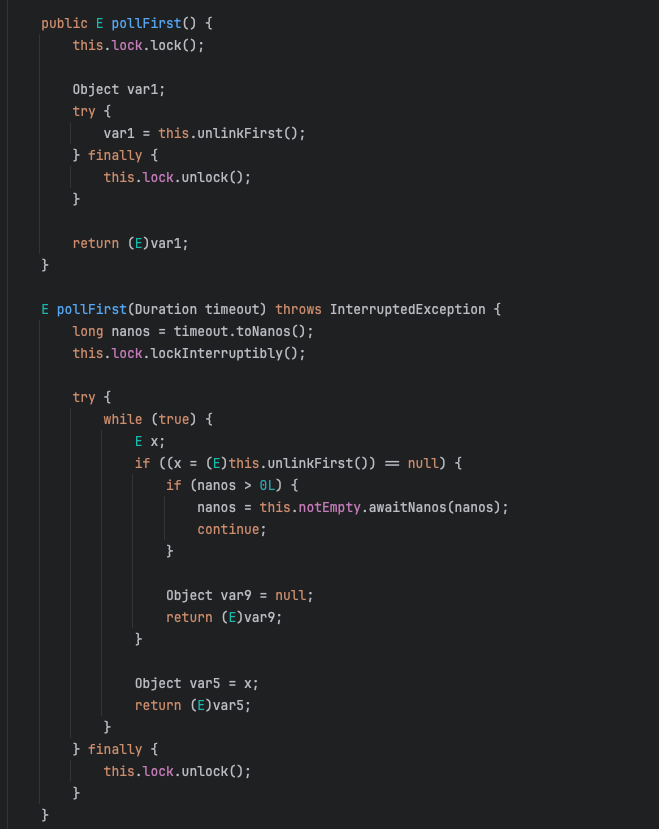
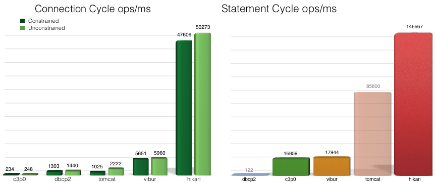
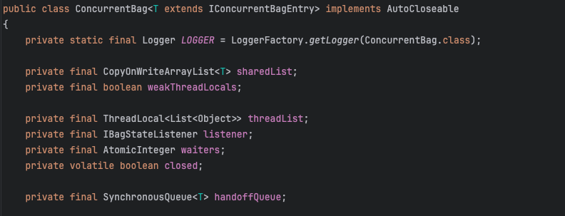
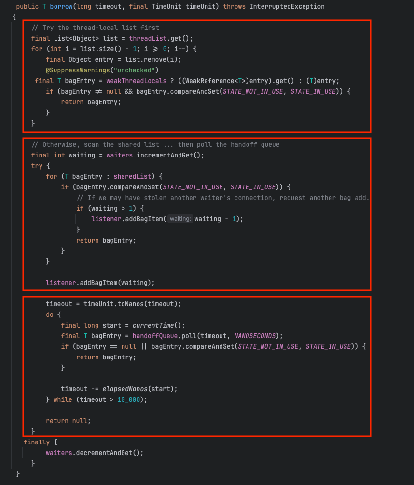
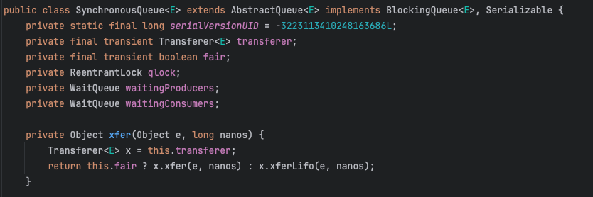
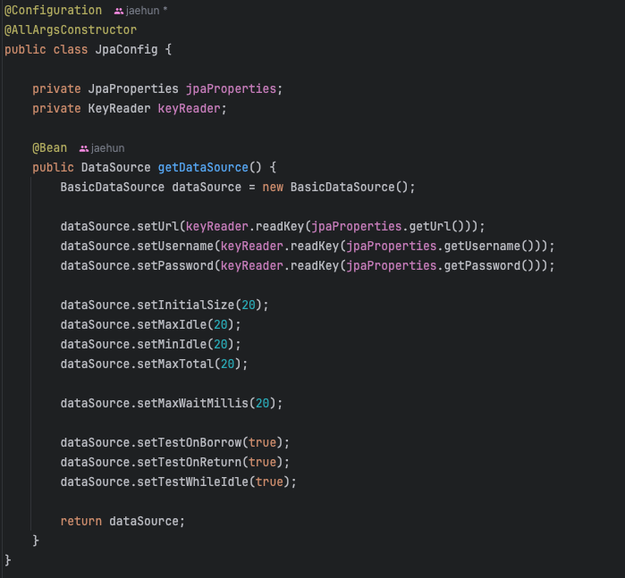

# DBCP2에서 HikariCP로 전환

NHN Academy에서 진행했던 InkBridge 프로젝트는 DBCP2를 커넥션 풀로 사용하고 있다. 그러나 현재 스프링부트의 기본 커넥션 풀은 HikariCP이다.  
이 부분에 의문이 들어서 두 커넥션풀에 대해서 공부해보고 나서 HikariCP로 전환하기로 결정하였다. 
이 글에서는 그 과정에 대해서 설명해보겠다.


## 1. DBCP2

DBCP는 Apache Commons 프로젝트에서 제공하는 커넥션 풀이다. DBCP는 오랜 기간 동안 사용되었으며, 많은 레거시 시스템에서 사용되고 있다.  
2002년에 DBCP1이 출시되었지만 1.x버전대에서는 성능이 부족하고 멀티스레드 환경에서 동기화 이슈가 종종 발생했다고 한다.   
DBCP2는 DBCP1의 후속 버전으로 2014년에 출시되어 성능 개선 및 버그 수정이 이루어졌다.  

### 1.1 내부구조


위 클래스는 DBCP2의 메인이 되는 클래스이다. 각 필드의 역할을 살펴보자
- ONAME_BASE
  - 여러 개의 GenericObjectPool 인스턴스를 사용할 때 구분하기 위해 사용된다.
- factoryType
  - 커넥션풀 객체를 생성해주는 팩토리 타입의 정보이다.
- maxIdle, minIdle
  - 커넥션 풀에서 유지하는 유휴(일을 하지 않고 쉬고 있는) 커넥션 객체의 최소, 최대 개수이다.
- factory
  - 타입에서 볼 수 있는 풀에 있는 각 요소들을 관리한다. 이 클래스는 커넥션 풀을 말하고 있으므로 커넥션을 관리한다고 볼 수 있다.
  - 커넥션을 생성하고 제거 하는 등의 관리를 한다.
- allObjects
  - 커넥션 풀에 존재하는 모든 커넥션을 관리하는 맵(ConcurrentHashMap 사용)이다.
  - Key: IdentityWrapper<T> (커넥션 식별자)  
    Value: PooledObject<T> (커넥션)
- creatCount
  - 생성된 객체의 총 개수를 저장하는 변수
- makeObjectCount
  - 현재 풀에서 객체를 생성하려고 시도한 횟수
- makeObjectCountLock
  - makeObjectCount을 증감할 때 스레드 동기화를 위한 락객체이다.
  - makeObjectCount를 보면 long타입을 사용하기 때문에 동기화의 위험이 있다. 이 객체가 멀티쓰레드 환경에서의 동기화 관리를 한다.
- idleObjects
  - 유휴(쉬고있는)상태의 객체를 관리하는 큐이다.

각 필드들은 위와 같고 여기서 더 확인해볼 것은 idleObjects인 것 같아서 일부분만 확인해보자.  

  
LinkedBlockingDeque의 poll메서드만 가져왔는데 거의 모든 메서드에서 위처럼 lock을 사용한다.
미리 말하자면 hikariCP는 lock을 거의 사용하지 않고 CAS연산으로 동시성을 해결해서 lock 비용이 발생하지 않는다.

### 1.2 커넥션을 빌리는 과정
DBCP의 커넥션을 빌리고 반납하는 과정은 단순하다.  
유휴 커넥션을 확인하고 있으면 즉시 빌려준다. 유휴 커넥션이 존재하지 않는다면 최대 생성가능한 커넥션 수 안에서 새로운 커넥션을 생성하거나 기다리게 된다.  

DBCP2에 관해서 더 자세한 내용이 궁금하다면 [Naver D2 - DBCP](https://d2.naver.com/helloworld/5102792) 에서 확인해보도록 하자.  
추가적으로 참고한 내용도 맨 아래에 참고링크를 남겨두었다.

## 2. HikariCP

HikariCP는 성능과 안정성을 고려하여 설계된 커넥션 풀이다.  
2012 ~ 2013년 쯤에 출시되어 2018년 스프링부트 2부터 기본 커넥션 풀로 채택되어 현재까지 기본 커넥션으로 사용되고 있다.

### 2.1 벤치마크 테스트

HikariCP 깃허브에서 제공하는 벤치마크 결과를 보면 HikariCP는 DBCP2를 포함해 어떤 커넥션 풀보다 속도가 성능이 좋은 것을 확인할 수 있다.  

  
[출처: HicariCP 깃허브](https://github.com/brettwooldridge/HikariCP)

#### **2.1.1 Connection 획득 및 반납 속도**
- **Connection Cycle ops/ms**는 새로운 커넥션을 획득하고 반납하는 속도를 측정한 것이다.  
- HikariCP는 `DataSource.getConnection()`, `Connection.close()` 성능에서 다른 커넥션 풀 대비 우수한 처리량을 보인다.

#### **SQL Statement 실행 속도**  
- **Statement Cycle ops/ms**는 SQL Statement를 실행하는 속도를 측정한 것이다.
- `Connection.prepareStatement()`, `Statement.execute()`, `Statement.close()`에 대한 성능에서도 HikariCP가 가증 높은 처리량을 보여준다.


### 2.2 성능이 좋은 이유
[HicariCP 깃허브](https://github.com/brettwooldridge/HikariCP/wiki/Down-the-Rabbit-Hole)을 보면 아래와 같은 내용이 나온다.  

커넥션 풀 성능은 단순히 커넥션 획득 속도가 전부가 아니다.
- 일반적으로 `getConnection()` 속도가 중요하다고 생각할 수 있지만, 실제로는 JDBC의 다른 요소들도 중요한 성능 요소이다.
- 특히 Connection, Statement, ResultSet 등을 관리하는 내부 구조가 더 중요한 성능 개선 요소가 될 수 있다.

라고 말하면서 아래와 같이 성능을 어떻게 개선했는지 말해준다.

1. **JIT컴파일러 최적화를 통해 바이트코드 단위까지 최적화가 이루어져 있다.**
2. **FastList : ArrayList를 최적화한 리스트**
    - 기존 JDBC 구현에서는 **ArrayList<Statement>**를 사용하여 Statement를 저장했으나, HikariCP는 **대부분의 JDBC Statement가 생성된 역순으로 닫힌다는 패턴을 분석하여, 역순 검색이 빠른 `FastList`를 직접 구현
3. **ConcurrentBag : HikariCP에서 자체 개발한 lock-free 컬렉션**
    - 전통적인 `BlockingQueue` 대신, 락 없이 스레드 사이에 안전한 커넥션 공유를 할 수 있게 구현
    - ThreadLocal 캐싱과 Queue-Stealing방식으로 커넥션 풀의 성능을 극대화 
    - Queue-Stealing : 특정 스레드가 할당받을 커넥션이 부족하면 다른 큐에서 사용 가능한 커넥션을 가져와 즉시 재사용한다.
4. **invokevirtual에서 invokestatic로 메서드 호출 방식 최적화**
   - 기존 JDBC 구현에서는 싱글턴 패턴을 통해서 statement(Connection, Statement, ResultSet)를 관리했는데 이렇게 하면 스택 접근이 추가되어 성능이 저하된다고 한다.
   - HikariCP는 정적 메서드를 사용하여 JVM의 인라인 최적화를 유도하고 불필요한 스택 연산을 제거함으로써 성능을 향상시켰다.
5. **OS 및 CPU 레벨 최적화**
    - 운영체제는 하나의 CPU 코어에서 수백 개의 스레드를 실행할 수 없기 때문에, 각 스레드가 조금씩 실행되도록 시간을 나누어 할당한다. 이시간을 퀀텀이라고 한다.
    - 스레드는 한 번 실행될 때 최대한 많은 작업을 해야 성능이 향상되는데 HikariCP는 모든주요 메서드가 하나의 퀀텀 내에서 실행될 수 있도록 최적화했다.
6. CPU 캐시 최적화
    - 캐시 친화적인 알고리즘을 사용하여 캐시 미스를 최소화한다.

즉, HikariCP는 단순한 커넥션풀이 아니라 JVM 바이트코드, CPU 캐시, OS 스케줄러까지 고려하여 최적화를 진행한 커넥션풀이다.

### 2.3 내부구조
아래는 HikariPool안에 들어있는 가장 메인이 되는 클래스라고 볼 수 있다. 이 클래스를 통해서 커넥션을 부여하고 반납한다.

**ConcurrentBag.class**

  

각 필드의 역할을 살펴보자.

- threadList
  - 쓰레드가 한번 사용했던 커넥션을 저장해두고 빠르게 사용하기 위한 ThreadLocal 저장소
- sharedList
  - 존재하는 모든 커넥션이 저장되어 있는 큐
- handoffQueue
  - SynchronousQueue을 사용하며, 스레드간 데이터 교환을 위해 사용하는 큐
- waiters
  - 현재 커넥션을 기다리고 있는 스레드의 개수를 저장하는 변수이다. 대기중인 스레드가 커넥션을 획득하거나 반납할 때 값이 변한다.
- listener
  - 풀의 상태변화를 감지하고, 외부에 알리는 역할을 한다. 즉, 새로운 커넥션이 필요할 떄 알림을 보내는 역할을 한다.


**ConcurrentBag - borrow method**    
HikariCP는 DBCP와 다르게 크게 3단걔로 나눠서 커넥션을 획득한다. borrow 메서드를 보면서 확인해보자. 



크게 위 세 영역으로 나눌 수 있다.  
- **threadList를 관리하는 잉역**
  - 맨 위 영역은 `threadList`와 관련된 부분인데 쓰레드가 이전에 사용했던 커넥션이 이 ThreadLocal에 저장이 된다.
  - 그래서 먼저 이 영역을 탐색하고 저장된 커넥션이 유휴 커넥션이라면 바로 사용을 한다.
  - 이미 참조 위치가 저장되어 있기 떄문에 빠르게 커넥션을 획득할 수 있다.
- **sharedList를 관리하는 영역** 
  - 만약 threadList에서 전에 사용했던 커넥션이 모두 사용중이라면 이 영역으로 넘어온다.
  - 여기는 모든 커넥션들이 저장된 공간이고, 유휴 커네션이 있다면 이 공간에서 커넥션을 빌려간다.
- **handoffQueue를 관리하는 영역**
  - 만약 모든 커넥션이 사용중이라면 이 영역으로 넘어온다.
  - 여기서는 커넥션을 얻어야하는 스레드가 커넥션을 기다리는 공간이다. 기다리다가 큐 혹은 스택의 방식으로 커넥션을 획득하게 된다.

그리고 전반적으로 `compareAndSet`메서드가 사용된 것이 보이는데 이것은 CAS(Compare-And-Swap)연산을 수행하는 메서드이다.  
멀티 스레드 환경에서 락없이 안전하게 공유 변수의 값을 변경할 수 있게 해준다. 여기서는 커넥션의 상태를 변환하는데 쓰인다.

**SynchronouseQueue**  

  

이것은 마지막 handoffQueue 타입의 구현체이다.  
BlockingQueue를 구현하고 있지만 전통적인 BlockingQueue와는 다르다.
일반적인 큐와는 다르게 버퍼가 없기 때문에 큐의 크기가 0이다. 그래서 커넥션을 저장하고 있는게 아니라 기다리는 쓰레드에게 커넥션을 직접 전달해준다.  
그리고 여기에 직접적으로 가담하는 클래스가 transfer클래스이다.


## NHN Academy에서 DBCP2를 사용한 이유와 나의 생각
NHN Academy에서 HikariCP 대신 DBCP2를 사용하라고 했을 때 그 이유에 대한 질문이 많았다고 한다.  
그래서 NHN Academy 강사님들이 해주신 답변과 함게 내 생각을 적어보겠다.  

- 먼저 강사님들은 DBCP가 오랜 역사와 안정성을 갖추고 있다고 하셨다. 실제로 DBCP는 2000년대 초반부터 등장해서 많은 레거시 시스템에서 사용된 것 같다.  
  그러나 내가 조사한 바로는 HikariCP 역시 2012년에 출시되어 이미 충분히 오랜 기간 안정성을 검증받았다는 것을 알아냈다.  
  또한, 스프링부트 2버전부터 기본 커넥션풀로 선정된만큼 안정성과 성능은 충분히 검증되었다고 생각한다.
- 두번째로 강사님들은 DBCP2가 HikariCP에 비해 정확성에 치중하고 있다고 했다. 여기서 말하는 정확성이 어떤 의미인지 명확하지는 않지만, 아마도 커넥션 유효성 검증에 대한 것이 아닐까 싶다.  
  실제로 DBCP는 `setTestOnBorrow`, `setTestOnReturn` 등의 설정으로 커넥션을 빈번하게 검증한다.
  HikariCP는 내부적으로 DBCP처럼 커넥션을 빌려주고 반납할 때 검증을 하지는 않지만 jdbc의 isValid메서드를 활용해서 더 효율적으로 검증을 진행한다고 한다.
  또한, DBCP의 검증 옵션은 실제로 DB에 쿼리문을 날려서 검증을 하게 되는데, [히카리 개발자의 답변](https://github.com/brettwooldridge/HikariCP/issues/766)을 보면 검증보다는 새로운 커넥션을 생성하는 것의 비용이 더 싸다고 한다.  
  DBCP는 빌려주고 반납할때마다 쿼리문을 날리기 떄문에 비용이 더 비싸다고 볼 수 있다.
- 세번째로 강사님들께서 HikariCP가 복잡하고 기본 설정으로 사용할 경우 장애 가능성이 높다고 언급하셨다.  
  그러나 Spring Boot 공식 문서를 포함한 다양한 자료를 조사한 결과, HikariCP는 오히려 기본 설정만으로 충분히 최적화된 성능과 안정성을 제공한다는 것을 확인했다.  
  또한, 트러블슈팅 사례들이 있긴 했는데 대부분 HikariCP 자체의 문제가 아니라 서비스 운영 과정에서의 설정 미스였으며, 커넥션 풀 자체의 문제는 아니었다.
   
더 말씀해주신게 있긴 하지만 건너 건너서 텍스트로 넘겨 받은 내용이라서 정확한 워딩이 파악이 안돼서 언급하지 않았다.  
하지만 대다수 이런 느낌의 내용이었다.  
그리고 [스프링부트 공식문서](https://docs.spring.io/spring-boot/docs/2.0.0.M7/reference/html/boot-features-sql.html)의 29.1.2 Connection to a Production Database 섹션을 보면 We prefer HikariCP for its performance and concurrency. If HikariCP is available, we always choose it. 이렇게 나와있다.  
동시성과 성능 때문에 선택지에 HikariCP가 있다면 HikariCP를 선택한다고한다.

이러한 생각들때문에 HikariCP를 사용하기로 했지만, 강사님들은 오랫동안 실무를 해오신 분들이기 때문에 섣불리 DBCP2보다 HikariCP가 모든면에서 뛰어나다는 말은 못하겠다.  
경험에서 나온 조언들일 것 같기 떄문이다. 그래서 며칠동안 관련 자료들을 찾아본건데 HikariCP에 문제가 있다는 자료는 찾지 못해서 찝찝한 기분이 든다.  
오랫동안 실무에 있었고, 레거시 프로젝트에서는 DBCP2를 사용하는 경우가 많을 것 같은데 그렇기 때문에 DBCP2를 사용하시는 게 아닐까 싶기도 하고, HikariCP를 사용하다가 심하게 장애가 난적이 있어서 그때부터 꺼리신걸까라는 생각도 들었다.  
기회가 된다면 여쭤보고 싶다


## 현재 InkBridge 커넥션 풀 설정과 전환 가능성 확인

현재 inkbridge 프로젝트에 설정된 커넥션풀 설정은 아래와 같다.
세밀한 설정을 위해서 DBCP2를 사용해야 한다는 의견과 함께 아래 우리 프로젝트에서 커넥션풀을 설정한 내용을 확인해보자.  



- dataSource.setInitialSize(20)
  - 커넥션 풀 시작 시, 생성할 초기 커넥션 개수이다. 기본값 0
  - 풀 시작과 동시에 일정 갯수를 생성해두어서 첫 호출의 지연을 줄일 수 있다
- dataSource.setMaxIdle(20)
  - 커넥션 풀 내에서 유휴 커넥션의 최대 개수. 기본값 8
- dataSource.setMinIdle(20)
  - 커넥션 풀 내에서 유휴 커넥션의 최소 개수. 기본값 0
- dataSource.setMaxTotal(20)
  - 커넥션 풀에 존재할 수 있는 최대 커넥션 수. 기본값 8
- dataSource.setMaxWaitMillis(20)
  - 커넥션을 빌리기 위해 대기할 수 있는 최대 시간. 기본값 (30000밀리초) = 30초
  - 여기서는 20으로 설정되어 있는데 이건 20ms라는 의미이다. 최대 20ms만 대기하고 그 시간이 지나 예외가 발생한다.
  - 왜 이렇게 설정되어있는지 모르겠는데 20ms는 너무 짧다. 웬만하면 요청이 다 실패할 것 같다는 생각이 든다. 이떄는 아무래도 모두가 처음 프로젝트를 했기 때문에 이게 무슨 의미인지 모르고 설정을 했던 것 같다. 
- dataSource.setTestOnBorrow(true), dataSource.setTestOnReturn(true)
  - 커넥션을 빌려가고 반납할떄마다 유효성 검사를 한다. 빌릴때마다 쿼리가 실행되기 때문에 성능 부담이 증가할 수 있다.
- dataSource.setTestWhileIdle(true)
  - 유휴 상태인 커넥션들도, 일정한 주기로 검사하겠다는 설정이다. 이 또한 Idle상태인 커넥션으로 주기적인 쿼리를 날리기 때문에 DB 부하가 증가할 수 있다.

이 설정들을 HikariCP로 바꿀 수 있는 지 확인해보자.

- initialSize -> HikariCP에는 존재하지 않음
  - HikariCP는 lazy creation을 통해서 필요할 떄 커넥션을 생성한다. 
  - 이것을 설정하지 않는다고 해서 성능에 영향이 가진 않는다. 만약 HikariCP에서도 이 설정이 필수라고 생각했다면 넣었을 것이고, 위에서 커넥션을 주기적으로 검증하는 것보다 새로 생성하는 것이 비용이 더 싸다고 한 점에서 크게 문제 되지는 않는다고 생각한다.  
- maxIdle -> HikariCP에는 존재하지 않음
  - HikariCP는 Idle과 Active를 구분하지 않고, 풀 전체 크기와 maxIdle을 maximunPoolSize로 관리한다.
  - 그래서 minimumIdle이상 maximunPoolSize이하 범위에서 자동으로 조절한다.
- minIdle -> setMinimumIdle. 기본값 10
- maxTotal -> setMaxTotalPoolSize. 기본값 10
- maxWaitMillis -> setConnectionTimeout 기본값 30000밀리세컨드 = 30초
  - DBCP2에서 이 옵션을 따로 설정하지 않으면 -1로 설정되어 무한대기가 된다. 하지만 HikariCP는 무한대기를 지원하지 않는다.
  - 무한대기는 커넥션 풀이 고갈되었을 때 영원히 깨어나지 못해 장애 분석이 어려워지므로 HikariCP는 풀 고갈 상황에서는 빨리 예외를 던지고 문제를 인지시키는 설계를 지향한다.
  - 설정값에 정해진 답은 없고 상황에 맞춰서 설정하는 게 중요한 것 같다. 하지만 프로젝트에 설정된 20ms는 너무 짧은 시간이기 때문에 일단은 default값을 사용하겠다.
- testOnBorrow(true), testOnReturn(true), testWhileIdle(true) -> 따로 존재하지 않음
  - 커넥션을 빌릴 때, 반납할 때 유휴 상태일 때 전부 쿼리를 보내서 커넥션 유효성 검사를 진행하는데 HikariCP에서는 jdbc의 isValid 메서드를 통해 커넥션이 필요하거나 생성시점에 검증을 한다.
  - 또한 쿼리를 통해 검증을 하는 것이 아니기 때문에 I/O비용이 들지 않아서 더 효율적이다. 
  - 그리고 매번 쿼리로 검증을 하는것보다 커넥션을 제거하고 생성하는 것이 더 효율적이라고 한다. 일반적으로 수십밀리 세컨드 정도 걸린다고 한다.
  - 또한 HikariCP에는 keepaliveTime이라는 기능이 있기 떄문에, 필요하다면 해당 옵션을 통해 유휴 상태의 커넥션의 검증을 쿼리로 확인할 수 있다. 
  - idleTimeout 옵션을 통해 오랫동안 사용되지 않은 커넥션을 제거하기도 해서 커넥션에 대한 신뢰도를 증가 시킬 수 있다. 이처럼 다른 방식으로 커넥션 풀에 대한 신뢰도를 챙긴다.

이 부분을 정리하면서도 HikariCP가 DBCP에 비해 안정성이 더 좋다는 것에 확신이 들었다.  
기본값으로 사용할 시 장애 발생 확률이 더 큰 것은 DBCP2이다.  
가장 안전한 설정은 초기 커넥션 수, 최소 유휴 커넥션 수, 최대 유휴 커넥션 수, 최대 커넥션 수를 같은 값으로 맞춰주는게 가장 안전한 설정이라고 한다.  
왜냐하면 idle값의 차이가 있을 시에는 커넥션풀에게 커넥션 생성의 책임을 많이 맡기게 되는 것이기 때문이다.   
DBCP2는 기본 유휴커넥션 최대값, 최솟값이 다르기 때문에 기본으로 사용한다면 잡기 힘든 에러가 더 생길 수 있다.
반면 HikariCP는 최대 유휴커넥션 수와 최대 커넥션 수를 동일하게 맞춰두고 최소 유휴커넥션 수도 기본값으로는 같은 값으로 맞춰두기 때문에 더 안전하다고 볼 수 있다.  
그런데 이렇게 같게 설정하는 것이 안전하긴 하지만 서비스의 상황에 맞춰서 설정하는 게 합리적이다. 


그럼 결과적으로 현재 프로젝트를 HikariCP로 변경하면 아래와 같다. 
```java
@Bean
public DataSource hikariDataSource() {
    HikariConfig config = new HikariConfig();

    config.setJdbcUrl(keyReader.readKey(jpaProperties.getUrl()));
    config.setUsername(keyReader.readKey(jpaProperties.getUsername()));
    config.setPassword(keyReader.readKey(jpaProperties.getPassword()));

    // 커넥션 풀 크기
    config.setMaximumPoolSize(20);  // 최대 커넥션 개수 (maxTotal 대체)
    config.setMinimumIdle(5);       // Idle 최소 개수 (minIdle 대체)
    
    // HikariCP는 maxIdle 개념 없음 -> 자동으로 조절됨

    // 커넥션을 얻기 위한 대기 시간
    config.setConnectionTimeout(30000); // 30초 (maxWaitMillis 대체)

    // 유효성 검사 관련 설정
    config.setConnectionTestQuery("SELECT 1"); // DBCP의 validationQuery 대체
    config.setKeepaliveTime(30000);  // 30초마다 Keepalive 쿼리 실행 (DBCP에는 없는 기능)
    config.setIdleTimeout(60000);    // 60초 이상 Idle이면 제거 (minEvictableIdleTimeMillis 대체)
    config.setMaxLifetime(1800000);  // 30분(1800초) 후 커넥션 새로 생성 (DB 세션 유지 문제 방지)

    return new HikariDataSource(config);
}

```
일단 이렇게 바꾸면 될 것 같다.
하지만 DBCP 최적화 설정은 서비스 상황과 CPU등의 컴퓨터 사양에 맞춰서 설정해야 한다.  
그래서 변경한 값은 위 코드처럼 고칠 수 있지만 일단은 default값으로 두고 사용하고 적합한 옵션을 찾아볼 생각이다.

그러면 maxmumPoolSize와 minIdle은 10,  
Connetiontimeout은 30초,  
idleTimeout은 10분,  
maxLifeTime은 30분으로 설정된다. 나머지 설정들은 제거되고, 검증은 isValid로 자동화된다.

## 참고
[우아한 형제들](https://techblog.woowahan.com/2664/)  
[Naver D2 - DBCP](https://d2.naver.com/helloworld/5102792)  
[HikariCP 깃허브](https://github.com/brettwooldridge/HikariCP)  
[SynchronusQueue 참고 블로그](https://m.blog.naver.com/jjoommnn/130171358905)  
[DBCP 참고 블로그](https://jh-labs.tistory.com/595)  
[DBCP 깃허브](https://github.com/apache/commons-dbcp)  
[HikariCP 속도 비교](https://dev-ws.tistory.com/106)  
[HikariCP idle connection valid](https://pkgonan.github.io/2018/04/HikariCP-test-while-idle)
