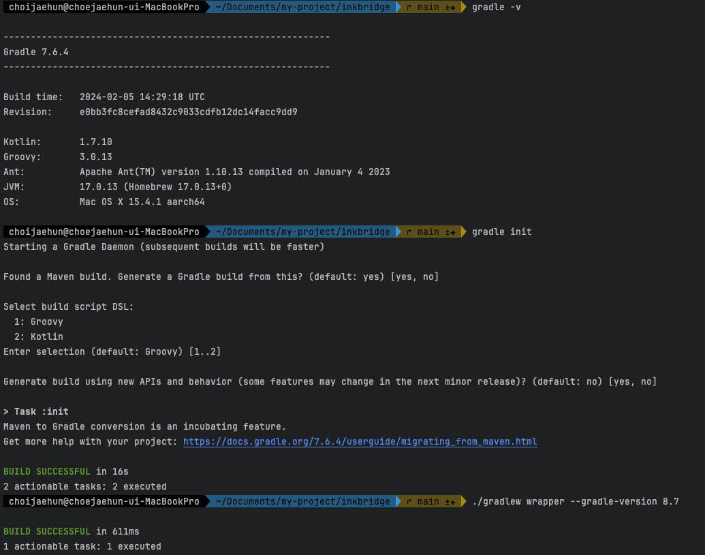
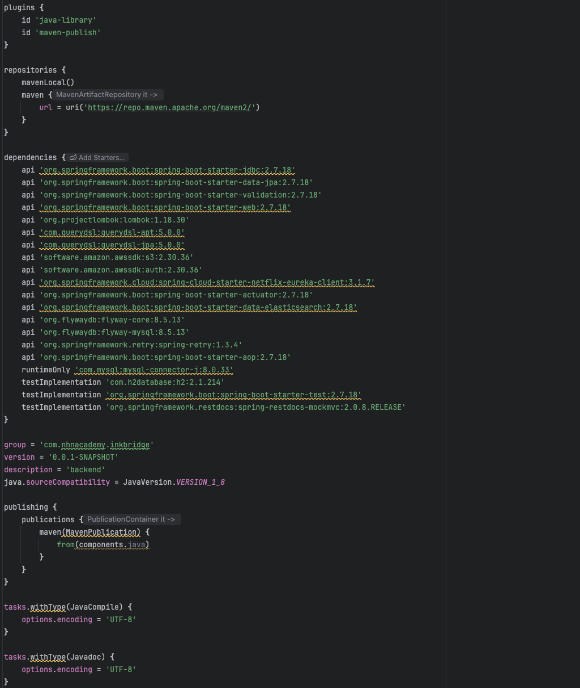
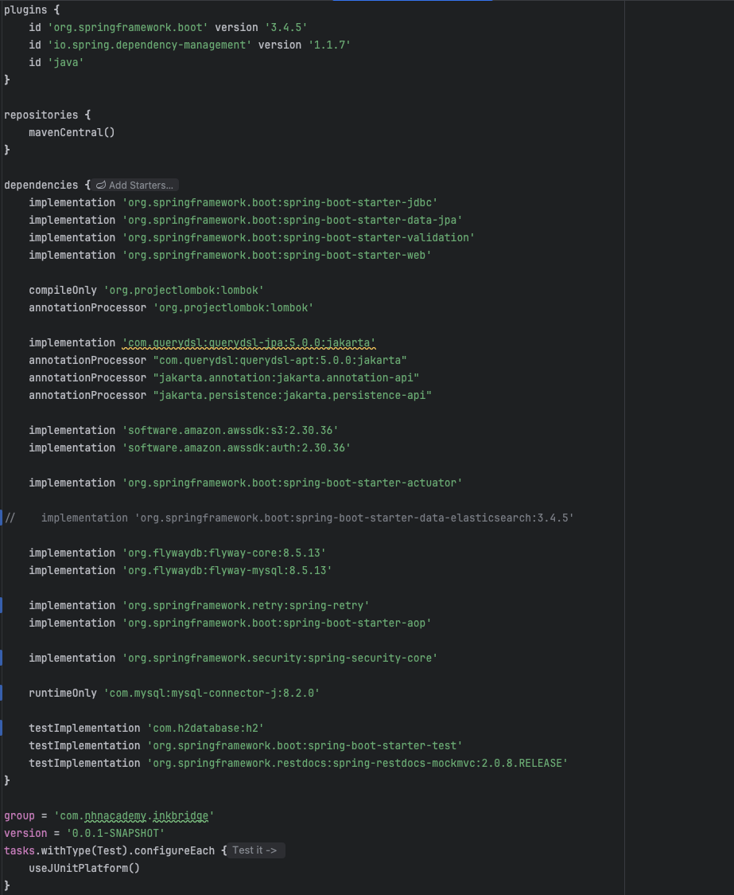
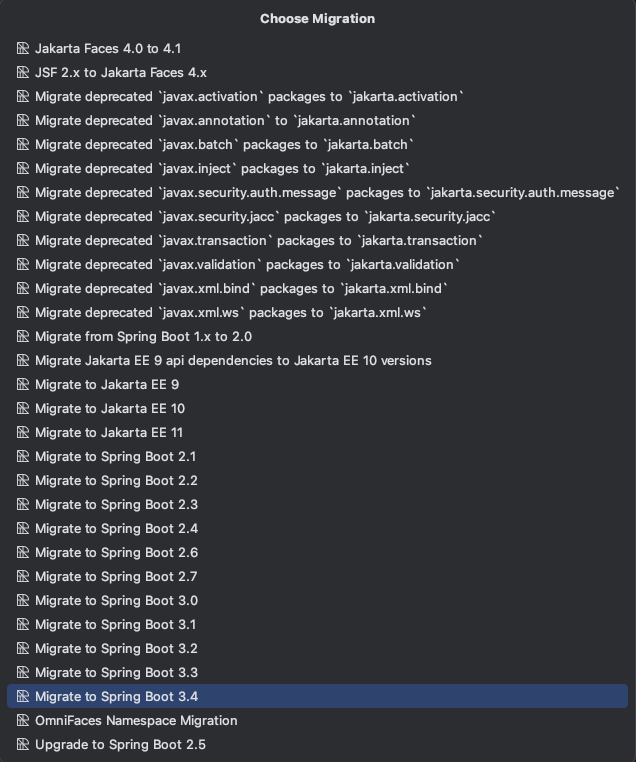

# Java 11에서 17, Maven에서 Gradle, Spring Boot 2.7에서 3.4까지 마이그레이션

InkBridge 프로젝트를 리팩토링하던 중, 스프링 배치를 적용해야 할 시점이 왔었다.  
그래서 스프링 배치 공부를 5버전으로 했는데 스프링 부트 3 이상에서만 이 버전을 지원한다는 것을 알았다.
원래는 전반적인 리팩토링을 끝낸 뒤 마이그레이션을 진행하려고 했지만, 배치를 5버전으로 공부한 김에 지금 계획했던 마이그레이션을 하기로 했다.

마이그레이션 대상은 다음과 같다. 

- Java 11 -> Java 17
- Maven -> Gradle
- Spring Boot 2.7 -> Spring Boot 3.4

현재 스프링 부트의 가장 최신 버전인 3.4 버전으로 마이그레이션 하기로 했고, 그에 따라 자바 버전도 17이상으로 올려야 했다.  
그리고 기존 빌드 도구는 Maven이었는데 이 팀 프로젝트를 진행한 이후로는 Gradle만 사용하기도 했고, [Gradle - 공식 문서](https://gradle.org/maven-and-gradle/)에서 빌드 속도가 Gradle이 매우 빠르다고 나온다.     
또한 Maven과 Gradle을 비교해보면 확실히 Gradle이 가독성이 더좋다.   
실제로 코드 라인 수만 봐도 기존 Maven에서는 200줄에 달하는 라인이 gradle로 오니 50줄로 줄었다.

> 현재 프로젝트에서 바꾸고 싶은 부분이 너무 많아서 리팩토링이 무색하게 재구축 수준이 되어버려서 기존 코드에서 사용하던 의존성을 몇 개 제거하긴 했지만, 그걸 감안하더라도 코드 라인수가 많이 차이 난다.

## 마이그레이션 순서 및 이유

### 1. 자바 버전 11에서 17로 변경

- Spring Boot 3 이상으로 마이그레이션을 진행하려면 JDK 버전이 17 이상이어야 한다.
- JDK 버전은 올라가지만 프레임워크나 코드 변경 사항이 없다.
- 공부할 때 `record`나 `instanceof pattern matching`을 종종 사용했는데 11 버전에서는 이 기능들을 사용할 수 없어서 불편했다.

### 2. Maven에서 Gradle로 변경

- 첫 프로젝트 이후로는 계속 Gradle만 사용해왔기 때문에, 개인적인 익숙함과 생산성 측면에서 Gradle로 통일하는 것이 합리적이었다.
- Gradle은 빌드 속도가 빠르고, 코드 라인수가 적고 직관적으로 코드 파악이 가능해서 유지보수가 용이하다.
- 빌드 도구는 애플리케이션 로직과 무관하기 때문에 로직 관련 코드 수준에서는 변경 사항이 없다.
- Maven에 있는 설정들은 기존 코드를 가져와서 그 기반으로 사용한 것이라서 스프링부트 버전을 먼저 올리게 되면 Maven 기반에서 또 수정을 해야하는데 Maven이 익숙하지 않았다. 

### 3. Spring Boot 2.7 버전에서 3.4 버전으로 변경

- Spring Boot 3.x는 Jakarta EE로의 전환을 포함하여 API 네임스페이스 변경, 클래스명 변경 등 대규모 코드 수정이 수반된다.
- 스프링 배치나 스프링 시큐리티를 사용할 경우 동반되는 코드 수정이 생긴다.
- 사용 예정인 Spring Batch 5, Spring Security 최신 버전도 Boot 3.x 기준에 맞춰 학습하고 있었다.

## 마이그레이션 과정

### 자바 버전 변경 과정

자바 버전 변경은 빌드 도구와 IDE 수준에서 숫자 변경만 하면 되는데 빌드 파일에서 버전을 올리고,   
인텔리제이라면 **Run/Debug Configuration**과 **Project Structure**, **Settings** 에서 버전 정보를 변경해주면 된다.

### 빌드 도구 변경 과정
Gradle로 변경하는 과정 자체는 까다롭지 않은데 Gradle 버전 때문에 시간이 조금 걸렸다.  
왜냐하면 나의 경우에는 8.12버전이 다운로드되어 있었는데 8버전 이상부터는 gradle로 바꿀때는 `lib.versions.toml`이라는 버전 정보를 관리하는 파일이 생긴다.  
파일의 예시 형태는 아래와 같다.

```toml
# gradle/libs.versions.toml

[versions]
spring-boot = "3.1.4"
logback = "1.2.11"

[libraries]
spring-boot-starter-web = { module = "org.springframework.boot:spring-boot-starter-web", version.ref = "spring-boot" }
logback-classic = { module = "ch.qos.logback:logback-classic", version.ref = "logback" }

[plugins]
spring-boot = { id = "org.springframework.boot", version.ref = "spring-boot" }
```
이 파일이 생성되면 버전 정보 자체는 여기서 관리하게 되는데 나는 `build.gradle`에서 모든 버전정보를 관리하고 싶었다.  
그런데 8 버전에서는 `lib.versions.toml` 파일을 만들지 않는 방법이 없없고, 만든 후 해당 파일을 삭제하고 버전 정보를 다시 옮겨줘야했다.

반면 7 버전대에서는 해당 파일 없이 Maven에서 Gradle로 변경이 된다고 해서 Gradle을 다운그레이드해서 마이그레이션을 진행했다.


빌드 도구를 변경하는 방법 자체는 간단하다. 아래와 같이 진행하면 된다.



먼저 Maven에서 Gradle로 변경하려면 로컬에 Gradle이 다운로드 되어 있어야 한다.  
그 후, 프로젝트 루트 위치에서 gradle init 명령어를 입력하고 나면 어떻게 마이그레이션 할 지 안내를 해주기 때문에 그에 따라서 선택하면 된다.  

처음에는 기존 maven 빌드를 찾아내서 그걸 기반으로 gradle로 변경 여부를 묻고,  
script 언어를 선택 후 새로운 방식으로 만들건지 물어보는데 이건 기본값이 no이므로 no를 따라서 선택하면 된다. 


그리고 이렇게 설정하고 나면 gradle wrapper 버전 정보 업그레이드를 권장해서 8.12버전으로 다시 올렸다.
그 후 확인해보니 [스프링 공식 문서 - 권장 버전](https://docs.spring.io/spring-boot/system-requirements.html)에서 8버전에서는 8.4버전 이후를 권장해서 그 이후 버전으로 올렸다.

또한 이렇게만 끝내는 것이 아니라 `build.gradle` 혹은 `settings.gradle`을 우클릭 해서 **Link Gradle Project** 를 눌러줘야 마이그레이션이 완료가 된다.
여기까지 완료되면 우측에 코끼리가 생기면서 완전히 gradle로 전환이 된다.

이후에는 maven 관련 빌드 파일들을 제거해주면 된다.

참고로 이전 빌드 설정에 따라서 최적화된 상태로 gradle 전환이 안될 수 있다.  
나 같은 경우에는 아래와 같이 plugins도 스프링부트에 맞게 설정이 안 되어 있고, dependencies도 의존성 범위가 적절히 사용되지 않았다. 



그래서 이후에 적절하게 변경해주었다.  
이후 버전은 다른 프로젝트를 보고 적절히 변경했는데 아래와 같다.  
스크린샷을 찍지 않아서 마이그레이션 끝낸 후에 찍었다.  



### 스프링부트 버전 변경

이건 진짜 간단하다. 인텔리제이 얼티메이트 버전만 해주는건지는 모르겠는데 `build.gradle`파일 들어가서 오른쪽 위를 보면 run openrewrite migration이 뜬다.  
이거를 클릭하면 마이그레이션 할 수 있는 버전이 뜨는데 클릭만 하면 끝난다. 그래서 3.4버전으로 바로 변경하였다.




## 실제로 복잡한 프로젝트라면 어떻게 해야할까?
나 같은 경우에 처음 목적은 프로젝트 리팩토링으로 시작했는데 바꾸고 싶은 사항이 너무 많아서 거의 재구축이 되어 버렸다.  
그래서 기존 코드 사용을 안하게 돼서 삭제 해버렸다. 그래서 비교적 마이그레이션이 쉬웠다.  
실제로 복잡한 프로젝트나 리팩토링을 위한 마이그레이션을 해야한다면 더 복잡한 프로세스를 거쳐야 할 것이다. 
경험해보지는 않았지만 어떤 방식으로 할 지 한번 이야기 해보자면 아래와 같다.

1. 마이그레이션 전용 브랜치 생성
    - 예를 들어 `migration/to-java17`, `migration/to-gradle`, `migration/to-spring-boot-3.4` 이런식으로 분리
    - 실 서비스와 분리된 상태로 작업해서 기존 서비스에 영향을 없앤다.
2. 단계별 전환 및 테스트
    - 이건 이번에도 그대로 하긴 했지만 Java -> Gradle -> Spring boot 순서로 전환할 것이다. 
    - 영향의 범위가 적은 것부터 큰 순서로 이어지기 때문이다.
3. 테스트 커버리지
   - 기존 테스트가 부족하다면 테스트 코드를 만들고 마이그레이션 전후 동일 시나리오로 테스트를 진행한다.
4. CI/CD 등 점검
   - 빌드 시스템이 변경되었기 때문에 그에 맞춰서 CI/CD를 점검하고 이외의 다른 영향 받을 수 있는 시스템들을 점검한다.

뭔가 당연한 이야기를 써둔것 같은데 지금 생각나는건 이정도인 것 같다.