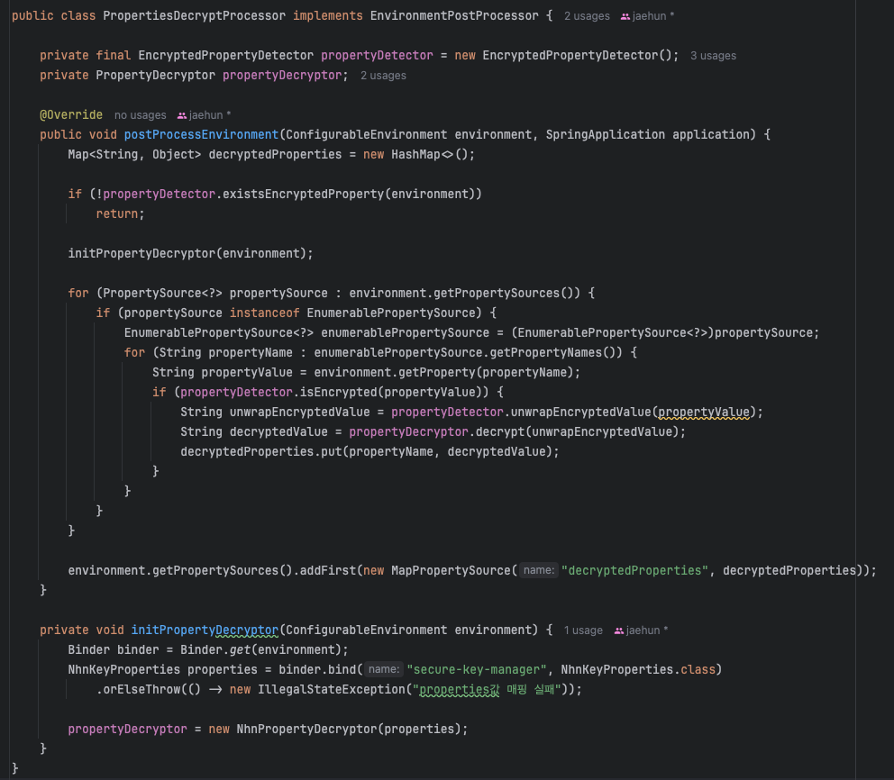

데이터베이스나 레디스 등의 접속 정보나 중요한 정보들을 퍼블릭한 공간에 노출한다면 보안이 취약해진다.  
만약 클라우드 관련 키를 노출한다면 요금 폭탄을 맞을수도 있다.  
그래서 설정키들을 깃허브나 도커허브에 올리면 위험하다.  
이 문제를 해결하는 가장 단순한 방법은 properties/yml 파일을 퍼블릭 공간에 업로드하지 않거나 환경변수로 처리해두는 것이다.  
이외에 여러가지 방법이 있지만 이 프로젝트는 key manager를 이용하여 보안이 필요한 설정키들을 암호화했다.  
key manager는 NHN Cloud에서 지원해주는 암호화 도구이다.  
Key Manager는 데이터베이스 접속 정보같은 중요 정보들의 원본데이터를 저장해두고 대칭키나 비대칭키를 사용해서 암호화를 진행한다.
스프링서버에는 암호화된 키를 설정파일에 저장해둔다.
그러면 스프링서버는 api 요청을 통해서 암호화키를 복호화하여 사용하게 된다.
AWS에도 KMS라는 Key Manager와 비슷한 서비스를 하고 있는것으로 알고 있다.
Key Manager에 대한 자세한 내용은 프로젝트를 진행할 때 정리해둔 [자료](https://github.com/nhnacademy-be4-InkBridge/docs/tree/main/SecureKeyManager)로 대신하겠다. 

이 코드를 다시 봤을 때 개선해야할 점은 두가지가 느껴졌었다.  

코드를 먼저 보자.

**KeyConfig.class**  
keyStore메서드로 복호화를 진행하는 코드이다.  
복호화 로직은 이 글과 직접적으로 상관은 없기 때문에 윗부분만 잘라왔다.

**JpaConfig.class**  
데이터베이스 접속 정보는 노출하면 안되기 때문에 암호화했고, keyConfig를 통해 복호화를 했다.

지금 나는 로컬에서 리팩토링을 하고 있기 때문에 키매니저를 굳이 사용할 필요가 없다.  
로컬정보이기 때문에 노출이 되어도 배포서버에 대한 정보만큼 위험이 크지 않고, 우려가 된다면 환경변수에서 데이터를 받아오면 된다.  
그러면 로컬에서 리팩토링할 때는 KeyConfig를 제거하고, 배포할 때는 다시 추가하면 되는걸까?  
너무 번거로운 작업이다. 또한, 지금은 JpaConfig만 보여줬지만 스토리지 서비스에서도 KeyConfig를 사용하고 있다. 중요 설정 파일이 증가할수록 KeyConfig는 여러 코드에 퍼져있을 것이다.  
그러면 점점 수정할 범위가 늘어난다. 그래서 설정값을 사용하는 클래스 입장에서는 자신이 암호화된 값을 사용하는지 암호화되지 않은 기본값을 사용하는지 모르게 하고, 사용하는 것 자체에만 집중하게 변경하였다.

key값 조회 클래스 구조

원래 구조에서 **KeyConfig.class**는 properties/yml의 설정값을 복호화해주는 역할을 한다.  
이 역할은 바뀐 구조에서 NhnKeyDecryptor로 변경하였다. 그리고 Key값들을 바로 받기보다는 NhnKMSProperties로 래핑해서 전달해주었다.

NhnKeyDecryptor는 KeyDecryptor 인터페이스를 구현하도록 했는데 그 이유는 클라우드 플랫폼 떄문이다.  
지금 프로젝트는 Nhn Cloud를 사용하고 있지만 리팩토링하면서 여러가지 테스트를 하기 위해 다시 배포를 한다면 프리티어 때문에 AWS를 사용할 것 같기 때문이다.  

그리고 이 KeyDecryptor는 EncryptedKeyReader에 필드에 포함되어 생성자 주입으로 사용된다.
이렇게 구조를 만든 이유는 key를 읽을때 암호화된 설정값일수도있고, 암호화 되지 않은 일반 설정값일 수도 있기 때문이다. 그래서
이 부분은 KeyReader인터페이스를 SimpleKeyReader와 EncryptedKeyReader로 구현하였다.
그리고 각 KeyReader를 좀 더 유연하게 선택할 수 있게 하기 위해 `@ConditionalOnProperty`을 사용하여 설정파일에서 설정하도록 하였다.

EncryptedKeyReader : `@ConditionalOnProperty(name = "encryption.enabled", havingValue = "true")`  
SimpleKeyReader : `@ConditionalOnProperty(name = "encryption.enabled", havingValue="false", matchIfMissing = true)`

그래서 설정값을 사용하는 클래스에서는 KeyReader에 의존하여 암호화 경우에 따라 다르게 의존성 주입을 받아 설정값을 읽도록 만들었다.  
즉 사용 클래스는 KeyReader만 알면 된다.  
사용 예시는 아래와 같다.

key값 조회 예시

[의존성 분리한 상태](https://github.com/nuheajiohc/inkbridge-refactoring/commit/35ffb8134d58b6a9f03dc9d52ff18e4392c284ff)

하지만 원래 일반적인 경우 config에서 설정값을 조회할 떄 XXXProperties 클래스를 주입받아 바로 읽거나 `@value`로 조회하게 된다.  
그래서 KeyReader를 주입받아 읽는 구조가 전에 비해 책임이 잘 나눠진 구조라고 하더라도 내부적으로 어떤 이유가 있어서 한번 래핑해서 읽는구나라는 생각이 들 것 같은 느낌이었다.  
그리고 억지로 추상화를 해서 끼워 맞춘 느낌이 들었다.  
그래서 설정값을 사용하는 클래스에서는 기존 방식대로 읽되 암호화되었든 평문이든 아예 모르게끔 하고 싶었다.  
그래서 한번더 수정을 하기로 하였다.  
또한 이 문제 말고도 하나의 문제가 더 있다.  
그것은 지금 구조에서는 매번 cloud로 api를 보내서 복호화를 진행해야한다는 것이다.  
지금 구조에서는 데이터베이스 값을 얻어올 때마다 api를 보내야하는데 이 과정은 매우 빈번하게 발생할 것이다. 그래서 사용자 수가 증가할수록 api요청 비용도 비례하여 증가할 것이다.  
또한 NhnCloud KeyManager시스템에 강하게 결합하여 있는 상태이기 때문에 KeyManager시스템에 문제가 생길 경우 우리 서비스도 장애가 발생할 수 있다.  

그래서 이부분도 해결해야할 문제였다.  

먼저 지금구조에서 수정을 한다면 Map객체를 사용해서 캐싱을 해둘 것 같다. 처음 요청들만 api를 통해 값을 얻어오고 map에 저장하면 그 이후요청부터는 Map에 의해 메모리에서 데이터를 읽어오게 말이다.  

하지만 구조를 바꾸기로 했기때문에 이방식은 사용하지 않았따.  

그래서 좋은 방법을 알아보다가 Jasypt 오픈소스를 알게 되었다. 이것은 어떤 값을 암호화하고 복호화하는 데 쓰이는 라이브러리이고 암호화된 설정값을 복호화하는 데 많이 사용하는 것 같았다.  
게다가 이 방식은 설정값 자체를 복호화해서 저장을 해두기 때문에 별도로 캐싱 작업을 할 필요가 없었다.  

다만 신경이 쓰였던 점은 오픈소스의 마지막 릴리즈가 2022 말 쯤이라서 나중에 버전 호환성 문제에 대한 염려가 있었다.  
또한 클라우드에서 암호화된 설정값을 복호화만 진행하면 되는데 커스텀을 하려면 암호화 메서드와 복호화 메서드를 전부 구현을 해야한다.  
암호화 메서드는 사용하지 않으므로 Exception을 던지도록 구현하면 된다. 하지만 원래 의도에 맞지 않게 사용한다는 느낌이 들어서 찝찝했다.

그래서 다른방식을 찾아보았고, EnvironmentPostProcessor를 사용하도록 하였다. 이 클래스는 `Environment`를 초기화 하는 과정에서 실행되는 인터페이스이다.  
properties/yml의 처리는 이 시점에서 이루어지기 때문에 이 인터페이스를 사용하도록 하였다.

최종 구조  

`PropertiesDecryptProcessor`는 `EnvironmentPostProcessor`를 구현한 클래스이다. 
여기서 properties/yml 파일 안에서 `EncryptedPropertyDetector`를 이용해서 암호화된 설정값을 찾아서 복호화를 진행한다.  
복호화를 하는 로직은 NhnCloud에서 다른 클라우드로 바뀌거나 커스텀한 로직으로 바꿀수도 있기 때문에 PropertyDecryptor 인터페이스를 통해 구체적인 변환 로직을 위임한다.  
그래서 여기서는 NhnPropertyDecryptor를 사용해서 복호화를 진행하게 된다.  
NhnKeyResponse와 NhnKeyProperties는 NhnPropertiesDecrytor에서 변환로직에서 사용되는 클래스들이다.

그리고 이 작업은 설정파일이 사용되기 전에 이루어지므로 이 작업이 끝나고 메모리에 올라갈때는 복호화가 된 값으로 메모리에 올라가게 된다.  
즉 캐싱작업은 필요하지 않다.  

PropertiesDecryptProcessor클래스를 확인하면서 정확한 로직을 살펴보자. 아쉬운 점도 있어서 함께 말해보겠다.  

먼저 여기서는 bean이 아직 만들어지기 이전이므로 IOC를 활용할 수가 없다. 이 부분이 아쉬운 것 같다. IOC가 안되다 보니 필드에 있는 클래스들을 직접 주입해줄 수 밖에 없었다.  
그래서 다른 클라우드의 암호화 서비스를 사용하게 된다면 PropertyDecryptor를 구현한 클래스를 만들고나서 이 클래스에서 직접 코드를 수정해줘야한다.  
이 부분은 더 좋은 방법이 있는지 나중에 찾아봐야겠다.

또 하나의 아쉬운 점은 `PropertiesDecryptProcessor` 를 로드하기 위해서는 resources폴더에 META-INF/spring.factories에 아래처럼 파일경로를 넣어줘야한다는 점이다. 
`org.springframework.boot.env.EnvironmentPostProcessor=com.nhnacademy.inkbridge.backend.infrastructure.decrypt.PropertiesDecryptProcessor`

이 두가지 말고는 좋은 방법인 것 같다. 

일단 코드를 보면 postProcessEnvironment메서드의 첫번째 if문에서 설정 파일에 암호화된 값들이 있는지를 확인한다.  
profile에 상관없이 파일안의 값들로 판단을 한다. ENC(xxx)처럼 ENC()로 감싸진 경우 암호화된 값으로 판단하게 만들어두었다. 그리고 이 판단은 proeprtyDetector에서 진행한다.  

그리고 최대한 의존성 주입을 분리하기 위해 initPropertyDecryptor로 메서드를 분리하였다.  

그 아래에서는 properties/yml을 포함한 모든 설정값 저장소들을 순회한다.
그리고 EnumerablePropertySource를 사용해서 key-value 형태로 나열할 수 있는 인터페이스로 캐스팅을 하고 각 저장소를 돌면서 암호화된 값을 찾는다.  
그리고 암호화된 값은 ENC()를 벗겨내고 복호화 로직을 통해 복호화를 진행한다. 
마지막으로 해당 값을 커스텀 저장소를 만들어서 우선순위를 가장 높게 저장을 하여 갚은 키를 가진 값들은 무시되게 한다.  

이렇게하면 이제 설정값을 사용하는 클래스 입장에서는 평문이든 암호화된 값이든 신경쓸 필요없이 XxxProperties나 Value로만 읽으면 된다.
또한 최초 API호출 한번으로 복호화가 진행되고 그 이후부터는 복호화를 위해 클라우드에 요청할 필요가 없어진다.

[최종 로직이 들어있는 PR](https://github.com/nuheajiohc/inkbridge-refactoring/pull/2)
