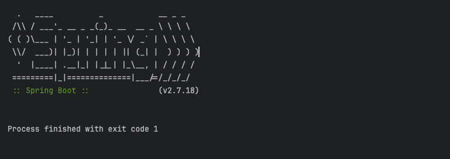

# Logback 설정 실수로 인해 로그가 출력되지 않은 문제 해결 과정

## 문제상황

1년전에 진행했던 팀프로젝트를 개선하기 위해서 Git에서 클론 후 인텔리제이에서 실행했는데 애플리케이션이 즉시 종료되는 문제가 발생했다.  
아래와 같은 메시지가 출력되었다.  


> 실제로는 즉시 종료된 것이 아니라 즉시 종료된 것처럼 보이는 것이었다. 차근차근 설명해보겠다.

## 원인 분석 과정

### 1. Process finished with exit code 1의 의미
`Process finished with exit code 1`는 **Spring Boot 애플리케이션이 내부적인 문제로 인해 비정상 종료**되었다는 것을 의미한다.  
정상적으로 실행된다면 `exit code 0`으로 끝나야 한다.

### 2. 어떠한 로그도 출력되지 않음
스프링 로고를 제외한 어떠한 로그도 출력되지 않는다는 점에서 Logback 설정을 의심했다.  
그래서 Logback파일을 임시로 지우고 실행을 해보았는데 로그가 정상 출력되었다.  

그럼 원인에 대해서 좀 더 자세히 알아보자.

## Logback 설정 문제
일단 이 프로젝트의 logback 설정은 아래와 같았다.

```xml
<?xml version="1.0" encoding="UTF-8"?>
<configuration scan="true" scanPeriod="10 seconds">

    <!-- 콘솔 출력 설정 -->
    <appender name="CONSOLE" class="ch.qos.logback.core.ConsoleAppender">
        <encoder>
            <pattern>%d{yyyy-MM-dd HH:mm:ss.SSS} [%thread] %-5level %logger{36} - %msg%n</pattern>
        </encoder>
    </appender>

    <!-- 파일 출력 설정 -->
    <appender name="FILE" class="ch.qos.logback.core.rolling.RollingFileAppender">
        <file>${LOG_DIR:-./logs}/logfile.log</file>
        <rollingPolicy class="ch.qos.logback.core.rolling.TimeBasedRollingPolicy">
            <fileNamePattern>${LOG_DIR:-./logs}/logfile-%d{yyyy-MM-dd}.%i.log.gz</fileNamePattern>
            <timeBasedFileNamingAndTriggeringPolicy class="ch.qos.logback.core.rolling.SizeAndTimeBasedFNATP">
                <maxFileSize>100MB</maxFileSize>
            </timeBasedFileNamingAndTriggeringPolicy>
            <maxHistory>7</maxHistory>
        </rollingPolicy>
        <encoder>
            <pattern>%d{yyyy-MM-dd HH:mm:ss.SSS} [%thread] %-5level %logger{36} - %msg%n</pattern>
        </encoder>
    </appender>

<!--    <root level="INFO">-->
<!--        <appender-ref ref="CONSOLE"/>-->
<!--    </root>-->
<!--     환경별 설정 -->
    <springProfile name="prod">
        <root level="${PROD_LOG_LEVEL:-INFO}">
            <appender-ref ref="CONSOLE"/>
            <appender-ref ref="FILE"/>
        </root>

    </springProfile>
    <springProfile name="dev">
        <root level="${DEV_LOG_LEVEL:-DEBUG}">
            <appender-ref ref="CONSOLE"/>
            <appender-ref ref="FILE"/>
        </root>
        <logger name="org.hibernate.type.descriptor.sql" additivity="false">
            <level value="DEBUG"/>
            <appender-ref ref="CONSOLE"/>
        </logger>
    </springProfile>

</configuration>
```

### 문제점

1. **기본 root 로거 설정이 없음**
   - 위 logback 파일을 보면 prod와 dev 프로파일이 활성화될 때만 로그 설정이 적용된다.
   - 기본 프로파일(default profile)에 대한 로그 설정은 존재하지 않는다. 
   - 즉, `spring.profiles.active`를 설정하지 않고 실행하면 Logback이 초기화되지 않아 로그가 출력되지 않는다.
2. **기본적으로 `default profile`을 사용하기 때문에 로그가 출력되지 않음**
   - 프로젝트를 클론한 후 특정 프로파일을 설정하지 않고 실행했기 때문에 default profile이 사용됐다.
   - default profile에 대한 root 설정이 없으므로 예외가 발생했더라도 로그도 출력되지 않았다.

### 해결방법
1. logback파일을 삭제
2. logback파일을 사용한다면 주석 처리한 기본 root 로거 추가
3. logback파일에 작성된 dev나 prod 프로파일을 사용 

위 방식 중 하나를 선택해서 적용하면 해결된다.


### logback과 즉시 종료는 관련 없다.
- 실은 logback은 즉시 종료와는 직접적으로 관련은 없다.  
- **Process finished with exit code 1** 가 출력되면서 실행이 종료된 이유는 logback 문제가 아니라 프로젝트 내 배포 관련 코드 및 ElasticSearch 등 외부 기술 설정의 의존성 문제 때문이었다.  
- 즉, 의존성 관련 오류 로그가 먼저 출력되고 **Process finished with exit code 1** 이 출력되면서 애플리케이션이 종료되어야 하는데 logback파일에 default profile에 대한 설정이 없어서 즉시 종료된 것처럼 보였던 것이었다.  

### mvn spring-boot:run에서 로그가 보였던 이유
- **maven**에서 `spring-boot:run` 실행 시 출력됐던 로그들은 **Spring Boot가 로드되기 전에 발생하는 빌드 및 의존성 로드, 내부 설정 로드 과정에서 나온 로그**들이었다. 
- 이러한 로그들은 Logback 설정과 무관한게 출력되며, Logback 설정은 Spring Boot가 완전히 로드된 이후에 적용되기 때문에 이와 별개로 동작한다.

