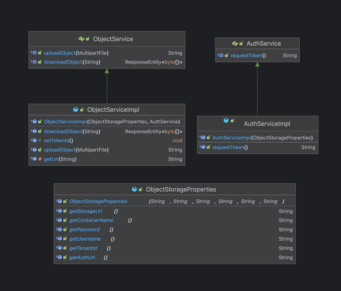
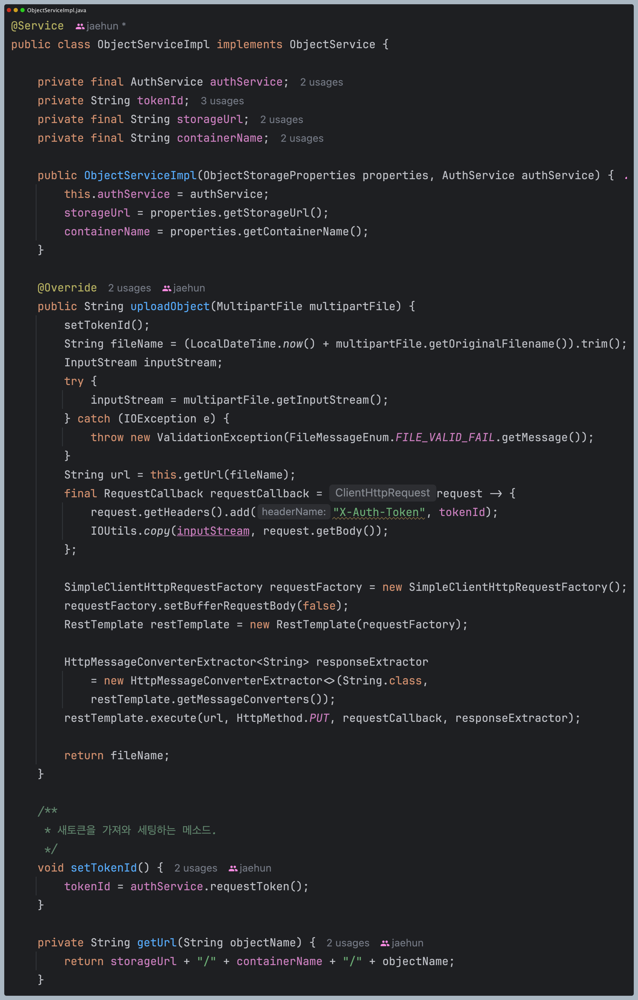
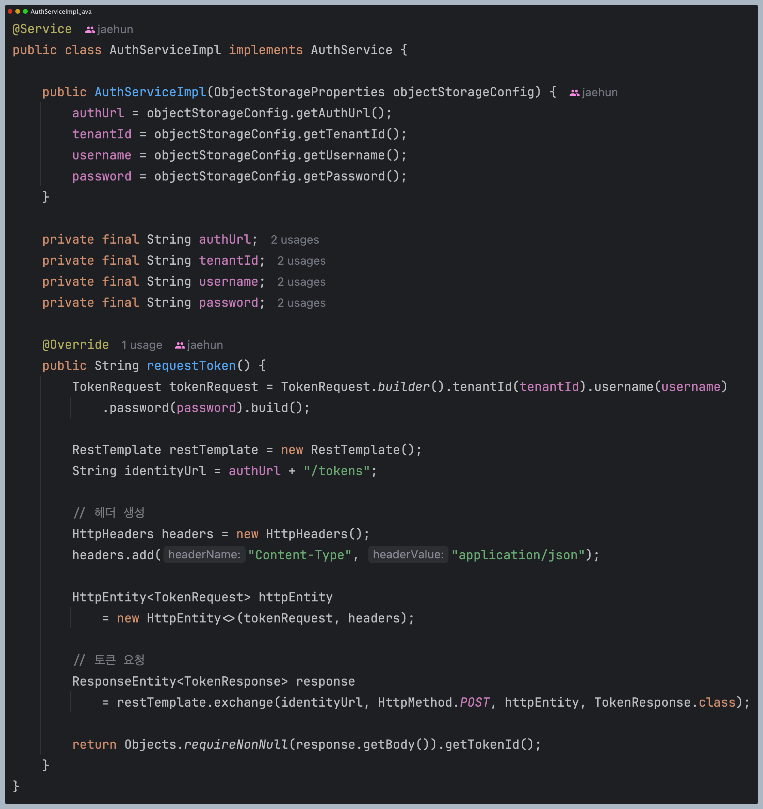
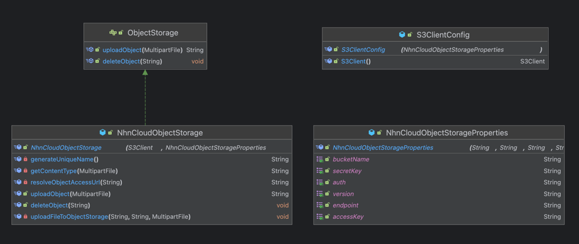
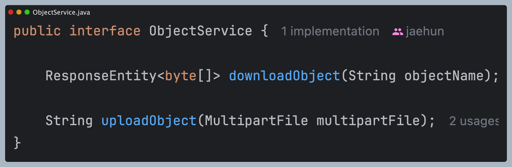

# Object Storage 업로드 방식 변경 및 이미지 조회 최적화

## 1. 기존 방식: RestTemplate으로 업로드

### 1.1 RestTemplate을 이용한 업로드의 문제점
기존 InkBridge는 **NHN Cloud Object Storage**를 사용하여 이미지를 업로드하고 있었으며
업로드 방식은 **RestTemplate**을 이용하여 **직접 API 요청을 보내는 방식**을 사용하고 있었다.

이 방식의 문제점은 다음과 같다
- **직접 API 호출 필요** → RestTemplate을 사용하여 직접 API를 호출해야 하므로 코드가 복잡해진다.
- **인증 처리 번거로움** → **X-Auth-Token**을 수동으로 발급 받아야 하고 토큰 갱신 로직이 필요하다.
- **대용량 파일 확장성 부족** → 현재는 책 사진, 리뷰 사진 등의 작은 이미지만 처리하는데 나중에 동영상 등 대용량 파일을 업로드할 경우 코드의 변화가 클 수 있다.

### 1.2 기존 코드 구조
  
  


기존 코드 구성은 AuthService를 통해 토큰을 발급받아서 ObjectService에서 restTemplate를 사용해서 API 요청을 보낸다.  
1.1 에서 언급한 것처럼 직접 인증 토큰을 발급받고, restTemplate로 파일을 업로드 하는 것은 꽤나 번거로운 작업으로 보인다.

## 2. 파일 업로드 방식 S3 SDK로 전환
[NHN Cloud ObjectStorage - S3 활용 가이드](https://docs.nhncloud.com/ko/Storage/Object%20Storage/ko/s3-api-guide/)에서 NHN Cloud는 AWS의 S3 API와 호환된다고 한다.
아무래도 AWS가 클라우드 시장에서 가장 큰 점유율을 차지하기 떄문에 AWS를 사용하던 고객의 유입을 늘리려는 전략으로 보인다.  
또한 NHN Cloud말고도 Open Stack 등의 다른 크라우드 기업들도 S3를 지원하고 있는데 S3가 클라우드 업계의 표준이 되어가는 것 같다.

### 2.1 S3 SDK의 장점
- **자동 인증 처리**
  - X-Auth-Token을 직접 발급할 필요 없이 Access Key와 Secret Key만 설정하면 자동 처리된다.
- **대용량 파일 업로드 가능**
  - Multipart Upload 지원한다.(파일을 여러 개의 청크로 나눠서 업로드 가능)
  - 현재는 사용하지 않을 테지만 동영상 등의 대용량 파일을 업로드해야할 경우 전환을 빠르게 할 수 있다.
- 네트워크 최적화
  - S3 SDK가 자동으로 최적화된 네트워크 설정을 적용한다.
  - RestTemplate는 직접 구현해야 한다.
- 다른 클라우드 스토리지로 이동이 쉬움
  - AWS, NHN Cloud, OpenStack 등 S3 API를 지원하는 스토리지로 쉽게 변경 가능하다.
  - 어느정도 리팩토링이 완료되면 AWS에 배포를 해서 테스트를 해볼 예정이기 때문에 S3 SDK를 활용하는 것이 합리적이다.

### 2.2 바뀐 코드 구조
  
인증을 SDK에서 자동화 해주기 때문에 기본 설정 Configuration과 objectStorage 구현만 하면 된다.

또한 기존 코드에서 필요한 설정값들은 storageUrl, containerName, password, username, tenantId, authUrl로 총 6개이다.  
반면 리팩토링한 코드의 필요한 설정값은 endpoint, access-key, secret-key, bucketName으로 4개이다. 나머지 값들은 개발 편의상 넣어둔 값이다.  

코드 로직은 [pr 코드](https://github.com/nuheajiohc/inkbridge-refactoring/pull/3/commits/3ba9a356a9fe846d4eae6a2d34d272e7f6f56285)로 대체

## 3. RestTemplate과 S3 SDK 비교

| 항목 | RestTemplate (기존) | S3 SDK (변경 후) |
|------|--------------------|------------------|
| **업로드 방식** | `RestTemplate`을 사용해 직접 API 호출 | `S3Client.putObject()` 사용 |
| **인증 처리** | `X-Auth-Token`을 직접 발급 및 관리 | `AccessKey`와 `SecretKey`만 설정하면 자동 인증 |
| **파일 업로드 방식** | 단순 `PUT` 요청 (수동 설정 필요) | `PutObject`, `Multipart Upload` 자동 지원 |
| **대용량 파일 지원** | 직접 구현 필요 (복잡함) | `Multipart Upload`, `Presigned URL` 자동 지원 |
| **네트워크 최적화** | 직접 설정 필요 | 자동 최적화 (성능 개선) |

바퀴를 재발명 하지 말라고 했듯이 잘 만들어진 S3 SDK를 활용하는 것이 생산성에 도움이 된다.


## 이미지 조회 방식 개선 (메모리 절약 & 성능 최적화)

### 4.1 기존 방식 코드 (백엔드에서 `byte[]`로 변환 후 반환)


로직이 주안점이 아니기 때문에 인터페이스로 가져왔다.  
지금은 이미지를 조회할 때 byte배열로 반환한다. 즉, 이미지를 백엔드 서버의 메모리에 전부 올린 후 클라이언트에게 넘겨준다.  

### 4.2 기존 방식의 문제점

- 백엔드 서버에서 이미지 파일을 메모리에 올린 뒤 클라이언트로 응답하기 때문에 서버 부하가 증가
- 파일의 용량을 제한하더라도 인기순, 최신순 등의 정렬된 책을 조회하거나 카테고리로 책을 조회할 때 여러 책 이미지를 조회해야 하기 때문에 부하에 대한 부담은 여전하다.  
- 부하 문제는 서비스 이용자 수가 증가할수록 체감은 더 커질 것이다.
- 동시에 많은 요청이 올 시 OOM(Out Of Mememory)가 발생할 수 있다.


### 4.3 개선한 방식 (클라이언트에서 URL로 접근)
- Object Storage에 이미지를 저장할 때 이미지 식별자를 데이터베이스에 저장한 뒤 URL을 클라이언트에 전달하여 조회하는 방식으로 개선
- 서버는 이미지 처리 부담이 사라지기 때문에 이미지 관련 메모리 사용량은 0이다.

> objectStorage에 관한 코드들이 많기 때문에 아직 이 부분은 코드에 반영을 안했다.  
> 대대적인 리팩토링을 할 때 이 부분을 같이 반영할 예정이다.


## S3 SDK 적용을 위한 설정
### pom.xml
```xml
<dependency>
    <groupId>software.amazon.awssdk</groupId>
    <artifactId>s3</artifactId>
    <version>2.30.36</version>
</dependency>
```
위 의존성을 추가하면 바로 S3 SDK를 사용할 수 있다.

## 정리
- RestTemplate 대신 S3 SDK 사용 -> 클라우드 플랫폼 전환이 쉬워짐, 비즈니스 로직에 더 집중할 수 있음  
- 클라이언트에서 URL을 사용하여 직접 조회 -> 백엔드에서 이미지 처리에 대한 메모리 절약