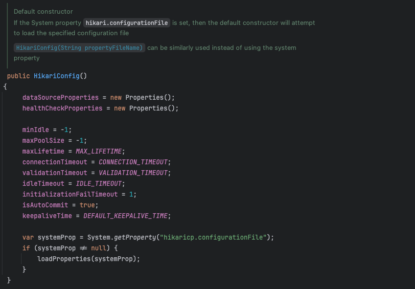
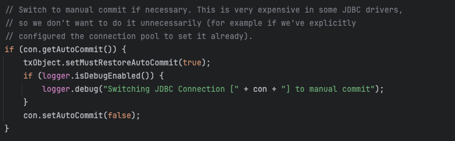

# 생일 쿠폰 배치 성능 99.7% 개선 과정 (3시간 48분에서 43초까지)

기존 잉크 브릿지 프로젝트에서는 생일 쿠폰을 매월 1일 00:00에 배치로 발급하는 기능이 구현되어 있었고, 이 로직은 팀원 분께서 Spring Batch 기반으로 개발했다.

이 기능의 요구 사항은 다음과 같았다.

- 사용자가 생일인 달 1일 자정에 생일 쿠폰 제공
    - 예) {5월 1일, 5월 5일, 5월 20일} 생일자 : 5월 1일에 쿠폰 제공
    - 쿠폰 사용 기간은 해당 월의 1일부터 말까지

여기서 나는 실제 이커머스(ex. 무신사?) 운영 환경을 고려해 다음과 같은 조건을 가정하고 요구사항을 확장했다.

- 전체 회원 수는 약 2,400만 명
- 각 달의 생일자는 약 200만 명씩 균등 분포

개발된 코드를 리뷰하던 중, 성능 측면에서 개선이 필요한 여러 문제점이 눈에 띄었고, 이를 기반으로 배치 처리 로직을 리팩토링하게 되었다.

## 기존 구조 문제점

기존 생일 쿠폰 발급 배치는 Spring Batch의 `JpaPagingItemReader`와 `ItemWriter`조합으로 구현되어 있었다.  
구체적인 구조는 다음과 같다.

``` java
// jpa를 활용해서 member 조회
public JpaPagingItemReader<Member> memberLoad() {
    return new JpaPagingItemReaderBuilder<Member>()
        .name("memberLoad")
        .entityManagerFactory(entityManagerFactory)
        .pageSize(chunkSize)
        .queryString("SELECT m FROM Member m WHERE MONTH(m.birthday) = MONTH(:today)")
        .parameterValues(Collections.singletonMap("today", LocalDate.now()))
        .build();
}

// processor는 생략. 

// jpa를 활용해서 memberCoupon 저장
public ItemWriter<MemberCoupon> birthdayCouponWriter() {
    return memberCoupons -> {
        for (MemberCoupon memberCoupon : memberCoupons) {
            entityManager.persist(memberCoupon);
        }
    };
}
```

이 구조는 기능적으로는 문제없이 작동하지만, 대용량 데이터를 처리하기에는 다음과 같은 한계가 있다.

### 1. JPA를 사용할 이유가 없다.

- 위 배치 로직에서는 단순히 회원정보를 읽고 쿠폰을 저장하는 수준에 불과하기 떄문에, JPA가 제공하는 더티 체킹, 1차 캐시, 지연 로딩 등은 오히려 메모리 낭비를 발생시킨다.
- `member_id`와 `coupon_id`만으로도 로직을 처리할 수 있지만, Entity 기반 설계로 인해 불필요한 모든 칼럼을 조회하게 된다.
- 배치 서버와 메인 서비스가 분리되어 있기 때문에 위의 이유들을 감수하고서 JPA를 사용할 필요는 없다.

### 2. 인덱스를 활용할 수 없는 조건절

- `WHERE MONTH(m.birthday) = MONTH(:today)`는 칼럼에 함수가 적용된 형태이므로 인덱스를 타지 못해서 **Full Table Scan**이
  발생한다.

### 3. `SELECT *` 절 사용

- `SELECT m FROM Member m`은 모든 칼럼을 조회하는 쿼리로, I/O 및 네트워크 비용이 커진다.
- 단순히 id 값들만 필요한 상황에서는 `SELECT m.id FROM Member m WHERE ...`처럼 필요한 칼럼만 명시적으로 조회하는 것이 성능을 개선시킨다.

### 4. 너무 작은 Chunk Size 적용

- chunk Size가 10으로 설정되어 있었고, 실제 테스트 결과 200만 명 중 약 16만 명만 처리하는 데에도 3시간 이상 소요되었다.   
  이것도 DB 인덱스 튜닝을 하고 진행한 것이라서 기존 구조로 진행했다면 더 느렸을 것이다.
- 적은 chunk로 인해 I/O 횟수의 증가와 트랜잭션 오버헤드가 주요 원인인 것 같다.

### 5. offset 페이지네이션의 한계

- `JpaPagingItemReader`는 내부적으로 offset 기반 페이지네이션 전략을 사용한다.
- 이 방식은 페이지가 뒤로 갈수록 `OFFSET n`으로 스킵하는 비용이 증가하게 된다.
- 즉, 200만 건 중 후반부 데이터를 읽을 때는 거의 모든 데이터를 건너뛰어야 하므로, 조회 성능이 급격히 저하된다.

### 6. Auto-Increment 환경에서 JPA Bulk Insert 한계

- Auto-Increment 값은 DB가 직접 생성하기 때문에 애플리케이션 환경에서 미리 알 수 없다.   
  그래서 insert가 발생한 후 Entity의 ID값을 채우기 위해 SELECT 쿼리가 발생한다. 이로 인해 insert를 한 건씩 처리할 수 밖에 없는 구조가 된다.
- 기존 방식의 Writer는 Auto-Increment + JPA 구조를 사용하기 때문에 Batch Insert를 한 것과 성능이 확연하게 차이난다.

## 개선 과정

### 1. Index 설정

기존 쿼리는 `SELECT m FROM Member m WHERE MONTH(m.birthday) = MONTH(:today)` 이다.

여기서 문제점은 `SELECT 절`과 `MONTH(m.birthday)` 조건이다.  
`MONTH(birthday)`에 인덱스가 걸려있다면 그나마 나은 상황이지만, 이 프로젝트에서는 인덱스를 설정하지 않은 것으로 보인다.  
그리고 만약 `MONTH(birthday)`에 함수 인덱스가 걸려 있더라도 커버링 인덱스를 사용하려고 해도 적용이 되지 않는다.  
즉, 함수형 인덱스를 걸면 인덱스를 활용할 수는 있지만, 커버링 인덱스를 사용할 수는 없다.

실제로 [MySQL 공식 버그 리포트 질문글](https://bugs.mysql.com/bug.php?id=101208)이 있어서 확인해봤는데 답변으로 버그는 아니라고 했다.
버그는 아니지만 커버링 인덱스는 탈 수 없게 설계되어 있는 것 같다.

실제로 실험을 해보았는데 인덱스는 사용하지만 커버링 인덱스까지는 사용할 수 없었다.  
SELECT가 아스트릭이든 member_id만으로 구성되어 있든 실행계획은 같았다.

```sql
CREATE INDEX temp ON member ((MONTH (birth)) );
SELECT *
FROM member
WHERE (MONTH(birth)) = 12
SELECT member_id
FROM member
WHERE (MONTH(birth)) = 12
```


그래서 가상칼럼을 사용하기로 했다.  
실제 칼럼으로 month_birth를 만들지 않은 이유는 비즈니스 로직으로 사용하고 있지 않고, 인덱스를 통한 성능 개선에만 활용하고 있기 때문이었다.  
그리고 가상 칼럼에는 STORED와 VIRTUAL로 종류가 나뉘어지는데 가상 칼럼을 포함한 커버링 인덱스만 사용한다면 어느것을 사용하든 문제가 없다.(이것 관련해서는 다른글에서
설명해보겠다.)  
가상 칼럼을 포함한 커버링 인덱스에만 사용할 것이기 때문에 VIRTUAL과 STORED 중 어느 것을 선택해도 상관없다. 그래서 테이블 저장 공간을 따로 사용하지 않는
VIRTUAL 방식을 채택했다.

이제 인덱스 없는 방식, 함수 인덱스 방식, 가상 칼럼 방식 성능에 대해서 비교해보겠다.  
2400만 회원 중 200만명의 회원을 조회하는 비교이다.  
(성능 개선과정에서 쿠폰 칼럼들을 바꿨고, 조회 조건으로 활성화된 계정만 조회할 수 있도록 수정하였다.)

#### 인덱스 없이 비교

```sql
SELECT *
FROM member
WHERE MONTH (birth) = 12 AND account_status = "ACTIVE";
SELECT member_id
FROM member
WHERE MONTH (birth) = 12 AND account_status = "ACTIVE";
```

**인덱스 없이 아스트릭으로 풀테이블 스캔**

약 9초 정도 시간이 소요된다. 앞으로 비교할 쿼리들에 비해 가장 느리다.


**인덱스 없이 member_id로만 풀테이블 스캔**  
실행계획은 위와 같고, 약 5.4초 정도 시간이 소요되었다.  
필요한 칼럼만 조회했더니 약 40%정도 성능이 개선되었다.


#### 함수 인덱스 비교

**인덱스 설정**

```sql
CREATE INDEX idx_birthday ON member ((MONTH (birth)), account_status);
```

**아스트릭 실험**  
약 2.8초 정도가 소요되었고 아스트릭으로 조회해도 인덱스를 사용하지 않은 member_id 조회보다 훨씬 빠르다.

```sql
SELECT *
FROM member
WHERE MONTH (birth) = 12 AND account_status = "ACTIVE";
```


**커버링 인덱스 가정 실험**  
역시 커버링 인덱스는 탈 수 없었고, 여러 번 실험해보았지만 약 2.4초 정도에 조회되었다.  
실행계획은 아스트릭과 동일하지만 조금 더 빠른 이유는 필요한 칼럼만 조회했기 때문이다.

```sql
SELECT member_id
FROM member
WHERE MONTH (birth) = 12 AND account_status = "ACTIVE";
```

  


> 위에서 설명했듯이 함수 인덱스로는 커버링인덱스의 효과를 받을 수 없다.

#### 가상 칼럼 비교

```sql
ALTER TABLE member
    ADD COLUMN birth_month INT GENERATED ALWAYS AS (MONTH(birth)) VIRTUAL;
CREATE INDEX idx_birthday ON member (birth_month, account_status);

SELECT member_id
FROM member
WHERE birth_month = 12
  AND account_status = "ACTIVE";

SELECT *
FROM member
WHERE birth_month = 12
  AND account_status = "ACTIVE";
```

**인덱스걸렸지만 아스트릭으로 조회**  
아스트릭으로 조회하면 함수인덱스를 사용한 것과 다를 바가 없기 때문에 함수 인덱스와 조회 성능은 비슷하다.

  


**커버링 인덱스**  
커버링 인덱스를 사용하면서 **member_id**로만 조회하기 때문에 속도가 매우 빠르다.  
약 0.3초로 가상칼럼을 사용한 아스트릭 방식에 비해서는 87% 정도 빨라졌고, 인덱스를 사용하지 않은 아스트릭에 비해서는 약 96~97% 정도 빨라졌다.

  


#### 케이스별 실행 시간 비교

| 케이스 설명                      | 실행 시간 (ms)       |
|-----------------------------|------------------|
| 인덱스 없음 + SELECT \*          | 9048             |
| 인덱스 없음 + SELECT member\_id  | 5430             |
| 함수형 인덱스 + SELECT \*         | 2894             |
| 함수형 인덱스 + SELECT member\_id | 2452             |
| VIRTUAL 칼럼 + SELECT \*      | 2306 (사실상 위와 같음) |
| VIRTUAL 칼럼 + 커버링 인덱스        | 325              |

이것으로 DB 단의 성능 개선은 **가상칼럼을 사용한 커버링 인덱스**를 사용하는 것으로 해결하였다.  
그리고 실제로는 200만개를 한번에 조회하는 것이 아니라 chunk 단위로 나눠서 가져올 것이기 때문에 훨씬 더 빠르다.

### 2. Reader 변경

기존 프로젝트에서는 `JpaPagingItemReader`를 사용했지만, 편의성을 위해 `RepositoryItemReader`로 대체해서 테스트를 진행했다.  
테스트에서 비교할 Reader의 후보는 처음엔 아래와 같이 정했다.

- RepositoryItemReader
- JpaPagingItemReader
- JpaCursorItemReader
- JdbcPagingItemReader
- JdbcCursorItemReader
- NoOffsetPagingItemReader(커스텀)

이 중 `JpaPagingItemReader`는 `RepositoryItemReader`로 대신하기로 했기 대문에 테스트 대상에서 제외했다.

그리고 `JpaCursorItemReader`도 후보에서 제외하였다.  
Cursor 기반 방식은 성능면에서는 가장 좋다고 볼 수 있지만 `JpaCursorItemReader`는 모든 데이터를 메모리에 올려서 Iterator로 Cursor를 흉내만 내는
구조이다.  
Chunk는 트랜잭션의 단위가 될 뿐, 전부 영속성 컨텍스트에 올라가기 때문에 대용량 데이터를 처리할 때는 **OOM**에 취약해질 수 밖에 없다.
또한, 기존구조는 배치서버가 메인서비스와 분리 되어 있고, 영속성 컨텍스트를 활용하지 않으며 칼럼 또한 일부만 활용하기 때문에 JPA의 필요성을 느끼지 못했다.  
그래서 제외하였다.

이제 남은건 `JdbcPagingItemReader`와 `JdbcCursorItemReader`, `NoOffsetPagingItemReader(커스텀)` 이다.
내가 `NoOffsetPagingItemReader`를 만들려고 했던 이유는 offset 페이지네이션 방식은 태생적으로 조회성능의 한계가 있기 때문이었다.  
그래서 커스텀을 해서 비교해보기로 생각하고 이미 스프링 배치에서 제공하고 있는 `JdbcPagingItemReader`를 참고하기로 했다.  
그런데 그 어느곳에서도 Offset 에 대한 코드가 보이지 않았고, 정렬 기준을 where절에 추가시켜 noOffset 으로 조건을 추가하는 방식으로 구현되어 있었다.
그래서 굳이 `NoOffsetPagingItemReader`를 만들 필요가 없어졌다.

그리고 `JdbcCursorItemReader`는 `JpaCursorItemReader`와 다르게 진짜 DB 커서를 활용해서 한 행씩 이동하며 데이터를 읽는다.  
그래서 성능이 괜찮다고 알고 있다.

결과적으로 `RepositoryItemReader`, `JdbcCursorItemReader`, `JdbcPagingItemReader`를 후보에 올리고 테스트를 진행했다.

#### 테스트 진행

**RepositoryItemReader**  
offset 페이지네이션을 사용하기 때문에 200만 건 정도의 데이터를 처리해야 한다면 측정이 힘들 정도로 느려질 것 같은 느낌이 있었다.
그래서 처음부터 커버링 인덱스는 아니지만 인덱스를 적용하여 테스트를 진행하였다.  
하지만 chunk가 10으로 설정 되었기 떄문인지 200만 건중 16만 건을 처리하는데 3시간이 넘게 걸렸다.  
뒤로 넘어갈수록 더 느려질 것이기 때문에 테스트를 중단하였고, chunk를 1000으로 늘려서 다시 측정하였다.  
그 결과 **Reader 시간은 2시간 40분 43초**가 걸렸다.  
이 방식을 테스트하긴 했지만, JPA를 사용하지 않을 것이고 offset 페이지네이션에 대한 문제를 인지하고 있고, 커버링 인덱스도 사용하지 않았기 때문에 비교 용도로만 테스트
후보에 넣었다.

**JdbcCursorItemReader**  
이 방식은 **약 3초**의 시간이 걸렸다.  
빠른 성능을 낸다는 것을 이미 알고 있어서 확실히 좋은 성능을 낼 것이라는 것은 알고 있었는데 이렇게까지 차이가 날 줄 몰랐다.

하지만 이 방식을 사용하더라도 데이터의 수가 늘어나면 소요 시간은 길어질 수 밖에 없다.
그럴 때는 멀티스레드 방식을 도입해서 해결할 수 있는데 `JdbcCursorItemReader`는 Thread-safe 하지
않다고 [공식문서](https://docs.spring.io/spring-batch/reference/appendix.html)에 나와있고, 쓰레드로 나눠서 처리하기도 어렵다.  
또한, 중간에 에러가 터져서 재시도를 시작할 때도 cursor 기반이기 때문에 처음부터 데이터를 차례대로 읽어서 에러가 난 지점까지 skip 해야한다.  
그렇기 때문에 에러가 난 상황에서 재시도 비용이 크다.  
그러므로 현재의 상황에서는 처리속도가 가장 빠르지만 확장성과 안정성을 생각했을 때 무리가 있는 방식이라고 볼 수 있다.

**JdbcPagingItemReader**    
결론을 먼저 말하자면 이 방식을 Reader로 채택했다.  
처리시간은 약 5초로 `JdbcCursorItemReader`에 비해서는 조금 느리다.  
하지만 페이징 방식이라서 멀티쓰레드로 데이터를 처리할 수 있고, 에러가 터진 상황에서도 에러 터진 chunk부터 재시도를 바로 처리할 수 있다.

결과적으로 **2시간 40분에서 5초로 단축되어 99.95%의 성능을 개선**하였다.

### 3. Writer 변경

기존 방식의 Writer는 JPA를 활용해서 저장을 한다.  
여기서 문제는 Auto-Increment를 사용한다는 점인데 이 전략은 기본키 생성을 DB에 위임하는 것이다.  
그래서 persist를 한 후 엔티티의 id값을 채워넣기 위해 select 절이 추가적으로 발생하게된다.  
그래서 batch insert가 불가능하다.  
결과적으로 이 방식으로 테스트했을 때 약 1시간 정도의 시간이 걸렸다.

그래서 batch insert가 가능한 `JdbcBatchItemWriter`로 변경해서 테스트를 했더니 약 3분 10초 정도로 단축되었다.

결과적으로 **약 1시간에서 3분 10초로 94.72%의 성능을 개선**하였다.

### 4. Auto Commit 해제

Reader에 비해서 Writer가 비교적 느린편이다. Reader는 읽기만 수행하니까 반드시 트랜잭션이 필요한 것은 아니다.  
반면 Writer 작업은 트랜잭션이 필수다. 그런데 HikariCP의 Auto-Commit 전략은 Default가 true이다. 그래서 어떤 작업이 발생할 때 트랜잭션 범위를
만들려면 Auto-Commit을 해제해야한다.  
이렇게 Auto-Commit을 false로 변경하고 트랜잭션이 끝나면 다시 true로 변경하는데 이 작업은 chunk단위로 매번 발생해서 변경을 위한 추가 시간이 발생한다.

실제로 `HikariConfig`의 생성자에는 Auto-Commit을 true 설정하는 로직이 있는데 별다른 설정을 하지 않으면 true가 기본 값이 된다.



또한 이 작업이 얼마나 큰 비용이 드는지는 `DataSourceTransactionManager` 클래스의 `doBegin` 메서드를 보면 알 수 있다.



필요하다면 커밋 전략을 바꾸라고 나와있고, JDBC Driver에서 이것은 비용이 크다고 한다.

그래서 AutoCommit을 해제하고 다시 배치를 돌려봤는데 나머지 처리 시간은 비슷했지만 Writer는 약 2분 5초로 개선되었다.  
스프링 배치의 Writer 전략을 `JdbcBatchItemWriter` 으로 바꾼 뒤 3분 10초로 단축된 시간에 비해 **약 34.21% 가 개선**되었다.

이로써 Auto-Commit의 비용은 생각보다 크다는 것을 확인할 수 있었다.

### 5. rewriteBatchedStatements 적용

Writer를 할 때 Batch Insert가 되고 있지만 실제로는 Insert 구문이 chunk 갯수만큼 발생한다.  
그래서 Insert 구문을 하나로 합치면 더 빠르게 실행할 수 있을 것 같아서 **rewriteBatchedStatements**를 적용하였다.  
그 결과 **29초**로 단축되었다.

그래서 최종적으로 Writer 성능은 **기존 1시간에서 29초로 단축되어 약 99.19% 개선**하였다.

### 6. Chunk Size 비교

Chunk Size는 1000, 2000, 5000을 비교해보았는데 read성능이 전체적인 성능이 조금씩 개선되어 1000에서 2000까지는 몇 초 정도 단축되는 게 보였지만,
2000과 5000은 큰 차이가 없었다.  
3개 다 큰 차이가 없다고 보았고, chunk가 커질수록 재시도를 위한 크기가 커지기 떄문에 기존의 1000으로 chunk를 유지하기로 했다.

chunk를 키운다고 해서 성능이 선형적으로 증가하지 않는 이유는 읽고 쓰는 데이터 양이 증가하여 네트워크 비용이 증가하고, 메모리를 더 많이 사용해서 GC에 의한 영향때문인 것
같다.

## 결과

| 구성 요소     | 기존 구조                | 기존 구조의 성능 | 개선 구조                | 개선 구조의 성능 | 개선율    |
|-----------|----------------------|-----------|----------------------|-----------|--------|
| Reader    | RepositoryItemReader | 약 2시간 40분 | JdbcPagingItemReader | 약 5초      | 99.95% |
| Processor | ItemProcessor        | 약 7초      | ItemProcessor        | 약 3초      | 57.14% |
| Writer    | RepositoryItemWriter | 약 1시간     | JdbcBatchItemWriter  | 약 29초     | 99.19% |

| 항목    | 기존 구조 총 시간     | 개선 구조 총 시간 | 총 개선율    |
|-------|----------------|------------|----------|
| 전체 시간 | 약 3시간 48분 26초  | 약 43초      | 약 99.69% |

