  

약식으로 테이블 구조를 만들어보았다. 간단하게 생각하면 위와 같이 테이블을 관계를 만들 수 있다.  
쿠폰을 만들어두고 발급을 하면 user_coupons에 레코드가 추가된다.  
하지만 이 구조에서는 데드락이 걸리는 문제가 있다.  

```sql

-- transaction A
BEGIN;  -- 1
INSERT INTO user_coupons(coupon_id, member_id) VALUES (1,1); -- 3
UPDATE coupons SET remaining_quantity = remaining_quantity - 1 WHERE coupon_id = 1;  -- 5
COMMIT;

-- transaction B
BEGIN;  -- 2
INSERT INTO user_coupons(coupon_id, member_id) VALUES (1,2);  -- 4
UPDATE coupons SET remaining_quantity = remaining_quantity - 1 WHERE coupon_id = 1;  -- 6
COMMIT;
```
번호 순서대로 실행을 할 때 5번에서 락이 걸리고, 6번에서 아래와 같은 데드락 문구가 나온다.  

예상대로라면 5번이 실행되고, 6번이 실행될 때 transaction A의 트랜잭션이 커밋이나 롤백이 될 때까지 락이 걸려야할 것 같은데 예상과 다른 결과가 나왔다.


그 이유은 [MySQL 공식문서](https://dev.mysql.com/doc/refman/8.0/en/innodb-locks-set.html)에서 확인할 수 있다.  
언급 부분은 아래와 같다.
> If a FOREIGN KEY constraint is defined on a table, any insert, update, or delete 
> that requires the constraint condition to be checked sets shared record-level locks on the records 
> that it looks at to check the constraint.
> InnoDB also sets these locks in the case where the constraint fails.

쉽게 설명하자면 FOREIGN KEY 제약이 정의된 테이블에서 INSERT, UPDATE, DELETE가 수행될 경우, InnoDB는 부모 테이블의 검사 대상이 되는 레코드에 공유 락(즉 S-락) 을 건다.
또한, 제약 조건이 실패하는 경우에도 이 락을 건다.

다시 돌아와서 차례대로 다시 실행 시뮬레이션을 돌려보자  
3번이 실행될 때 coupons 테이블에 대한 FOREIGN KEY 제약 조건이 있는 user_coupons를 삽입하므로 coupons 테이블의 대상 쿠폰에 공유락이 걸린다.  
4번이 실행될 때도 마찬가지로 coupons 테이블의 대상 쿠폰에 공유락이 걸린다.  
공유락은 여러 트랜잭션이 걸 수 있으므로 여기까지는 대기를 할 필요가 없다.
하지만 공유락은 같은 공유락을 허용하지만, 베타락은 허용하지 않아서 대기 해야한다.
여기서 문제가 발생하는데 5번이 실행될 때 대상 레코드에 공유락이 걸려있기 때문에 대기를 하게 된다.  
그 다음 6번에서는 데드락이 발생한다. 왜냐하면 A와 B 트랜잭션은 각각 같은 레코드에 공유락을 갖고 있으면서 해당 레코드에 베타락을 걸고 싶어한다.  
즉, 각 트랜잭션이 각자의 자원을 점유한 채로 서로의 자원을 원하는 상황이 발생해서 데드락이 발생한다.

그렇다면 INSERT와 UPDATE 쿼리 순서를 바꿔 볼까?

```sql

-- transaction A
BEGIN;  -- 1
UPDATE coupons SET remaining_quantity = remaining_quantity - 1 WHERE coupon_id = 1;  -- 3
INSERT INTO user_coupons(coupon_id, member_id) VALUES (1,1); -- 5
COMMIT;

-- transaction B
BEGIN;  -- 2
UPDATE coupons SET remaining_quantity = remaining_quantity - 1 WHERE coupon_id = 1;  -- 4
INSERT INTO user_coupons(coupon_id, member_id) VALUES (1,2);  -- 6
COMMIT;
```

이 경우에는 락은 걸리지만 데드락은 발생하지 않는다. 시뮬레이션해보자.  
3번에서 수량을 줄이기 위해 coupons 테이블의 대상 레코드에 베타락을 건다.  
4번에서도 베타락을 걸고 싶어하지만 베타락은 같은 레코드에 대해 하나만 걸 수 있어서 대기 상태로 남는다.  
5번은 어느 쿼리에도 영향을 받지 않기 때문에 정상적으로 저장된다.  
6번은 4번에서 대기를 하고 있기 때문에 4번 이후에 실행 되도록 기다리게 된다.
그 후 A 트랜잭션이 커밋이나 롤백을 하게 되면 B 트랜잭션 작업이 완료된다.  

그렇다면 이 순서로 코드를 작성하면 데드락이 걸리지 않는걸까?  
그렇지 않다. 이 부분에 관해서는 전에 마주했던 문제여서 이번에는 실제로 시도하지는 않았지만, 설명을 위해 예시 코드를 만들어서 진행하겠다. 
일단 위 방식대로 코드를 대략적으로 작성해보겠다.

```java
@Transactional
public void issueCoupon(Long userid, Long couponId){
    CouponEntity coupon = couponRepository
        .findLimitedCouponByCouponId(couponId)
        .orElseThrow(() -> new BusinessException(ErrorMessage.COUPON_NOT_EXISTS));
    
    coupon.decreaseQuantity();
    userCouponRepository.save(new UserCouponEntity(userId, couponId));
}
```
이런 느낌으로 쿠폰을 조회하고 수량을 줄이고 멤버쿠폰테이블에 발급정보를 저장한다.  
그런데 실제로 실행은 save가 먼저 되고 update 가 진행된다. 
hibernate의 AbstractFlushingEventListener 추상클래스의 performExecutions 메서드를 보면 알 수 있는데 여기에 있는 주석은 다음과 같다.

Execute all SQL (and second-level cache updates) in a special order so that foreign-key constraints cannot be violated:
1. Inserts, in the order they were performed  
2. Updates
3. Deletion of collection elements
4. Insertion of collection elements
5. Deletes, in the order they were performed

그래서 코드 로직 순서를 어떻게 정하든 insert가 먼저 발생하고, update문이 실행되므로 데드락이 발생할 수 밖에 없다.  
물론 로직 순서를 정의한대로 실행시키고 싶으면 flush와 함께 사용하면 된다. flush를 넣는게 좀 그렇다면 연관관계 매핑을 해제하면 된다.  
실무에서는 연관관계 매핑을 안 맺는 경우가 많다고 하지만 나는 아직 학습하는 단계이고 무작정 매핑을 제거하기 보다는 다른 해결책이 있을 것 같아서 해제하지 않았다.  

그렇다면 어떻게 해결할 수 있을까?
지금 나의 경우에는 선착순 쿠폰 뿐만 아니라 수량 제한 없는 쿠폰 발급도 할 수 있다.  
수량 제한이 없다면 수량관련 칼럼이 필요가 없을 것 같다. 그래서 1대1 관계로 수량 테이블을 분리했다.  
선착순 쿠폰은 쿠폰 수량 테이블의 레코드를 가지지만 수량 제한 없는 쿠폰은 레코드를 가지지 않는다.
테이블 구조는 아래와 같다.


이렇게 구성할경우 member_coupon 테이블에 insert를 한다면 coupon 테이블의 대상 레코드는 공유락이 걸린다.
하지만 쿠폰 수량 테이블에는 영향을 미치지 않기 때문에 데드락에 걸리지 않고 수량감소가 가능하다.
(물론 수량을 줄이는 두 트랜잭션은 베타락에 의해 대기하는 과정이 필요하긴 한다.)
쿠폰수량을 먼저 감소시켜도 데드락에는 자유롭다.  

그래서 테이블 구조는 구성하였다.

이제 데드락은 해결되었고, 코드 단위에서 동시성을 해결해 나가는 과정에 대해서 이야기해보겠다.


선착순 쿠폰을 조회하고, 쿠폰 수량을 줄인다. 그 후 중복 발급 여부를 판단하고, 쿠폰수량을 데이터베이스에 저장한다.  
그리고 멤버쿠폰 테이블에 쿠폰을 추가한다.


id가 3번인 쿠폰이 선착순 쿠폰이고, 10개의 쿠폰만 발급가능하다.
여기서 100명의 회원이 쿠폰을 순차적으로 요청할 경우 10개의 쿠폰이 발급되어야하고, 90개의 쿠폰 발급 실패가 발생할 것으로 가정했다.


그 결과 예상한 수량인 10장만 발급되어 테스트에 성공했다.

하지만 실제 상황에서는 이런 순차상황보다는 동시 요청 상황이 발생할 수 있고, 선착순 쿠폰 요청 특성상 거의 무조건 동시 요청이 발생한다.
그래서 동일상황에서 동시에 여러 요청이 발생하는 상황을 테스트 해보았다.


기존 코드와 큰 틀은 같지만, 쓰레드를 100개 만들어서 동시에 발급 요청을 진행했다.


  
그 결과 같은 조건에서 쿠폰 발급이 99개나 성공하였다. 재시도를 할 때는 100개 전부 성공할 때도 있고 조금씩 다르지만 동시성 문제가 생긴다는 사실은 변함없다.


그렇다면 이번에는 동시성 문제를 해결해보도록 하자.

가장 쉽게 접할 수 있는 동시성 해결 방법인 synchronized를 적용해보자.

java에서 synchronized 키워드를 붙이면 대상 메서드에 접근할 때 락을 걸어서 멀티 스레드 환경에서 동시성을 제어할 수 있다.

위에서 소개한 코드와 같은데 synchronized 키워드만 추가하였다.


결과를 확인해보자.


정상적인 경우였다면 쿠폰은 10개가 출력되었어야 하지만 예상과 다르게 12개가 출력되었다. 여러 번 시도한 결과 전부 쿠폰 발급 정합성은 맞추지 못하였다.  
하지만 완벽히는 아니지만 어느정도 동시성 제어가 되었다. 

왜 그런 것일까?
정답은 @Transactional 키워드에 있다. @Transactional 키워드와 synchronized 키우드를 같이 사용하게 되면 문제가 생긴다.

왜냐하면 @Transactinoal 키워드를 사용하게 되면 Spring은 프록시 객체를 생성하게 된다.  
@Transactional 키워드를 붙인다고 갑자기 뚝딱 트랜잭션이 적용되는 것이 아니라 내부적으로는 해당 메서드를 호출하는 프록시 객체를 만들게 된다.

예를 들어 간단하게 코드로 설명하자면 아래와 같다.
프록시 객체가 만들어질 때 원본 메서드를 트랜잭션 로직이 감싼채로 실행된다.  
자세한 내용은 [JPA save와 saveAll 비교(feat. @Transactional의 영향) - 5. 분석](https://nuheajiohc.tistory.com/53) 에서 설명해두었다.  

``` java
public class CouponService$$EnhancerBySpringCGLIB {
    
    private CouponService couponService;
    
    public issueLimitCouponV1(Long userId, Long couponId) {
        tx.start();
        couponService.issueLimitCouponV1(userId, couponId);
        tx.end();
    }
}
```

이렇게 되면 두개의 쓰레드가 동시에 접근하게 되면 트랜잭션을 동시에 시작할 수 있다.  
하지만 원본 메서드에는 synchronized 키워드가 있기 때문에 여기서 둘 중 하나의 스레드는 진입하게 되고 나머지 하나는 대기를 하게 된다.  
쿠폰 수량이 10인 상태에서 하나의 스레드가 먼저 들어가서 수량을 줄이고 로직을 끝내고 메서드를 나오면 다른 스레드가 접근할 수 있게 되는데 대기하던 스레드는 이미 트랜잭션이 시작한 상태이기 때문에 수량을 줄이기 이전의 레코드에 접근하게 된다.  
그래서 아 때도 수량이 10이다. 이런 현상 떄문에 동시성 문제가 해결되지 않은 것이다.  
다만 원본 메서드에 접근할 때는 락이 걸리기 때문에 아예 사용하지 않은 것보다는 동시성 문제가 비교적 해결 된 것이다.  
하지만 이 방식으로는 동시성 문제를 해결할 수 없기 때문에 다른 방식을 찾아야 한다.

@Transactinal 키워드 때문에 생긴 문제이기 때문에 @Transactional을 제거하면 동시성 문제가 해결된다.  
하지만 트랜잭션이 없는 상황에서는 변경감지가 되지 않고, 전체 작업을 하나로 묶을 수 없어서 올바른 해결책이라고 볼 수 없다.

@Transactional와 synchronized 키워드를 같이 사용하면 synchronized 밖에서 트랜잭션이 생긴다는 것은 아까 확인했다.  
그렇다면 @Transactional 애노테이션을 감싸는 메서드에서 synchronized를 사용한다면 락을 잡은채로 메서드에 진입해서 프록시 객체가 생기므로 동시성 문제를 의도한대로 잡을 수 있을 것 같다.  

코드로 나타내면 아래와 같고 이 서비스 컨트롤러에서 호출해보자
```java
@Service
@RequiredArgsConstructor
public class SynchronizedService {

    private final CouponService couponService;

    public synchronized void issueCoupon(Long userId, Long couponId) {
        couponService.issueLimitCouponV1(userId, couponId);
    }
}
```


결과는 정상적으로 동시성 문제가 해결되었다.  

하지만 이것을 사용하기에는 몇가지 문제가 있다.  
먼저 위의 예시처럼 원래 서비스와 컨트롤러 사이에 새로운 클래스가 필요해서 이전에 비해 비교적 가독성이 떨어진다.  
두번째는 우리 프로젝트가 기존에는 서버를 다중 인스턴스로 이루어져 있었다.  
synchronized 키워드는 각 서버안으로 들어오는 요청에 대해서는 동시성 문제를 해결할 수 있지만, 서로 다른 서버로 들어오는 요청에 대해서는 동시성을 해결할 수 없다.  
마지막으로 선착순 쿠폰이라서 들어오는 순서를 잘 지켜서 쿠폰 발급을 진행해야하는데 synchronized 키워드로 동시성 문제를 해결할 경우 공정성이 어긋난다.  
즉 A,B,C의 사람이 순서대로 요청을 보낸상황에서 A의 처리가 끝난 후 B가 자원을 획득해야하는데 기다리고 있는 요청 중 무작위로 자원을 넘겨주게 된다. 그래서 C가 자원을 획득할 수 있다.  
이러한 이유들로 인해 synchronized 키워드로 동시성 문제를 해결하기는 힘들 것으로 판단했다.  


자바 애플리케이션에서 동시성 문제를 해결하는 방법은 하나 더 있는데 그것은 reentrantLock 클래스이다.
이것은 synchronized 키워드와 달리 객체로 제공되는 락이고, 공정성을 부여해줄 수 있다.
ReentrantLock에 true 매개변수를 추가하면 공정성을 부여할 수 있다.
```java
@Service
@RequiredArgsConstructor
public class ReentrantLockService {

    private final CouponService couponService;
    private ReentrantLock reentrantLock = new ReentrantLock(true);

    public void issueCoupon(Long userId, Long couponId) {
        reentrantLock.lock();
        try {
            couponService.issueLimitCouponV1(userId, couponId);
        } finally {
            reentrantLock.unlock();
        }
    }
}
```
하지만 공정성의 문제가 해결될 뿐 다중 서버에서의 동시성 문제와 중간계층의 필요성은 synchronized로 해결한 것과 같으므로 이 방식도 패스하겠다.  


그럼 다중 서버에서 동시성 문제를 잡기 위해서는 다른 방향으로 생각해보아야 한다.  
애플리케이션 내에서는 다른 서버에 영향을 주지 못하기 때문에 공동으로 사용하는 데이터베이스를 생각해볼 수 있다.  
여기에서는 크게 낙관적 락과 비관적 락이 존재한다.


낙관적 락부터 적용해보자.
낙관적락은 JPA에서 @Version 어노테이션을 활용한다면 쉽게 적용할 수 있다. 물론 DB 칼럼에도 추가해야한다  
업데이트 쿼리가 날라갈 때 내부적으로는 아래와 같은 쿼리가 발생한다.  
영속성 컨텍스트에 version 애노테이션이 있는 칼럼이 들어오면 수정이 발생할때 자동으로 아래처럼 version정보를 포함해서 수정한다.
자세한 내용은 다른 글에서 기약을 해보겠다.

```sql
UPDATE coupon_quantity
    SET remaining_quantity = ?, version = version + 1
    WHERE id = ? AND version = ?
```


```java
@Entity
@Table(name = "coupon_quantity")
@Getter
@Setter
@NoArgsConstructor(access = AccessLevel.PROTECTED)
public class CouponQuantityEntity {

    @Id
    @Column(name = "coupon_quantity_id")
    @GeneratedValue(strategy = GenerationType.IDENTITY)
    private Long id;

    @Column(name = "total_quantity", nullable = false)
    private Integer totalQuantity;

    @Column(name = "remaining_quantity", nullable = false)
    private Integer remainingQuantity;

    @OneToOne(fetch = FetchType.LAZY)
    @JoinColumn(name = "coupon_id", nullable = false)
    private CouponEntity couponEntity;

    @Version
    @Column(name = "version")
    private int version;
}
```
과연 동시성이 잡힐까?

  
  
  
  

이번엔은 스레드의 갯수를 조절하면서 시도해봤는데 스레드 갯수가 적을때는 쿠폰 발급을 정상적으로 하지 못했고, 기존의 100개의 스레드에서는 올바르게 발급이 되었다. 
100개의 스레드 실험은 여러번 했는데 전부 잘 받급되었다.  

낙관적락에 대해서 전부터 알고 있어서 일부러 여러 경우를 대상으로 테스트를 진행했는데 만약 모른채로 했다면 100개의 쓰레드로만 시도하고 잘되는군~ 햇을 거 같아서.. 식은땀이 난다..

먼저 낙관적락은 애플리케이션 수준에서 version과 함께 조회해서 동시성을 제어하는 것이므로 실제 DB에 락을 거는 것은 아니다.  
그리고 충돌이 발생하면 해당 트랜잭션은 ObjectOptimisticLockingFailureException 을 던지며 실패를 하기 때문에 동시성이 잡힌다.  
근데 이 방식은 동시성을 잡긴 하지만 실패한 작업에 대해서는 어떠한 조치도 취하지 않는다.  
그래서 위 테스트에서 10개의 스레드로 테스트할 때 10개가 진짜 동시에 조회를 진행해서 1건만 제대로 저장되고 나머지는 실패를 해서 9건의 발급실패가 발생한 것이다.  
두 번째도 10개의 쓰레드고 동시에 접근하고 9개가 실패햇고, 그 이후로도 충돌이 많이 발생헀지만 넘지 6건을 성공한것이다.
세 번째도 비슷하다.
마지막 네 번쨰는 올바르게 결과가 나온 것처럼 보이지만 많은 쓰레드가 동시에 접근을 했기 때문에 이런 결과가 나온것이다.
예를 들어 1,2,3,4 ... 99, 100 이렇게 접근을 하더라도 1번이 성공하고 91번까지 충돌이 발생하고 92번부터 마지막까지 운좋게 성공한다면 위와 같은 결과가 나온다.  

동시성 문제는 해결하더라도 선착순을 전혀 지키지 못하고 있다.  
충돌이 발생하더라도 먼저 시도한것이라면 나중에 접근한 요청보다는 빠르게 처리되어야하는데 느린것도 아니고 완전히 실패를 하게된다.  
그럼 충돌상황에 대해서 @Retryable 애노테이션을 써서 재시도를 하면 될까?
```java
@Retryable(
    value = { OptimisticLockingFailureException.class },
    maxAttempts = 5,
    backoff = @Backoff(delay = 1000)
)
```
이런 식으로 대상 메서드에 활용할 수 있는데 이것을 사용하더라도 재시도 타이밍에 따라 순서가 뒤로 밀릴 수 있다.  
그리고 재시도가 몇번이나 될지 모르기도 하고, Integer.MAX_VALUE 로 설정하는 것도 서버에 무리가 갈 수 있다.  
또한 선착순 쿠폰 특성상 충돌이 매우 잦을 것이기 때문에도 이 방식은 좋은 선택지가 아니다.


다음은 비관적 락으로 넘어가보자

비관적락은 낙관적락과 다르게 실제로 데이터베이스에서 락을 잡는것이다.  
그래서 락을 잡고 있는동안에는 다른 작업이 끼어들 수 없다. 트랜잭션을 시작하고나서 바로 쿠폰수량 테이블의 대상 레코드에 락을 걸기 때문에 다른 작업은 끼어들 수 없고, 동시성 문제가 해결될 것이라고 기대할 수 있다.
``` java
    @Lock(LockModeType.PESSIMISTIC_WRITE)
    @Query(value = "SELECT cq FROM CouponQuantityEntity cq WHERE cq.couponEntity.id = :couponId")
    Optional<CouponQuantityEntity> findCouponQuantityByCouponIdForLock(Long couponId);
```
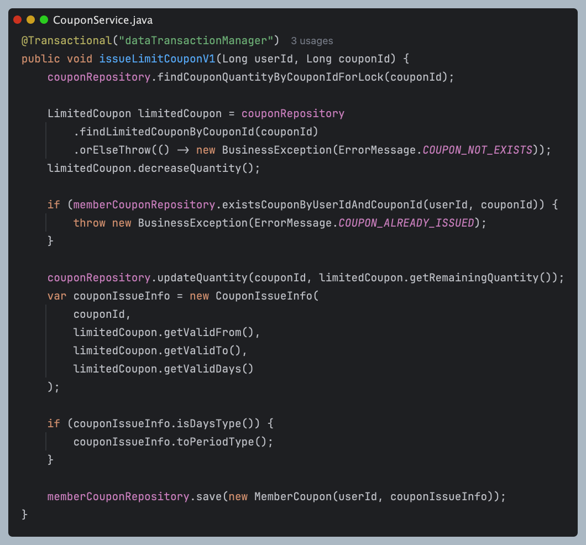
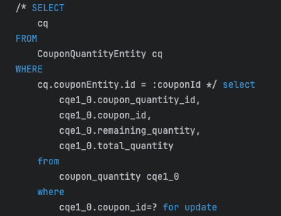

실제로  여러 경우로 테스트를 진행했을 때 전부 동시성 문제가 발생하지 않는 것을 확인했다.  
그리고 진입하고 바로 락을 잡기 때문에 공정성도 해결된다.

  
  


이렇게 해서 비관적 락을 사용하면 공정성 문제가 해결되고, 다중서버에서도 작동하기 때문에 위에서 언급했던 문제들이 전부 해결된다.  

그런데 이 방식을 선택했을 때 성능을 보장할 수 있을까?  
락을 사용한다는 건 강제적으로 자원을 점유하는 것이고 다른 요청은 기다려야 하기 때문에 성능적으로 문제가 생길 수 있다.  
그리고 선착순 쿠폰 특성상 트래픽이 몰릴텐데 무조건 쿠폰수량테이블에 락을 걸기 때문에 쿠폰이 남아있든 소진됐든 락에 의해 처리를 기다려야한다.  


이번엔 락없이 문제를 해결해보자

먼저 updatq 쿼리를 원자적으로 작동하게 변경한다.

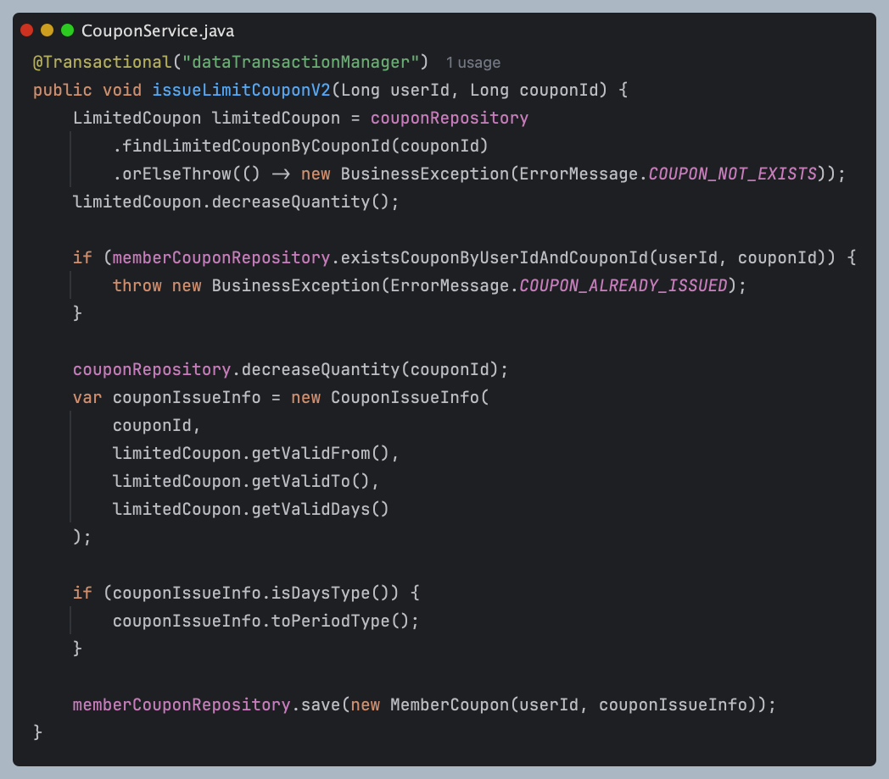


하지만 당연하게도 이 상태에서는 동시성 문제가 터지게 된다. 왜냐하면 조회순간에는 동시에 접근이 가능하기 때문에 
쿠폰이 1개 남았을 때 접근하더라도 원자적으로 수량을 줄일 때 두 개의 요청이 접근한다면 -1이된다.

  
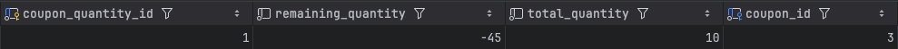


코드는 그대로 유지하고, DB에서 check 조건을 걸어서 정합성을 보장해주면 된다.
```sql
    constraint check_remaining_quantity_non_negative
        check (`remaining_quantity` >= 0)
```

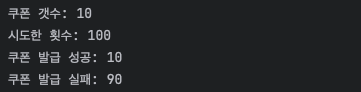

이제 동시성 제어를 하는데 있어서 `limitedCoupon.decreaseQuantity()`는 없어도 되지만 넣어주는 게 좋다.  
왜냐하면 여기 내부에서 쿠폰수량이 0이면 Exception을 던지는데 동시성 문제는 `couponRepository.decreaseQuantity(couponId)` 에서 해결이 가능하지만,  
수량을 줄이고 check 제약조건으로 확인을 하는 과정을 매번 겪어야하고, 쿠폰중복 발급에 대해서도 계속 확인해야해서 성능 저하가 우려된다.    
그래서 동시성은 잡지 못하지만 수량이 0이 된 이후에는 아래 로직으로 해결 가능하기 때문에 유지하였다. 

```java
    public void decreaseQuantity() {
        if (remainingQuantity <= 0) {
            throw new BusinessException(ErrorMessage.COUPON_OUT_OF_STOCK);
        }
        remainingQuantity -= 1;
    }
```


아직 고민인 것은 데이터베이스의 check 조건을 사용해서 동시성을 잡다보니 비즈니스로직의 분산이 일어나는 것처럼 보여서 변경점이 늘어나는 것 같다.  
그리고 비관적락처럼 명시적인 락을 걸지는 않지만 수량 업데이트는 원자적으로 발생하기 때문에 각 요청이 동시에 발생할 수 없고, 대기를 하는 구조로 이루어진다.  
그래서 성능에 영향이 갈 수 밖에 없다.

동시처리를 하면서 동시성을 해결할 수 없을까?

지금 동시성을 제어해야할 것은 쿠폰 수량이다. RDBMS은 정합성을 지켜주기 위해서 사용하는 것이 가장 큰 이유 중 하나라고 볼 수 있다.  
멤버에게 하나의 쿠폰을 발급할 때마다 쿠폰수량을 감소시키는데 이것은 데이터베이스에서 정합성을 맞춰주는 것이 아니라 애플리케이션 레벨에서 정합성을 맞춰주고 있다.  
그렇다면 정합성 자체를 데이터베이스에게 맡기는 방식으로 생각해보자.  
수량으로 카운팅을 하는 대신 미리 쿠폰을 만들어두고 쿠폰 발급이 이루어진다면 아이디를 부여하는 방식은 어떨까?
외래키는 null 값을 가질 수 있으므로 처음에는 수량만큼 쿠폰을 발급해두고 실제 선착순 쿠폰을 받게 될 때 멤버 아이디를 부여한다면 절대로 발급 갯수 이상의 쿠폰을 받을 수는 없다.  
이렇게 한다면 쿠폰수량 테이블도 없앨 수 있다.  
하지만 이 방식을 선택한다면 다시 Lock을 걸어야한다. 그러나 MySQL 8.0 버전부터는 SKIP LOCKED 라는 방식이 생겼다.  
Lcck을 걸긴 하지만 조회할 때 Lock이 걸려있는 레코드를 제외하고 조회할 수 있는 기능이다.  
그러므로 Lock을 걸어도 여러 쓰레드가 동시에 쿠폰을 발급할 수 있기 때문에 더 성능이 좋아질 것으로 기대할 수 있다.  
다만 SKIP LOCKED는 JPA에 native query로 작성해야 한다.  

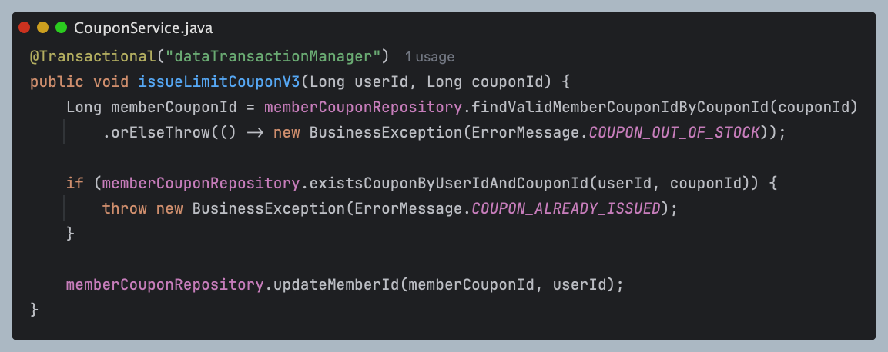
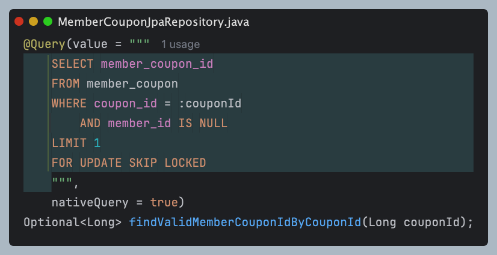


이제 비관적 락, update 원자성 + check 제약조건, skip locked 이 세 방식으로 동시성을 제어할 수 있다는 것을 알았다.  
선착순 쿠폰인만큼 정합성 이외에도 성능도 챙겨야할 것으로 생각하기 때문에 세 방식에 대해서 성능 측정도해보겠다.  
기대하는 순서는 skip locked, update 원자성 + check 제약조건, 비관적 락 순서일 것 같다.
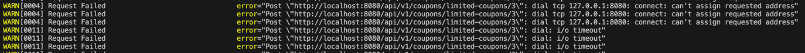

| 에러 메시지                           | 원인                                       |
| -------------------------------- | ---------------------------------------- |
| `can't assign requested address` | 로컬에서 사용 가능한 ephemeral port(임시 포트) 모두 소진됨 |
| `dial: i/o timeout`              | 서버가 너무 느리거나, 서버가 죽어서 커넥션을 열지 못함          |


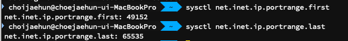


sudo sysctl -w net.inet.ip.portrange.first=1024
sudo sysctl -w net.inet.ip.portrange.last=65535

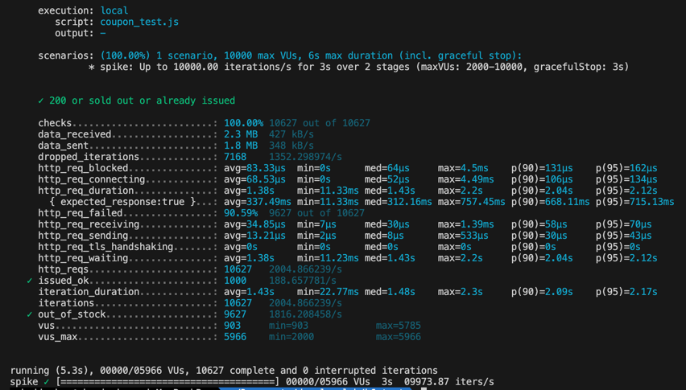

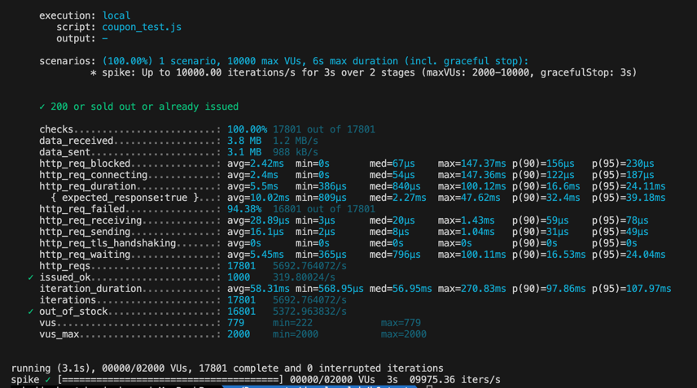

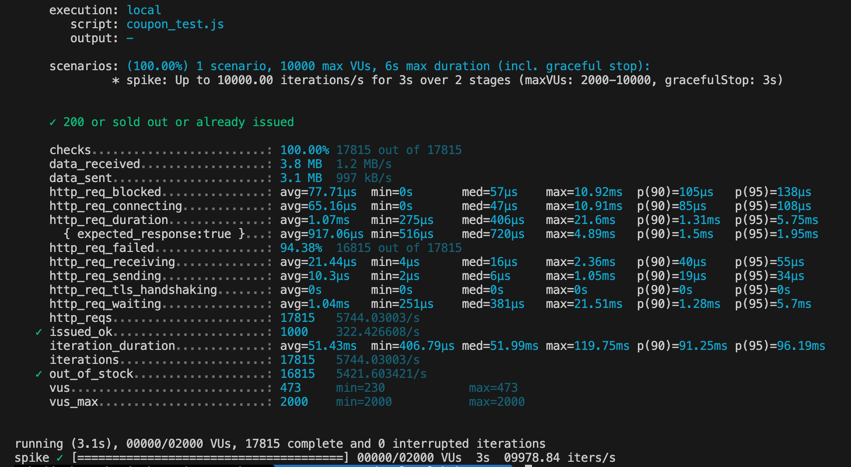


조회를 수량 감소이후로 돌린다면 정합성을 지킬수있다.
하지만 데이터 조작이 일어나고 롤백이 무조건 발생하기 떄문에 좋은 구조는 아니다.

이렇게 하는건 어떤가?
조회 0 인가? -> 수량감소 로직 실행안하기 위함
수량 감소
조회 0 인가? -> 완벽한 정합성을 위함


테이블 구조 변경을 통한 데드락 해결

