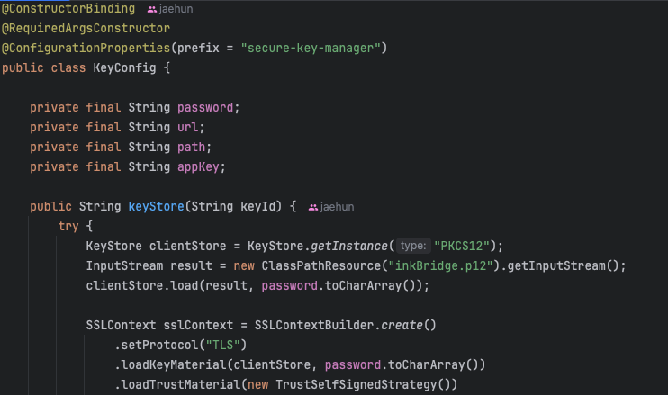
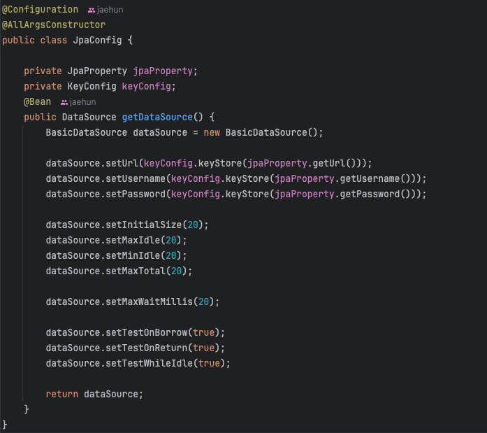
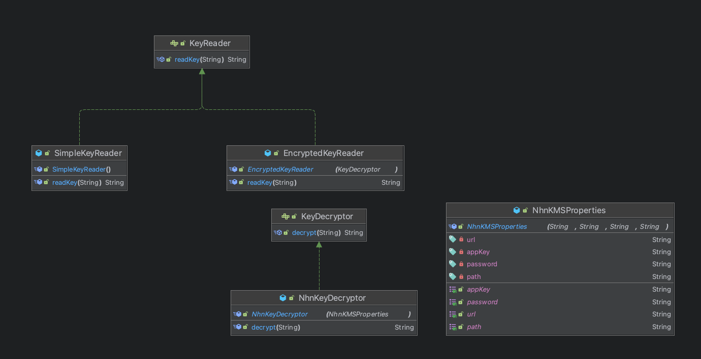
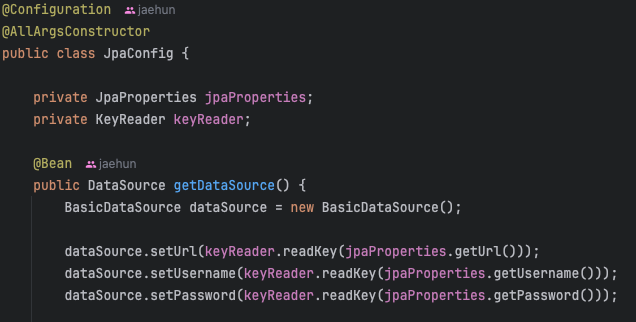
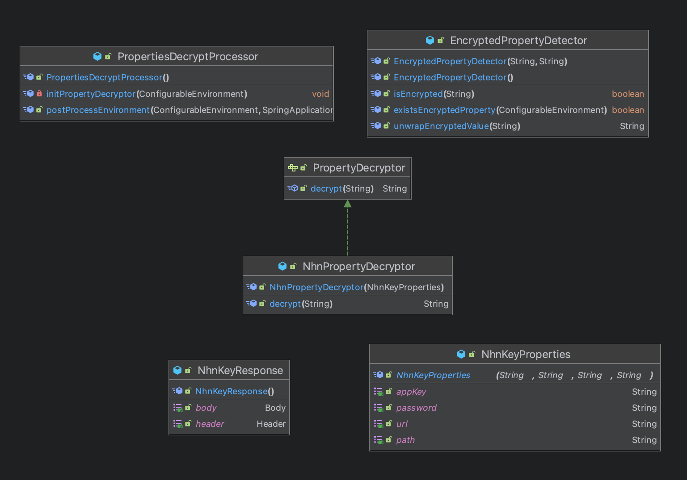
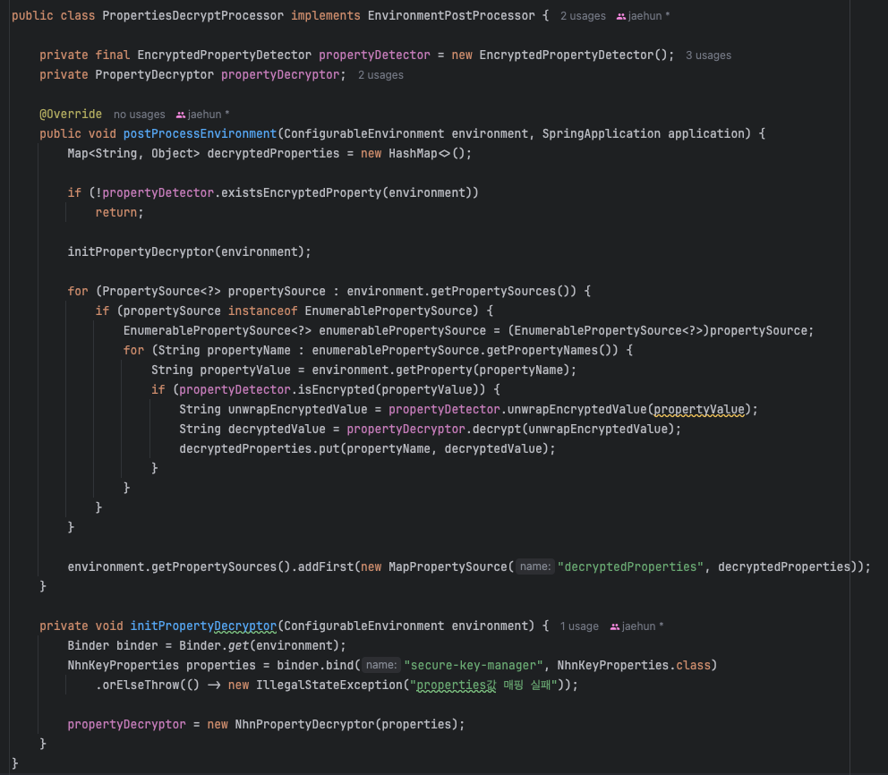

# 설정파일 암호화 로직 리팩토링으로 의존성 분리

데이터베이스 접속 정보나 클라우드 관련 키가 퍼블릭한 공간에 노출되면 보안이 취약해진다.  
특히 클라우드 키가 노출되면 요금 폭탄을 맞을 수도 있다. 따라서 키들을 Github나 DockerHub에 업로드하는 것은 위험하다.  

이 문제를 해결하는 가장 단순한 방법은 **properties/yml** 파일을 퍼블릭 공간에 업로드하지 않거나 환경 변수로 처리하는 것이다.  
하지만 이 프로젝트에서는 **NHN Cloud에서 제공하는 Key Manager를 이용하여 설정 키들을 암호화하는 방식**을 이용했다.  
그래서 이 방식을 최대한 살려서 리팩토링을 진행하였다. Key Manager에 대한 설명은 프로젝트를 진행할 때 기록해둔 [자료](https://github.com/nhnacademy-be4-InkBridge/docs/tree/main/SecureKeyManager)로 대신하겠다.

## 1. 기존 방식

### KeyConfig.class
KeyStore메서드로 복호화를 진행하는 코드이며, 핵심 로직은 아래와 같다.

### JpaConfig.class
데이터베이스 접속 정보는 노출하면 안되기 때문에 암호화했고, keyConfig를 통해 복호화를 했다. 핵심 로직은 아래와 같다.  
실제로 키를 복호화해서 사용하는 클래스는 다른 것도 있지만 사용예시를 위해서 이 클래스만 가지고 왔다.

## 2. 기존 방식의 문제점

### 암호화 서비스와의 강한 의존성

로컬환경에서 프로젝트 리팩토링을 진행하고 있어서 지금은 클라우드 서비스를 사용하지 않는다.  
그래서 평문으로 사용하려고 하는데 코드들이 Key Manager와 강하게 결합되어 있어서 수정이 불가피했다.  

코드 수정을 해서 Key Manager로직을 다 제거를 하더라도 나중에 다시 사용해야한다면 추가해야한다.  
그래서 암호화 로직과 키를 사용하는 로직들을 분리할 필요성이 느껴졌다. 

## 3. 중간 리팩토링

### 3.1 key값 조회 클래스 구조

#### NhnKeyDecryptor
- 원래 구조에서 **KeyConfig.class**는 properties/yml의 설정값을 복호화하는 역할을 하는데 바뀐 구조에서는 NhnKeyDecryptor로 변경하였다.
- 내부적으로는 Key값들을 바로 받기보다는 NhnKMSProperties로 래핑해서 전달해주었다.

#### KeyDcryptor
- NhnKeyDecryptor는 KeyDecryptor 인터페이스를 구현한다.  
- 지금 프로젝트는 Nhn Cloud를 사용하고 있지만 리팩토링하면서 여러가지 테스트를 하기 위해 다시 배포를 한다면 프리티어 때문에 AWS를 사용할 것 같기 때문에 인터페이스로 만들었다.  

#### KeyReader
- **properties/yml**을 읽는 인터페이스이다.  
- 평문키를 읽는 것과 암호화된 키를 읽는 경우를 분리하기 위해 인터페이스로 만들었다.
- 각 KeyReader를 좀 더 유연하게 선택할 수 있게 하기 위해 `@ConditionalOnProperty`을 사용하여 설정파일에서 설정하도록 하였다.

#### SimpleKeyReader
- KeyReader 인터페이스를 구현한 클래스로 평문키를 읽을 떄 사용된다.
- `@ConditionalOnProperty(name = "encryption.enabled", havingValue="false", matchIfMissing = true)` 조건에서 사용
#### EncryptedKeyReader
- KeyReader 인터페이스를 구현한 클래스로 암호화된 키를 읽을 떄 사용된다.  
- 어떤 암호화 방식을 사용할지 모르므로 KeyDecryptor 인터페이스를 주입받아 사용하도록 했다.
- `@ConditionalOnProperty(name = "encryption.enabled", havingValue = "true")` 조건에서 사용

### 3.2 key값 조회 예시

이제 키를 사용하는 클래스는 KeyReader에 의존해서 키를 읽으면 되고, 키가 암호화되었는지 평문인지는 알 필요가 없다.

하지만 일반적인 경우 config에서 설정값을 조회할 떄 XXXProperties 클래스를 주입받아 바로 읽거나 `@value`로 조회하게 된다.
그래서 지금의 구조가 의존성 문제를 해결한 구조라고 하더라도 "내부적으로 어떤 이유가 있어서 한번 래핑해서 읽는구나" 라는 생각이 들 것 같았다.  
즉 의존 문제를 억지로 끼워맞춰서 해결한 느낌이 들었다. 그래서 한번 더 리팩토링을 하기로 하였다.  

자세한 코드는 [여기](https://github.com/nuheajiohc/inkbridge-refactoring/commit/35ffb8134d58b6a9f03dc9d52ff18e4392c284ff)애서 확인가능하다.

## 4. 최종 리팩토링

### 4.1 리팩토링 방법 생각 과정
복호화 로직은 **Jasypt 오픈소스 라이브러리**를 사용하려고 했다.  
이것은 어떤 값을 암호화하고 복호화하기 위해 사용하는 라이브러리이고 **properties/yml의 값**을 복호화하는 데 많이 사용하는 것 같았다.  

그런데 신경쓰이는 점이 두가지가 있었다.
첫번째는 마지막 릴리즈가 2022년 말 쯤이라서 나중에 버전 호환성 문제에 대한 염려가 있었다.
두번째는 복호화만 진행하면 되는데 커스텀을 하려면 암호화 메서드와 복호화 메서드를 전부 구현을 해야한다.  
암호화 메서드는 사용하지 않으므로 Exception을 던지도록 구현하면 되지만 원래 의도에 맞지 않게 사용한다는 느낌이 들어서 찝찝했다.

그래서 **EnvironmentPostProcessor**인터페이스를 사용하기로 하였다.
이 인터페이스는 `Environment`를 초기화 하는 과정에서 실행되는 인터페이스이다.
그리고 이미 복호화가 된값이 메모리에 올라가기 때문에 설정값을 사용하는 클래스는 `@ConfigurationProperties`나 `@Value`를 사용해서 읽기만 하면 된다.

### 코드 구조

#### PropertiesDecryptProcessor
- **PropertiesDecryptProcessor**는 **EnvironmentPostProcessor**를 구현한 클래스
- 복호화 로직의 메인이 되는 클래스이다.

#### EncryptedPropertyDetector
- **PropertiesDecryptProcessor**클래스 안에서 설정파일을 순회하며 암호화된 값들이 있는지 확인한다.
- 암호화된 값들은 ENC(XXX)로 래핑을 해둬서 ENC()를 벗겨주는 작업을 한다.

#### PropertyDecryptor
- 암호화 방식의 변화에 유연하게 대응하기 위한 인터페이스

#### NhnPropertyDecryptor
- **PropertyDecryptor**를 구현한 클래스
- Nhn Cloud의 KeyManager 서비스의 복호화 로직을 구현한다.

#### NhnKeyResponse
- KeyManager의 복호화 로직에 사용되는 응답클래스

#### NhnKeyProperties
- KeyManger의 복호화 로직에 사용되는 요청할때 필요한 정보

### PropertiesDecryptProcessor클래스 로직

**postProcessEnvironment**메서드의 첫번째 if문에서 설정 파일에 암호화된 값들이 있는지를 확인한다.
여기서는 profile에 상관없이 파일안의 값들로 판단을 한다. ENC(xxx)처럼 ENC()로 감싸진 경우 암호화된 값으로 판단하게 만들어두었다.  

만약 암호화된 값이 있다면 초기화 메서드가 실행되고, 그 아래에서 properties/yml을 포함한 모든 설정값 저장소들을 순회한다.  
그리고 복호화를 진행하여 커스텀 저장소를 만들어 우선순위가 가장 높게 키를 저장한다. 그래서 같은 키를 가진 암호화된 키들은 무시가 된다.

### 아쉬운 점

EnvironmentPostProcessor를 사용하려면 resources폴더에 META-INF/spring.factories에 아래처럼 파일경로를 넣어줘야한다.
`org.springframework.boot.env.EnvironmentPostProcessor=com.nhnacademy.inkbridge.backend.infrastructure.decrypt.PropertiesDecryptProcessor`

그리고 이 코드를 보면 IOC로 의존성 주입을 하지 않고 직접 의존성 주입을 한 것을 볼 수 있다.  
왜냐하면 **PropertiesDecryptProcessor**클래스는 bean이 등록되기 전에 실행되는 클래스이기 떄문이다. 
그래서 최대한 의존성 주입을 분리하기 위해 initPropertyDecryptor로 메서드를 분리하였다.

이 두가지가 아쉬운 부분인데 만약 더 좋은 방법이 있다면 또 수정해보겠다.

[최종 로직이 들어있는 PR](https://github.com/nuheajiohc/inkbridge-refactoring/pull/2)

결과적으로 이 리팩토링을 통해서 보안을 챙기면서도 개발하는 입장에서는 보안코드의 의존성을 생각하지 않을 수 있게 되었다.
