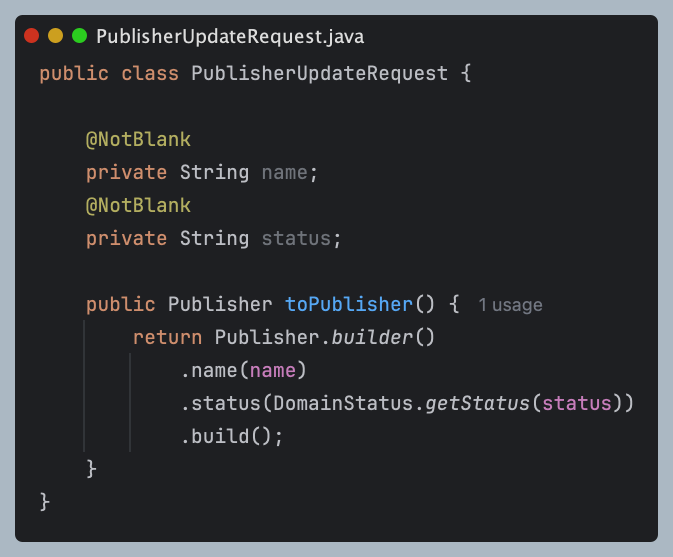
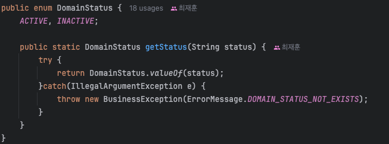
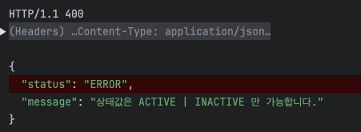
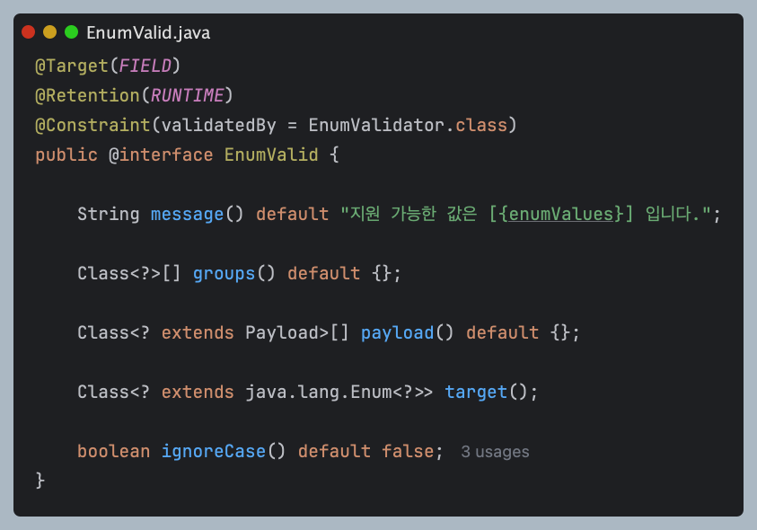
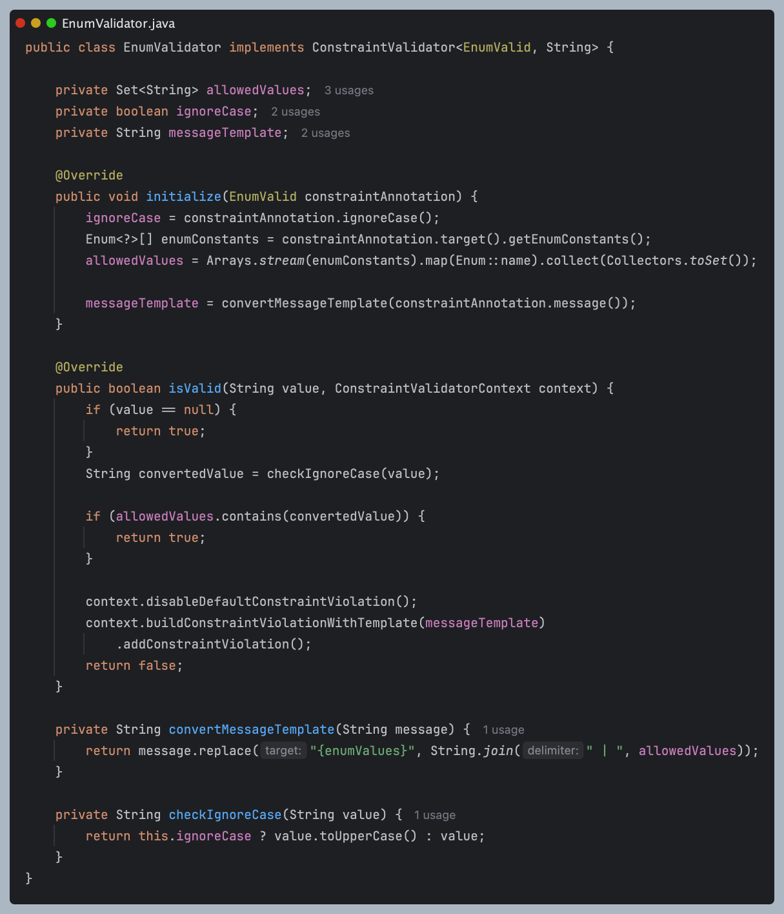
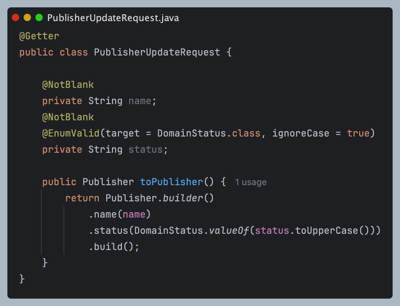
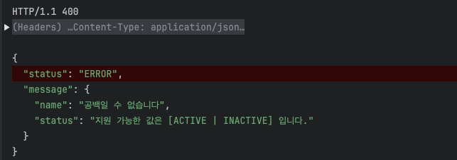

# 요청 DTO에서 ConstraintValidator로 Enum 검증하기

클라이언트에서 데이터를 넘겨줄 때 `@NotBlank`, `@NotEmpty` 등으로 대부분의 유효성 검사를 할 수 있다.  
하지만 나의 경우에는 **Enum**에 바인딩 될 수 있는 값인지 검증을 해야했다.

그래서 이번 글에서는 `ConstraintValidator`를 활용해 **Enum**에서 지원하는 값인지 검증하는 방법을 공유해보겠다.

## 첫 번째 시도 : 바인딩 이후 도메인 변환 시점에서 Enum 검증

처음에는 요청으로 들어온 문자열이 유효한 Enum 값인지 검증할 때, 아래와 같이 도메인 변환 로직 안에서 직접 처리했었다.

**예시 Request 클래스**

**DomainStatus.class**

**응답**  

이렇게 처리하면 올바르게 예외 처리를 할 수 있다.  
하지만 `@Valid` 를 통해서 데이터 바인딩 직후에 유효성 검사를 하는 것이 아니라 `@NotBlank`나 `@NotEmpty` 등과 같은 시점에 유효성 검사를 하는 것이 아니다.  
즉, 이 구조는 같은 시점에 `MethodArgumentNotValidException`로 예외를 처리할 수 없다.

나는 `@Valid`를 통해 다른 검증들과 동일한 시점에 Enum이 지원하는 값인지를 검증하고 싶었다.

## ConstraintValidator를 사용한 커스텀 어노테이션으로 검증

스프링에서는 `@NotBlank`, `@NotEmpty` 등 기본 제공 어노테이션 외에도 `ConstraintValidator` 인터페이스를 구현하면 커스텀 유효성 검사기를 만들 수 있다.

그래서 다음과 같이 **Enum**에서 지원하는 값인지 검증기를 만들었다.

### 유효성 검사 커스텀 어노테이션: EnumValid

- @Constraint(validatedBy = EnumValidator.class): 어떤 Validator 클래스가 검증할지 지정
- message: 유효성 검사 실패 시 반환할 메세지
- groups: 유효성 검사의 적용 대상을 구분할 때 사용
- payload: 확장 목적으로 사용되는 필드. 일반적으로는 거의 사용하지 않음
- target: 다양한 Enum 클래스에 적용하기 위한 설정으로 어떤 Enum 클래스인지 지정
- ignoreCase: 대소문자 무시 여부

message, groups, payload는 필수적으로 구현해야하는 필드이고 나머지는 추가 기능을 구현하기 위해 넣었다.  
자세한 내용은 @Constraint 어노테이션에 들아가면 알 수 있다.

### 유효성 검사 로직: EnumValidator

- ConstraintValidator
  - 이 인터페이스를 구현해야 어노테이션을 붙였을 때 검증을 할 수 있다.
  - 제네릭 타입 매개변수는 각각 검증 대상 **어노테이션 타입**, **유효성 검사를 적용할 필드 타입**이다.
- initialize
  - default 메서드이며, 검증 실행 시 처음 한번만 설행된다.
  - 매개변수는 어노테이션으로 들어오는 메타정보들이다.
- isValid
  - 검증이 발생할 때마다 실행되는 메서드로 true를 반환하면 검증 통과이고, false면 검증 실패로 `MethodArgumentNotValidException`이 발생한다.
  - 매개변수는 차례대로 유효성 검사를 **적용할 필드 타입**과 유효성 검사 실패 시 나오는 **메시지를 제어**할 수 있게 해주는 클래스이다.
자세한 내용은 ConstraintValidator 인터페이스에 들어가면 확인할 수 있다.

내 코드에서는 `initialize`에서 대소문자 여부를 확인하고 Enum 배열을 받아서 Set에 넣어주었다.  
그리고 현재 기본 메시지는 하드코딩되어 있는 부분이 있기 때문에 지원가능한 Enum을 보여주는 형태로 템플릿화했다.  
이 부분들은 검증마다 진행할 필요가 없고 한번만 진행하면되므로 `initialize`에서 초기화하였다.

`isValid` 메서드에서는 처음 value가 null일때 통과를 시키는데 `@NotNull`을 통해 검증하도록 책임을 넘겨주는 것이다.  
그리고 그다음엔 대소문자 무시 여부를 통해 값을 변형하고, Set에서 지원가능한 값인지 확인한다.  
지원 불가능한 값이라면 기본 메시지를 비활성화하고 `initialize`메서드에서 만든 메세지 템플릿을 활성화시켜준다.

### 실제 사용 예시

이제 이렇게 사용하면 String에 값을 바인딩한 후 지원하는 Enum값인지 검증을 할 수 있다.  
그리고 도메인 객체로 변환해줄 때 ignoreCase를 고려하여 대문자로 바꿔서 초기화한다.

이렇게할 경우 검증 실패 시 아래와 같이 다른 필드와 함께 에러를 처리할 수 있다.  

## 요청 DTO 필드로 Enum을 직접 받지 않은 이유

`DomainStatus status`로 직접 받으면 안 되는지에 대한 의문이 생길 수 있다.

결론부터 말하면 안 된다.
왜냐하면 각 필드에 바인딩이 이루어진 뒤에 유효성 검사가 발생하는데 올바르지 않은 Enum값이라면 바인딩 시점에서 예외가 발생하기 때문이다.
그래서 String으로 바인딩한 후 유효성 검사를 진행했다.

## 정리
- 커스텀 어노테이션을 통해 유효성 검사의 흐름을 일관되게 관리할 수 있다.
- 스프링은 많은 것을 커스텀할 수 있게 제공하고 있다는 것을 알았다.
