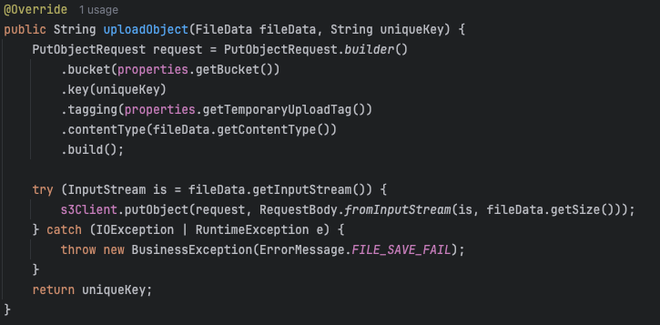
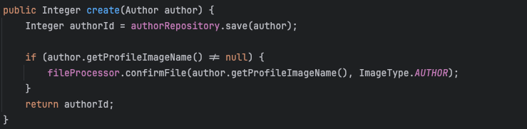
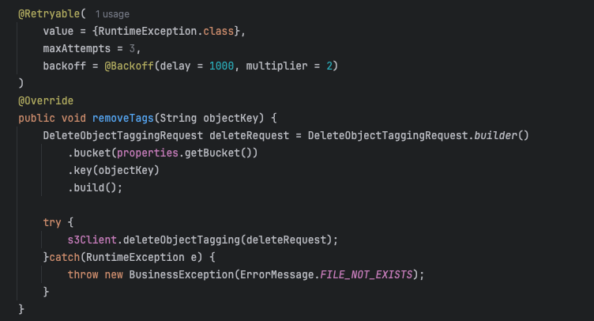

# 이미지 업로드와 DB 저장에 대한 고민과 해결과정

책 정보나 작가 정보, 리뷰 등을 등록할 때, 이미지 파일을 함께 저장해야 한다.  
이미지 파일은 DB와는 다른 IO 작업이라서 어떻게 로직을 구성할지가 중요했다.  
간단하게 생각하면 "이미지 업로드 → DB 저장" 또는 "DB 저장 → 이미지 업로드" 중 하나를 선택하면 될거라고 생각할 수도 있지만, 트랜잭션 처리, 예외 상황, 서버 부하 등 여러 요소를 함께 고려해야한다.  

그래서 이 글에서는 내가 고민한 부분들과 해결 과정을 공유해보겠다.

## 1. 사진 업로드와 DB 저장의 순서에 대한 고민

### 1.1 하나의 요청 안에서 사진 업로드 → DB 저장 
이 방식은 파일을 먼저 업로드한 뒤, 그 결과로 받은 URL 혹은 파일식별자를 DB에 저장하는 구조다.

#### 장점
- 이미지 업로드를 실패하면 DB 작업을 진행할 필요가 없어서 트랜잭션 관리가 단순하다.
- 이미지 업로드를 확인하고 DB에 저장하기 떄문에 무결성이 지켜진다.

#### 단점
- 업로드는 외부 API 호출이자 I/O 부담이 큰 작업이다.
- 업로드 후 DB 저장에 실패하면 업로드된 파일을 정리해줘야 함 (수동 삭제 or 스케줄링)

## 1.2 하나의 요청 안에서 DB 저장 → 사진 업로드
DB 저장을 먼저 처리하고, 그 후에 이미지 업로드를 수행하는 방식이다.

#### 장점
- DB 저장 실패 시 사진 업로드를 진행할 필요가 없어서 외부 API 호출 비용을 아낄 수 있다.

### 두 가지 경우 모두에서 나타나는 공통적인 단점
- 사진 업로드는 I/O 비용이 크기 때문에 사진 업로드와 DB 저장을 하나로 묶으면 **다른 요청에 비해 응답 시간이 길어질 수 있다.**
- 사진 업로드는 트래잭션으로 처리할 수 없는 작업인데 논리적으로 묶어서 사용하고 있다. 논리적 트랜잭션을 사용해야할 수도 있지만 업로드 요청을 트랜잭션으로 묶는 것은 커넥션 사용시간을 비교적 길게 만든다. 또한 aws 서버의 문제가 있어서 지연이 길어질 경우 DBMS 서버까지 위험해지는 상황이 발생한다. 파일 업로드는 동기적으로 처리된다.

## 2. 사진 업로드와 DB 저장 요청 분리로 해결

사진 업로드와 DB 저장 로직을 분리하여 2개의 요청으로 처리하여 구현하였다.
그 이유는 아래와 같다.

- 클라이언트에서 사진 업로드할 수도 있음
  - `Multipart` 요청을 통해 서버에서 업로드할 수 있지만 파일 업로드는 다른 요청에 비해 부하가 큰 작업이기 때문에 클라이언트에게 파일 업로드 책임을 넘겨줄 수 있다. (AWS-S3에서는 Presigned URL 지원)
  - 책임을 이동시켜 줄 수 있기 때문에 로직을 분리하는 것이 이후 변화에 유연하게 대응할 수 있음
- 요청 분리를 통한 UX 향상
  - 사진 업로드 요청을 먼저 하고 책 정보나 작가 정보를 입력하면서 업로드를 진행할 수 있다. 그래서 실제 파일 업로드 시간 자체는 동기적으로 이루어지는 것과 다를 바 없지만 더 빠르게 업로드 된다고 느낄 수 있다.

내가 개발하고 있는 서비스 특성상 이미지 요청이 많지 않고, 대부분 관리자 전용 기능이기 때문에 서버에서 파일 업로드를 처리해도 부담이 없다고 생각했다.  
그래서 서버에서 파일 업로드를 구현했지만, 향후 트래픽 증가나 구조 변경 가능성을 고려해서 파일 업로드와 DB 저장 요청은 분리하기로 결정하였다.

하지만 이 구조가 확장성에는 유리하지만 몇가지 문제를 발생시킬 수 있다.

### 2.1 사진 업로드 후 화면 이탈 시 생기는 고아 객체
사진을 업로드 했지만, 사용자가 내용을 작성하다가 화면을 이탈하면 S3에는 사용되지 않는 파일이 남는다.  
이를 히결하기 위해 **S3 수명주기**와 **태그 기반 관리**를 활용했다.

s3에서 사용하는 bucket에 들어가서 관리 탭을 들어가면 수명 주기 규칙을 설정할 수 있다. 
여기서 설정한 태그를 붙이면 1일 후에 객체가 만료되도록 설정하였다.

아래 사진을 통해 실제 업로드 로직에 사용되는 메서드이다.  

태그를 붙여주는 것을 확인할 수 있는데 이것은 실제로 일시적으로 업로드 하기 위해 설정한 태그이다.

이렇게 임시적으로 업로드를 진행한 뒤 아래 로직을 통해 실제 파일 업로드를 확정짓는다.  

`confirmFile` 메서드를 타고 들어가보면 태그를 떼는 작업을 해주는데 이 작업은 논리적인 트랜잭션으로 묶어주었다.  
아까는 외부 API는 트랜잭션에서 제외해주어야 한다고 말했지만 이 경우에는 괜찮다. 그 이유는 아래와 같다. 

1. AWS 내부적으로 문제가 생길 시 내부적으로 재시도를 진행하고, 굉장히 안정적인 서비스이기 때문에 문제가 생길 일이 거의 발생하지 않는다.  
2. 태그를 제거하는 작업은 파일 업로드와 다르게 API 요청 하나를 하는 것 뿐이고, 키값형태로 저장되기 때문에 시간복잡도가 O(1)이다.

### 2.2 이미지 업로드 지연 문제
현재 내가 구현한 것은 파일 업로드를 진행하면서 동시에 책이나 작가 정보를 작성할 수 있지만, 책이나 작가 정보 저장 요청을 하려면 파일 업로드가 완료되어야 할 수 있다.  
하지만 **Presigned URL** 을 사용하거나 비동기 업로드로 변경하여 파일 식별자는 미리 넘어올 수 있다면 파일 내용이 먼저 저장되는 현상이 발생할 수 있다.

그래서 파일이 s3에 저장되기 전에 태그를 떼는 작업이 먼저 발생할 수 있다.  
태그를 떼는 작업은 이미지 조회가 먼저 발생하고 태그를 제거하게 되는데 이미지 파일이 존재하지 않을 경우 **NoSuckKey 에러**가 발생한다.  
이 에러는 지연 문제 때문에 발생하는 문제라서 **rollback** 처리해주기에는 아쉬움이 있다.  
그리고 이 에러는 비즈니스 로직의 에러이기 때문에 aws 내부의 재시도 로직이 해결해주지 않는다.

그래서 이 문제를 해결하기 위해 **Spring Retry** 라이브러리를 활용하여 총 3번의 시도를 하도록 재시도 로직을 추가했다.

사용자가 정상적인 루트로 정보를 등록한다면 재시도까지 갈 일이 거의 발생하지 않겠지만 지연 문제는 발생할 수 있기 때문에 방어 코드를 추가해둔것이다.  
또한 여기서 지수 백오프까지 적용할 필요는 없을 것 같지만 규칙적인 재시도보다 불규칙적인 재시도가 성공 확률을 높이기 때문에 최초 1초를 기준으로 2배씩 증가시켜 요청하도록 처리하였다.

### 2.3 따닥으로 인한 이미지 중복 참조 문제
이미지를 업로드한 뒤, 사용자가 네트워크 이슈 등으로 같은 이미지를 참조하는 책이나 작가 정보를 두 번 보내는 상황이 생길 수 있다.  
즉 동일한 이미지 URL을 참조하는 중복된 글 두 개가 저장될 수 있다.  
사용자는 두 개의 글이 저장된 것을 인지하고 하나를 삭제한다면 이미지도 삭제되기 때문에 나머지 하나의 글도 영향을 받는다.  
그래서 이를 막기 위해서 DB 칼럼에 이미지이름에 unique 제약조건을 걸어서 중복 저장 자체를 차단하였다.

## 정리
- 사진 업로드와 DB 데이터 저장 분리로 UX 향상
- S3 수명 주기와 태그를 활용하여 고아 객체 정리
- 재시도 로직을 통한 이미지 업로드 지연 대응
- 이미지 URL/이름 칼럼에 unique 제약조건을 걸어서 따닥 문제 해결
- presigned URL로 구조 전환 가능하도록 설계

- [AWS-S3 : 객체 만료](https://docs.aws.amazon.com/ko_kr/AmazonS3/latest/userguide/lifecycle-expire-general-considerations.html)  
- [AWS : 재시도](https://docs.aws.amazon.com/ko_kr/sdk-for-java/latest/developer-guide/retry-strategy.html)