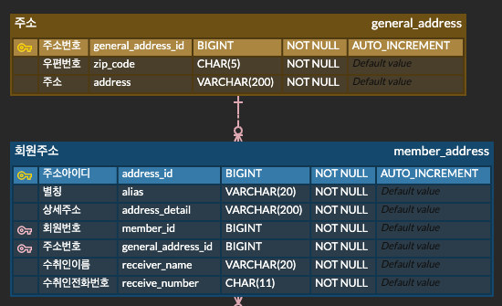
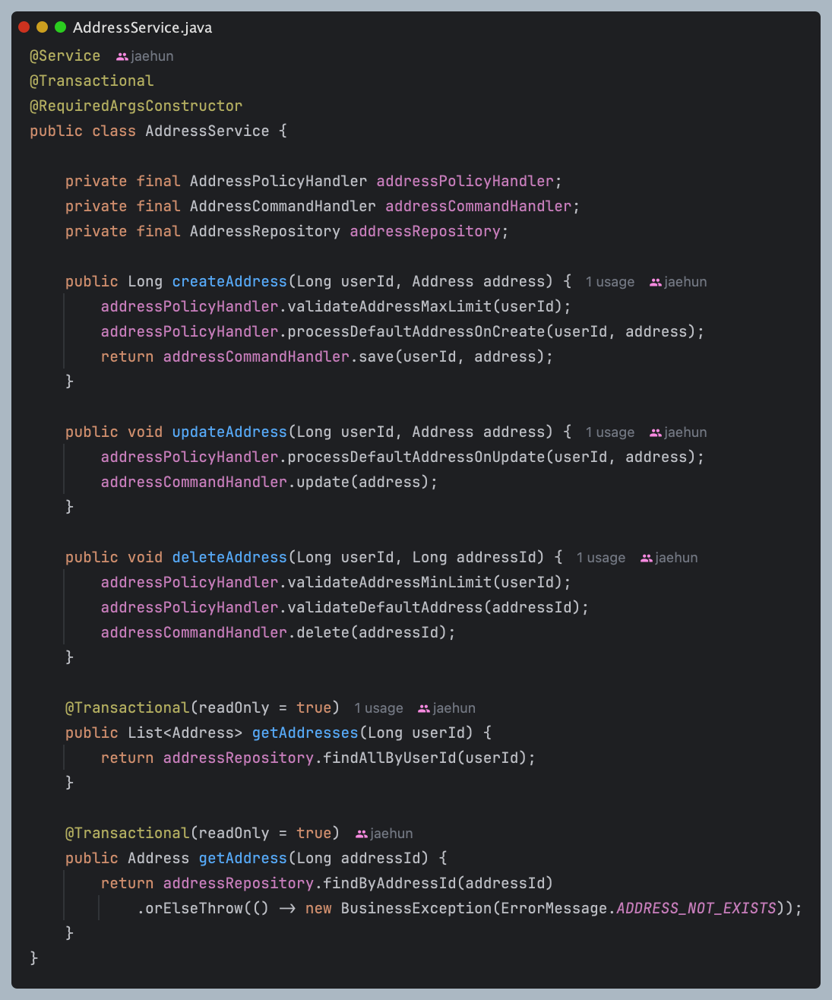

# 주소 도메인 리팩토링

주소 도메인의 구조에 문제점이 있다고 판단하여 리팩토링을 진행했다.  
이 글에서는 ERD와 코드 구조를 개선하고, 어떤 문제를 어떻게 해결했는지 전반적인 리팩토링 과정을 작성해보겠다.

## 리팩토링 내용
- **2개로 나뉘어 있던 테이블 -> 단일 테이블**
- **기존 코드 구조 개선 및 기능 추가**
  - 주소 최대 10개 제한 로직 추가(기존 요구사항에 있던 내용)
  - 기본 배송지 설정 로직 추가(개인적인 추가)
- **계층 단위로 나뉘어진 패키지 구조 -> 도메인 기반 패키지 구조**
  - 추후 모듈 분리를 고려한 구조로 설계

## 기존 ERD 구조



기존 주소 도메인은 `general_address`, `member_address` 두 테이블로 분리되어 있었다.  
아마 아파트 등의 **공통 주소를 공유하는 사용자를 고려한 정규화**로 추정된다.

하지만 이 구조에 의해서 여러 문제가 발생했다.

### 문제점
1. **주소 중복 제거 효과 미미**
   - 공통 주소를 사용하더라도 그 수가 미미하여 정규화가 유의미하지 않다.
2. **공통 주소 수정 시 여러 사용자에게 영향**
   - 비즈니스 로직을 잘못 작성했을 경우 주소를 수정할 떄 다른 사용자의 주소도 바뀔 수 있다.
3. **단순 주소 조회에 JOIN 사용**
   - 단순히 주소를 조회하는 기능인데 정규화에 의해서 JOIN이 발생하여 성능 저하와 코드 복잡도가 증가한다.

> 또한 이 ERD 구조에 의해 동시성 문제가 생길 수 있다. 이 부분은 아래에서 설명하겠다.

## 개선된 ERD 구조


### 개선 사항
- `general_address`, `member_address` 통합 → 단일 `address` 테이블
- 비정규화로 불필요한 JOIN제거

> 기존 구조가 여러 사용자가 주소를 공유한다는 점에서 비정규화가 아니라 올바른 구조로 바꾸었다고 볼 수도 있을 것 같다.

### 새로운 컬럼 추가
- `is_default` : 기본 배송지 여부 설정
- `created_at`, `updated_at` : 운영 로그용 타임스탬프 필드, 정렬 기준


## 코드 구조 리팩토링

### 패키지 구조 변경

**기존 패키지 구조**
```
com.nhnacademy.inkbridge.backend
├── annotation      # 커스텀 애노테이션
├── controller      # REST API 컨트롤러
├── dto             # 요청/응답 DTO
├── entity          # Entity
├── enums           # enum
├── exception       # 커스텀 예외 및 메시지
├── facade          # 복합 서비스 조합
├── repository      # Repository
├── service         # 서비스 로직
```

**개선 패키지 구조**
```
// 리팩토링하면서 구조는 바뀔 수 있음
.
└── com.nhnacademy.inkbridge.backend
    ├── api         # controller 등 web 계층
    ├── domain      # service + 비즈니스 로직
    ├── infrastructure # 외부 연동 (cloud, elasticSearch 등)
    └── storage     # RDB, Redis, NoSQL 등
```

#### 구조 변경 이유
기존 구조는 계층 기반 아키텍처로, 각 계층별로 클래스를 모아두는 방식이었다.  
이 방식은 작은 프로젝트에서는 직관적이고 이해하기 쉽지만, 프로젝트의 규모가 커질 때는 아래와 같은 단점이 드러난다.

- 리팩토링 시 도메인 흐름 파악이 어려움
  - 수십 개의 클래스가 각기 다른 계층에 흩어져 있어서 일일이 찾아다녀야함
- 클래스 간 응집도 부족
  - 같은 기능을 하더라도 서로 다른 패키지에 위치해 있어서 기능 파악이 힘듦

#### 개선 방향
새로운 구조는 겉보기에는 기존 구조와 유사해 보이지만 아래와 같은 차이점이 있다.
- 계층 + 도메인 중심 분리
  - 기존: 계층별로만 구분(`controller`, `service`, `repository`)
  - 개선: 계층분리를 유지하면서 각 계층을 도메인 단위로 분리 + 각각의 책임을 가진 패키지
- 멀티 모듈 고려
  - 지금은 단일 모듈로 리팩토링을 해나가지만 리팩토링이 끝날 쯤엔 멀티 모듈로 변경 예정
  - 학습 용도로도 이 프로젝트를 사용할 예정이라 `JPA -> JOOQ` 전환 등 기술 교체를 유연하게 하기 위해 모듈화를 고려 중
  - 기존 프로젝트의 CI/CD 시간이 길었던 기억 때문에 멀티 모듈을 통해 시간 최적화 기대
- 의존 방향
  - 기존: 기존에는 `controller -> service -> repository`으로 의존방향이 흐름
  - 변경: domain(service, 도메인 로직)에 `controller`와 `repository` 등이 의존하도록 설계, 기술 변경에 유연하게 대응하기 위해


### 기존 서비스 클래스 분석

  

#### 문제점
- **동시성 문제**
  - updateAddress 메서드에서 GeneralAddress 저장 시 동일한 주소를 두 사용자가 동시에 입력하면 중복 저장이 발생 가능
- **조회 시 풀 스캔**
  - updateAddress 메서드 GeneralAddressRepository조회 시 우편 번호와 주소로 조회하므로 풀 스캔 발생
  - 사용자 수에 비례하여 탐색 시간 선형 증가
  - zip_code + address에 인덱스를 설정하면 생성, 수정 성능이 저하되고, 더 나은 방식이 있어서 리팩토링하면서 수정함
- **수정 시 예외 발생 가능성**
  - 동시성 문제에 의해 두 개의 GeneralAddress가 저장되면 updateAddress 메서드에서 조회할 때 Optional로 처리 하기 때문에 `NonUniqueResultException` 위험
- 가독성
  - 가독성은 주관적인 측면이지만 가독성 개선이 가능할 것 같아서 수정 진행
- 주소 조회시 불필요한 조건
  - 전반적인 메서드에서 주소를 조회할 때 userId와 addressId로 조회
  - userId는 외래키, addressId는 기본키이므로 addressId만으로도 조회 가능


#### EXPLAIN 결과 비교 (`address_id` 단독 vs `userId + addressId` 복합 조건)
| 설명                         | select_type | type     | possible_keys | key       | key_len | rows |
|----------------------------|-------------|----------|---------------|-----------|---------|------|
| `address_id`만 조건         | simple      | `const`  | PRIMARY       | `PRIMARY` | 8       | 1    | 
| `userId + addressId` 조건   | simple      |  `const` | PRIMARY,<br/>FKeslc8586cwl3ej73mv7gr83x2  | `PRIMARY` | 8       | 1    |

결과를 비교해봤는데 인덱스 후보만 userId, addressId 조건 이 외래키인 userId를 더 가지고있는 것 말고는 전부 같다.  
후보는 두 개여도 옵티마이저는 기본키만 사용해도 식별이 가능하다고 생각하여 기본키만 사용하여 조회를 진행한다.  
결과는 동일해도 userId는 불필요한 조건이기때문에 제거해주겠다.


### 개선한 서비스 클래스 분석



#### 설명
- **AddressPolicyHandler 클래스**
  - 주소 도메인의 정책과 관련된 로직을 관리
  - 주소 개수 제한 (1~10개)
  - 기본 배송지 관리 로직
- **AddressCommandHandler 클래스**
  - 커멘드성 코드(주소 생성, 수정, 삭제)를 관리
- **AddressRepository 클래스**
  - 주소 조회용도로 사용
  - 복잡하지 않아서 직접 조회하지만 이후에 다른 도메인 리팩토링을 진행하며 분리 예정 
- **AddressService 클래스**
  - 위 3개의 클래스는 구체적인 로직이 담겨있다.
  - 이 클래스에서는 로직의 흐름을 쉽게 파악할 수 있다.
- **createAddress**메서드 
  - 주소 최대 개수를 확인하고, 기본 배송지 설정을 처리한 후 주소를 저장한다.
  - 주소 저장 후 반환하는 것은 addressId이다. 
  - 주소를 저장한 후 새로고침이 되면은 상관없겠지만 동적으로 주소를 바로 추가하는 경우 id가 없으면 수정이나 삭제가 불가능하다. UI에 의존하는 개발을 하기보다는 유연하게 상황에 대응하기 위해 이렇게 구현했다.
- **updateAddress** 메서드
  - 주소를 수정할 때 기본 배송지에 관한 로직을 처리한 후 주소를 수정한다.
  - 수정할 때는 이미 프론트에서 주소 정보를 다 알고 있기 때문에 데이터를 따로 응답하지 않았다.
- **deleteAddress** 메서드
  - 주소 최소 갯수이면 삭제할 수 없고, 기본주소여도 삭제할 수 없게 하였다.  
  - 이미 프론트에서 기본주소이면 삭제버튼을 만들게 두지는 않을테지만 최대한 방어적으로 코딩을 해야하기 때문에 **validateDefaultAddress**에 로직을 구현해두었다.
- 나머지 두개는 조회 로직이다.

> 구체적인 로직에 대한 것은 [Pull Request URL](https://github.com/nuheajiohc/inkbridge-refactoring/pull/4)로 남기겠다.

## 리팩토링 결과
- 2개의 테이블에서 1개의 테이블로 축소
  - 극단적 정규화로 인한 불필요한 JOIN 제거
  - 기존 테이블 구조는 여러 사람들의 상태를 공유하는 느낌이기 때문에 올바른 정규화가 아니라고 생각
- 락없이 동시성 문제 해결
  - 거의 동시성 문제가 발생하지 않는다는 점에서 낙관적락을 걸수도 있지만 단순 조회로직에 락을 거는 것은 아쉽다는 생각
  - 테이블 구조에서 비롯되는 문제라고 생각해서 근본적인 원인을 해결하니 동시성 문제도 자동 해결
  - 공통 주소 조회 시 생길 수 있는 예외 상황 해결
- 공통 주소 조회 시 풀스캔하는 현상
  - 테이블 구조 수정으로 모든 로직 기본키로 조회
- UI에 의존하는 코드 -> 어느 UI에도 적용가능한 코드
- 응집도 낮은 패키지 구조 -> 확장성 있는 패키지 구조로 변경
- 기본 배송지 추가, 주소 개수 제한 조건 추가


## 요구사항
- **주소 등록**
  - [x] 주소는 도로명 주소 + 상세 주소를 함께 등록한다.
  - [x] 배송지 등록 시 기본 배송지 여부를 선택할 수 있다.
  - [x] 주소는 최대 10개까지 등록 할 수 있다.
- **주소 변경**
  - [x] 기본 배송지를 변경할 수 있다.
  - [x] 주소 내용을 변경한다.
- **주소 삭제**
  - [x] 주소를 삭제한다.
  - [x] 유일한 배송지라면 삭제할 수 없다.
  - [x] 기본 배송지는 삭제할 수 없다.
- **주소 조회**
  - [x] 기본 배송지로 선정한 주소는 상단에 고정된다.
  - [x] 주소 목록은 최근 등록 순으로 정렬된다.
- [ ] 회원가입 시 기입한 주소를 기본 배송지로 등록한다. 
  - 마지막은 회원 도메인 리팩토링할 때 추가하겠다

## 정리
처음에는 주소 도메인이 단순하다고 생각했지만, 기본 배송지 지정이라는 조건이 추가되면서 생각보다 구조가 복잡해졌다.  
좋은 구조에 대한 고민을 하다보니 단순한 CRUD 이상의 설계가 필요하다는 것을 느꼈다.

또한, 개발 전에 요구사항을 정리하고 체크리스트를 관리하니 기능 구현의 방향을 잃지 않고 개발할 수 있었다.

무엇보다 이번 리팩토링을 통해 동시성 문제를 단순히 락으로 해결하기보다 문제의 근본 원인을 찾아 해결하는 것이 더 중요하다는 걸 깨달았다.