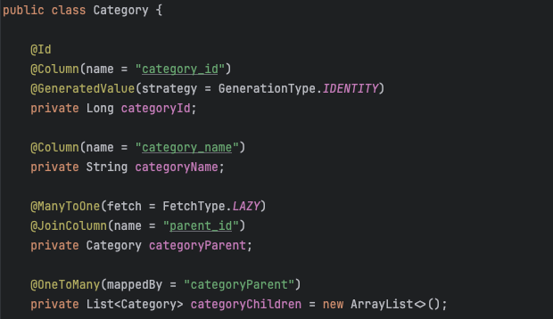
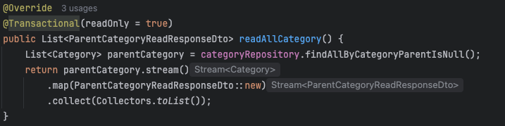
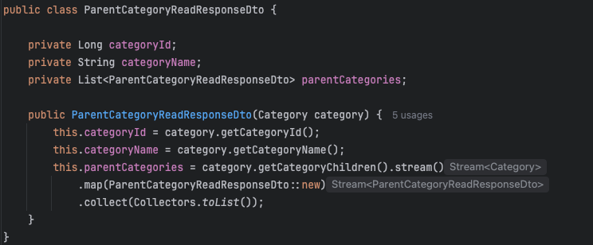
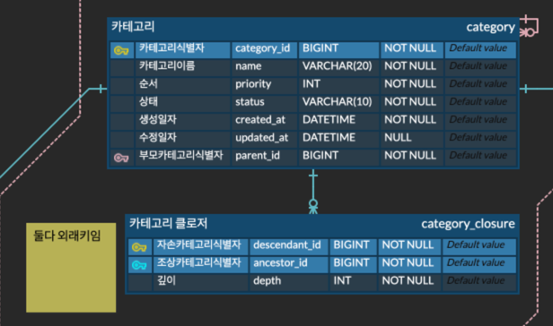
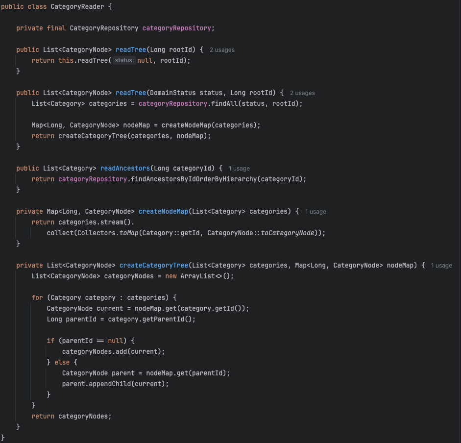

# 카테고리 구조 리팩토링: N+1 문제 해결과 계층 구조 설계 개선

기존에 구현한 카테고리 로직에서는 N+1 문제, 재귀적 구조의 한계, 조회 효율성 저하 같은 문제점들이 있었다.  
그래서 이번 글에서는 카테고리 리팩토링 과정을 담아보도록 하겠다.

## 기존 구조의 문제점

### 인접 리스트 모델(Adjacency List Model)

기존 구조는 인접 리스트 모델로, `Category` 엔티티 내에 자기 자신을 참조하는 `CategoryParent`, `CategoryChildren` 필드를 통해 재귀적으로 자기 자신을 참조했다.



### N+1 문제 발생

`readAllCategory()` 메서드에서 부모 카테고리를 조회한 뒤, 각 카테고리의 자식들을 DTO로 변환하는 과정에서 **지연 로딩**으로 인해 매번 추가 쿼리가 발생했다.

  


여기서는 @BatchSize설정을 사용한다고 하더라도 완전한 최적화는 불가능하다.  
Hibernate에서 BatchSize를 통해 in절을 묶는 원리는 조회를 진행할 때 현 상황에서 같은 타입이면서 영속성 컨텍스트에서 초기화되지 않은 프록시 객체에 한해서 묶음 조회를 진행한다.

아래의 예시와 함께 살펴보자.

```
A
├── A1
│   ├── A11
│   └── A12
├── A2
│   ├── A21
│   └── A22
B
├── B1
└── B2
C
├── C1
└── C2
```

- A,B,C는 findAllByCategoryParentIsNull()로 한 번에 조회
- A1, A2, B1, B2, C1, C2 는 A를 조회할 때 categoryChildren 프록시 객체에서 조회되므로 in절로 한 번
- A11와 A12, A21와 A22는 A11을 조회할 때  마찬가지로 in절로 한 번
- 마지막으로 A11와 A12, A21와 A22의 자식들이 존재하는지 A11을 부모 조건으로 조회할 때 in절로 한 번

그래서 IN절로 묶는다고 하더라도 하나의 쿼리로 만들 수 없고, 4번의 쿼리가 발생한다. 이것은 계층이 깊어질수록 쿼리가 더 발생할 것이다.  
그래서 완전히 N+1문제를 해결할 수 있다고 볼 수 없다.

### 트리 경로 조회 어려움

`IT > Backend > SpringBoot`처럼 조상 경로를 표현하려면 깊이를 모르는 상태에서 재귀 CTE를 사용하거나 JPA에서 반복 쿼리를 실행해야 했다.  
즉, 경로 조회 성능도 좋지 않았고 구현도 번거로웠다.

## 구조 리팩토링: 클로저 테이블 + 인접 리스트 혼합 모델

계층 구조 테이블을 구성하는 방식에는 여러 가지가 존재한다.  
각 방식의 비교 내용은 [계층 구조 테이블 설계 방식 비교](https://nuheajiohc.tistory.com/51)글에 정리해두었다.

여기에 실제 적용한 것은 클로저테이블과 인접리스트를 혼합한 모델이다.

### 새로운 테이블 구조



- 인접 리스트 테이블 : 기존처럼 `parent_id`를 유지함. 트리 구성 편의성을 위해 유지
- 클로저 테이블 : 모든 조상-자손 관계를 미리 저장하여 트리 경로 조회를 쉽게 조회할 수 있게 함
- 정렬 필드: 정렬 순서 보장을 위해 추가

> `parent_id`를 제거할 수도 있지만, 유지하면 전체 트리 구성 시 `JOIN` 없이도 간편하게 구성 가능하다.

### 계층 구조 모델 선정 기준

전체 카테고리를 한 번에 가져와서 애플리케이션에서 트리 구조로 만드는 작업이라면 사실 어떤 계층 구조 모델을 사용해도 가능하다.  
하지만 경로 조회는 클로저 테이블이 가장 적합하기 때문에 기존 구조에 클로저 테이블을 섞은 혼합 모델로 구현하게 되었다.  
각 계층 구조 방식의 비교는 [계층 구조 테이블 설계 방식 비교](https://nuheajiohc.tistory.com/51) 글에서 확인해보길 바란다.

## 트리 구성 로직 : CategoryReader

트리형태로 변경해주는 중요한 클래스는 `CategoryReader`에 구현했기 때문에 이 코드로만 설명을 진행해보겠다.



### 주요 메서드 설명

- readTree : 지정된 루트를 기준으로 전체 카테고리를 트리 형태로 조회하는 메서드
- readAncestors : 특정 카테고리의 모든 조상 카테고리 경로 조회 (ex. `IT > BackEnd > SpringBoot`)
- createNodeMap : 루트부터 순서대로, 갚은 깊이에서는 우선순위 순으로 조회한 카테고리를 Map에 저장한다. (트리를 구성할 때 시간복잡도를 줄여주는 핵심)
- createCategoryTree : 위 Map과 parentId를 통해 실제 계층 구조 트리 생성

### 카테고리 트리 구성 방식 요약

1. DB에서 카테고리 테이블 기반 전체 카테고리 조회
2. 각 Category 객체를 `CategoryNode`로 변환하여 Map 구성
3. 부모 ID를 기준으로 자식 노드를 붙이며 트리 완성

``` java
if (parentId == null) {
    categoryNodes.add(current); // 루트 노드
} else {
    CategoryNode parent = nodeMap.get(parentId);
    parent.appendChild(current); // 자식 노드 연결
}
```

`IT > BackEnd > SpringBoot` 구조로 조회하는건 **SpringBoot**의 id를 **descendant** 로 두고 조건을 걸어서 구하면 된다. 간단한 작업이므로 생략하겠다.


> 원래는 루트 노드(조회 편의를 위한 가짜 노드)가 하나이기 때문에 List<categoryNode>로 안하고 CategoryNode로 반환해도 된다.  
> 하지만 진짜 루트 노드들로 바뀐다면 여러개가 생길 수도 있기 때문에 이렇게 구현하였다.

## 결과 및 정리

- 재귀 구조의 N+1 문제 > 쿼리 1번으로 전체 트리 조회
- 깊이에 관계없이 경로 조회 가능

> 카테고리는 조회가 잦은 데이터이기 때문에 이후에는 캐싱을 적용하여 응답 속도를 더 개선할 수 있을 것 같다.