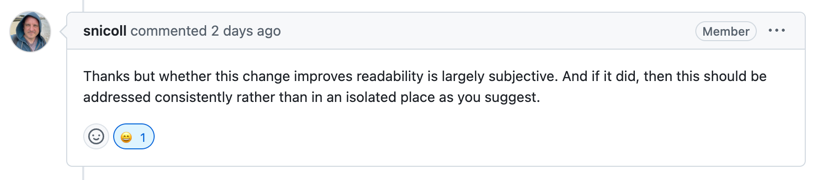

# 첫 스프링 컨트리뷰트 도전기(feat.실패)

얼마전 [서블릿 컨테이너 초기화](https://nuheajiohc.tistory.com/20)에 대해 공부했다.  
그리고 NHN Academy에서 진행했던 서블릿 기반 쇼핑몰을 다시 만들면서 스프링에서 서블릿 컨테이너 초기화를 어떻게 진행하는지 코드를 자세히 찾아보았다.  
코드가 그렇게 길지는 않아서 코드 첨부 후에 이어서 경험을 공유해보겠다.

```java
@HandlesTypes(WebApplicationInitializer.class)
public class SpringServletContainerInitializer implements ServletContainerInitializer {
  
	@Override
	public void onStartup(@Nullable Set<Class<?>> webAppInitializerClasses, ServletContext servletContext)
			throws ServletException {

		List<WebApplicationInitializer> initializers = Collections.emptyList();

		if (webAppInitializerClasses != null) {
			initializers = new ArrayList<>(webAppInitializerClasses.size());
			for (Class<?> waiClass : webAppInitializerClasses) {
				// Be defensive: Some servlet containers provide us with invalid classes,
				// no matter what @HandlesTypes says...
				if (!waiClass.isInterface() && !Modifier.isAbstract(waiClass.getModifiers()) &&
						WebApplicationInitializer.class.isAssignableFrom(waiClass)) { //<< 이 부분이 복잡한 것 같았다.
					try {
						initializers.add((WebApplicationInitializer)
								ReflectionUtils.accessibleConstructor(waiClass).newInstance());
					}
					catch (Throwable ex) {
						throw new ServletException("Failed to instantiate WebApplicationInitializer class", ex);
					}
				}
			}
		}

		if (initializers.isEmpty()) {
			servletContext.log("No Spring WebApplicationInitializer types detected on classpath");
			return;
		}

		servletContext.log(initializers.size() + " Spring WebApplicationInitializers detected on classpath");
		AnnotationAwareOrderComparator.sort(initializers);
		for (WebApplicationInitializer initializer : initializers) {
			initializer.onStartup(servletContext);
		}
	}

}
```

위 코드는 스프링이 서블릿 컨테이너를 초기화하는 클래스이다.  
코드를 읽던 중 `if`문 내부의 리플렉션 로직이 복잡하게 느껴졌다. 그래서 가독성을 높이기 위해 해당 로직을 아래와 같이 헬퍼메서드로 분리해보자는 생각이 들어 코드를 수정하고 PR을 보냈다.  
```java
private boolean isWebAppInitializerImplementation(Class<?> waiClass) {
		return !waiClass.isInterface() && !Modifier.isAbstract(waiClass.getModifiers()) &&
				WebApplicationInitializer.class.isAssignableFrom(waiClass);
	}

```

그리고 얼마 지나지 않아 PR에 대한 피드백이 왔다.  
  
피드백을 주신 분은 가독성은 주관적인 부분이라 하셨고, 만약 가독성이 높아진다고 하더라도 전체 코드베이스의 일관성을 유지하기 위해 다른 부분들도 수정해야 한다고 설명해주셨다.  
혼자서 신나서 혹시 기여가 될 수 있지 않을까 기대했지만 역시 오픈소스 기여는 쉽지 않았다.   
그리고 피드백을 읽고 가독성은 주관적일 수 있다는 것을 다시 한번 깨달았다. 나는 리플렉션 코드가 익숙하지 않으니 잘 안읽히지만, 익숙한 사람들에게는 편하게 읽히기 때문이다.  
스프링 생태계는 거대하기도 하고 많은 사람들이 사용하기 때문에 보수적으로 병합이 이루어지는 것 같고, 다른 PR들을 보니 코드의 미학적?인 부분보다는 오류나 성능 개선을 하는 PR을 더 원하는 것 같았다.  

비록 이번 컨트리뷰트는 실패했지만, 앞으로도 계속 스프링 코드를 읽어볼 것이기 때문에 언젠가 기회가 된다면 스프링 생태계에 기여를 해 보고 싶다.

[pr내용](https://github.com/spring-projects/spring-framework/pull/34175)
